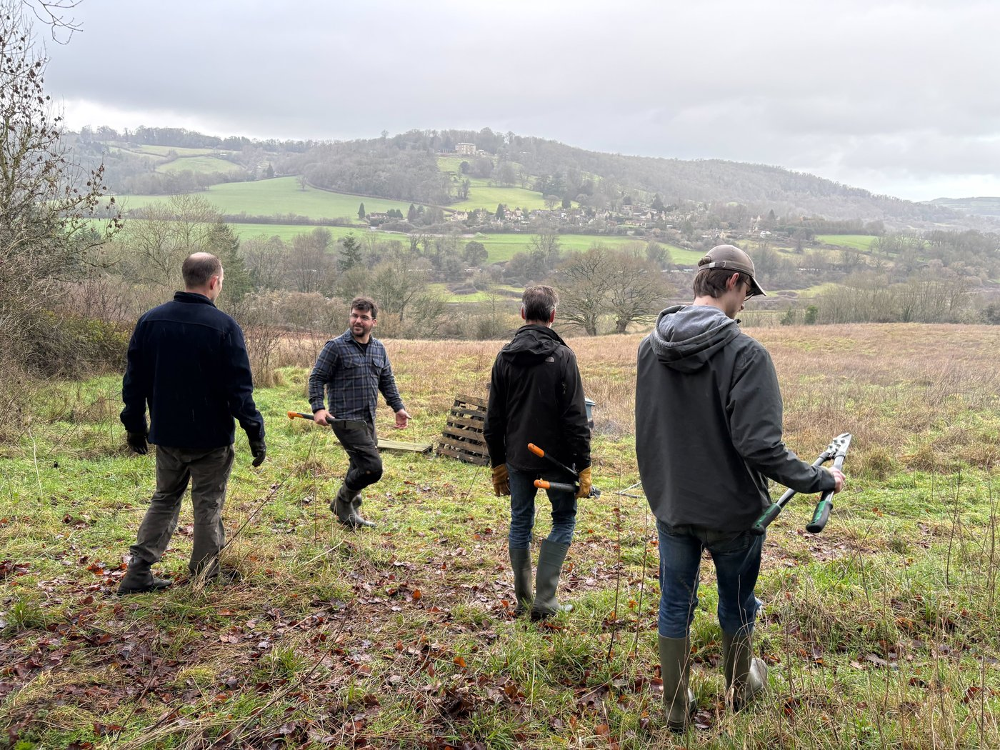
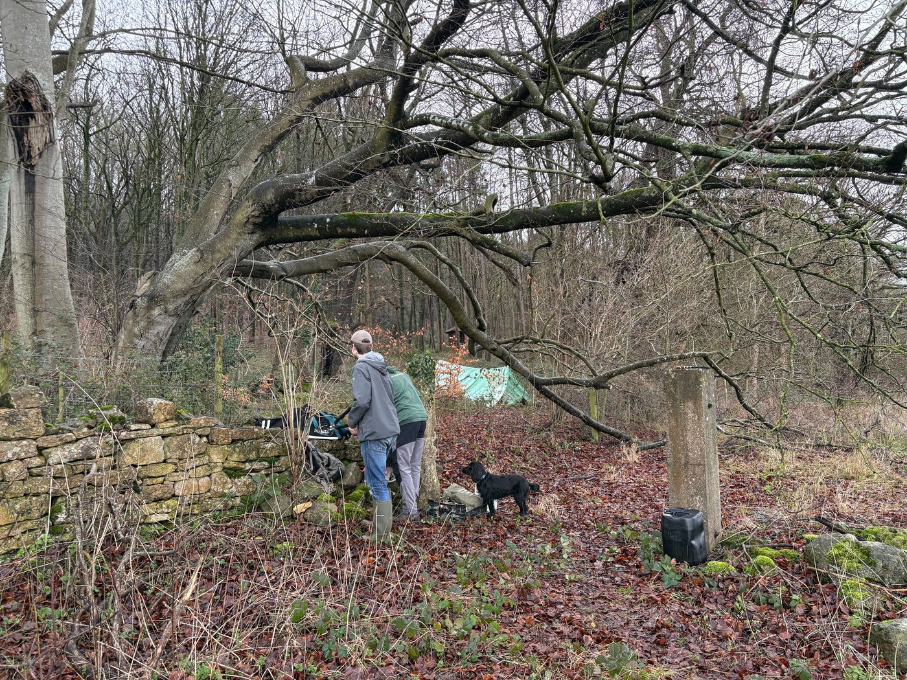
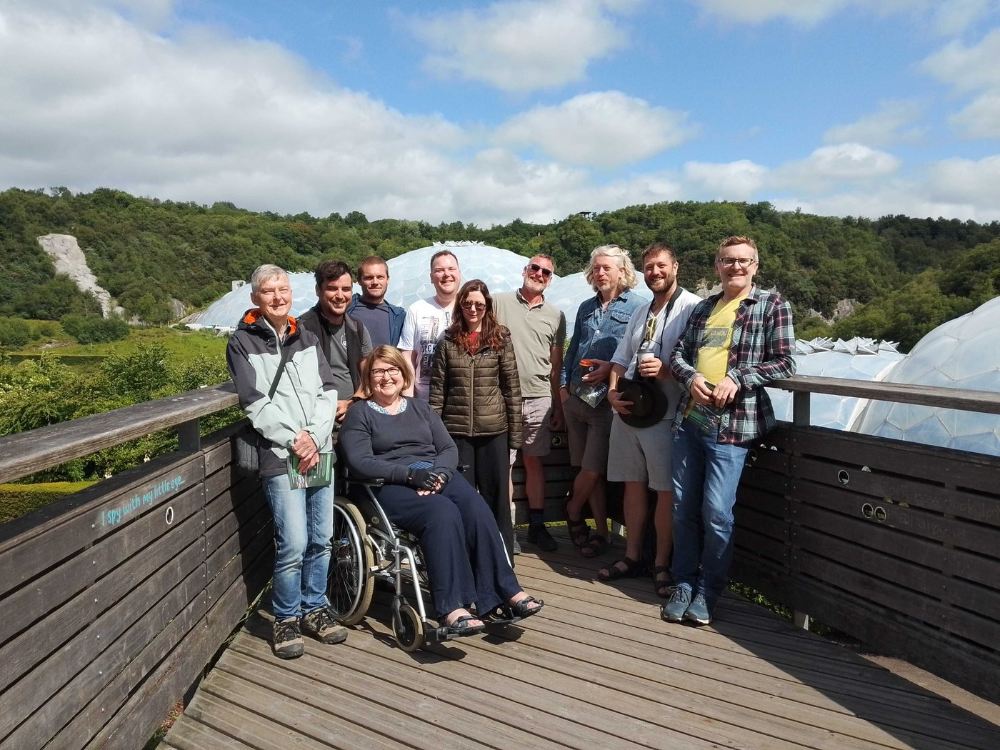
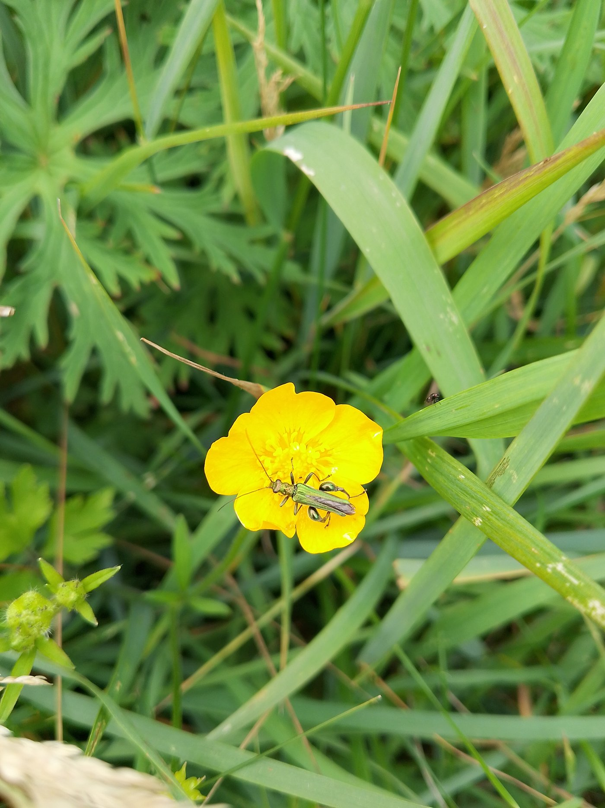
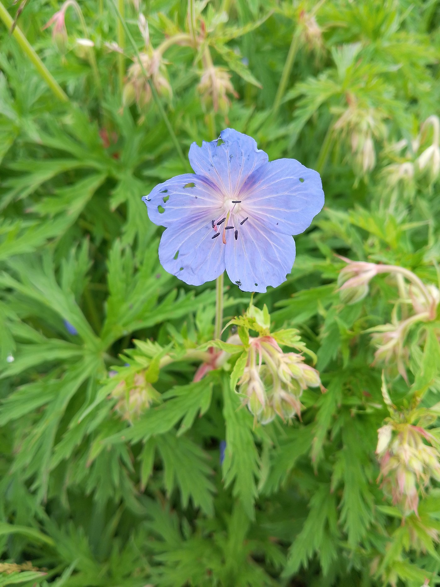
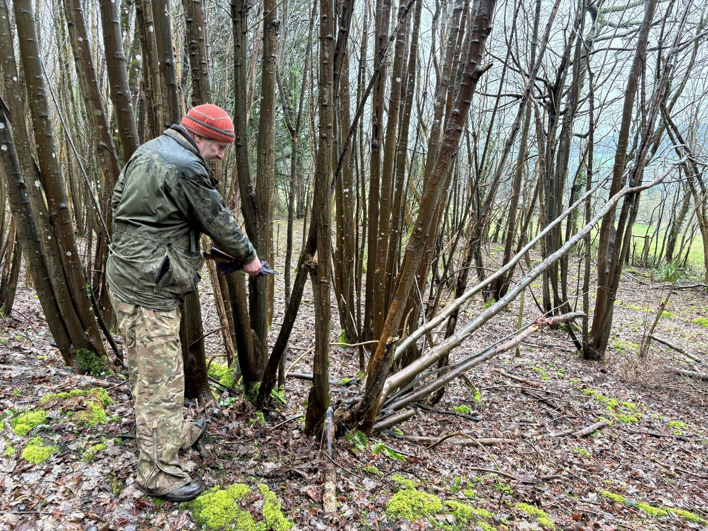
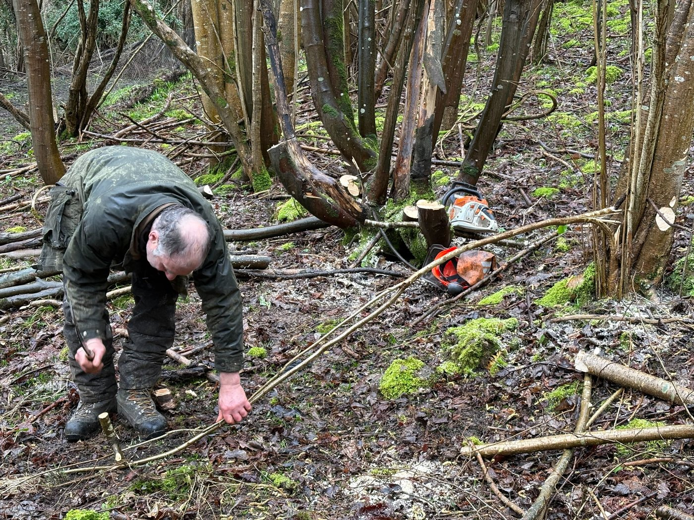
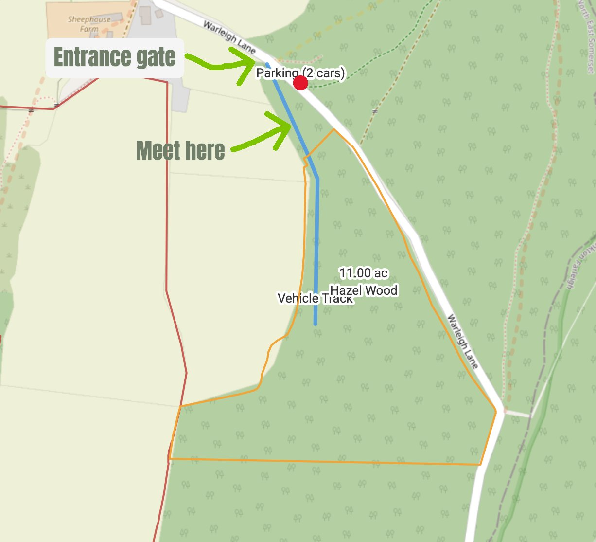
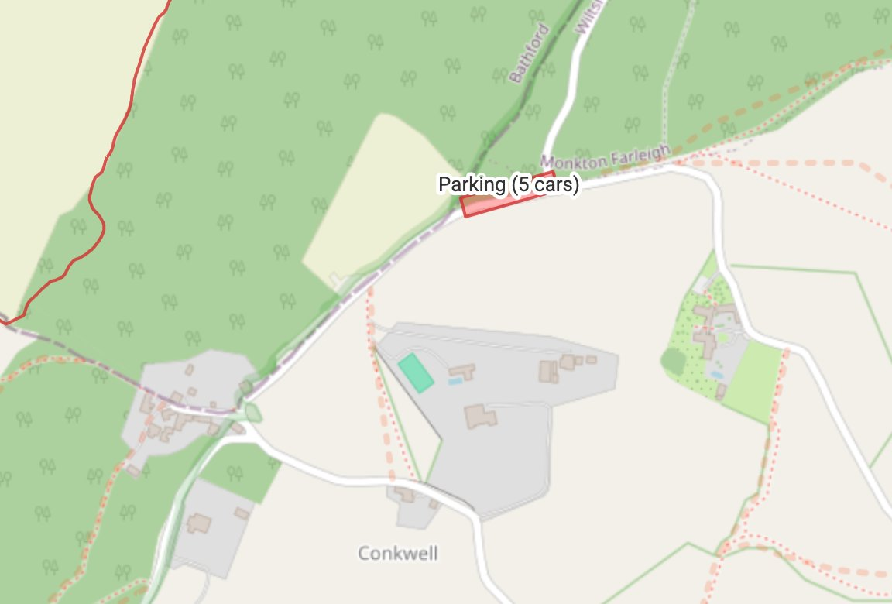

If you are receiving this email it is because you have either expressed an interest in our work to create a nature reserve at Warleigh, or because you are interested in volunteering there. Either way, you are very welcome and we thank you for your support.

Below you will see some the things we have managed to do so far in the short time we have owned Warleigh, together with some dates for coppicing sessions if you would like to come and help. It doesn’t matter if you have never done this before as we can show you how to do it on the day.

If you have any specific skills which you think might be helpful and you would like to volunteer them, please contact Kathy, our events coordinator on kathy@protect.earth

We are currently looking for someone with carpentry skill to help us rebuild the toilet shelter.

# What have we done so far?

Once the purchase of Warleigh was completed the Protect Earth team couldn’t wait to get started.

The public footpath was muddy, slippery and dangerous so we reopened an old vehicle track which we believe was a public footpath in the past. We have removed a lot of chicken wire, barbed wire, broken pallets and other rubbish. A handful of dead Ash trees which were over areas where volunteers congregate were removed for safety.

Some volunteers made stakes for the fence we want to put up to protect the Elm hedge from deer and others prepared the area where we will be coppicing.

We are working to create parking areas for volunteers on the site as there is limited parking elsewhere. In the meantime we will need to keep groups quite small. There is no number limit for anyone who lives close enough to walk or cycle. Please see the end of this email for parking suggestions.

# You may also be interested in…

A little bit about Protect Earth

Protect Earth is a small environmental charity, established in November 2020. We plant trees for landowners across the UK, help with woodland maintenance, remove invasive species and plant wildflower meadows. We also run hedge-laying courses which are free for people working in farming.

We have other properties in addition to Warleigh Nature Reserve. We are restoring an ancient woodland called High Wood near Liskeard, Cornwall, rewilding a hillside called Goytre Wood in Powys and another woodland near Nannerch in Flintshire.

You can ‘meet’ the core team here on our website.

[Meet the Team](https://www.protect.earth/about/meet-the-team)

Photo: A team outing to the Eden project last June

# Photos of Warleigh Nature Reserve

These photos were taken on a visit last summer.

If you visit Warleigh Nature Reserve and you have photos you would like to share, please send them to kathy@protect.earth with the date you took them and any comments and we will put them in a future newsletter.

# Volunteering & coming to events

# Work Parties

Information about planned work parties can be found in this section. Previous experience is not usually necessary as we will show you what do. We will say if experience is required for a specific activity. You are welcome to come for a full day or half a day, whatever you can manage.

Our next work party is on Friday, 20th February from 10am when we will be coppicing some of the hazel. Email kathy@protect.earth if you would like to come. This is for adults only please.

Details of how to find us and what to bring can be found at the bottom of this email.

Why are we coppicing hazel?

This video from Wood for the Trees explains the importance of coppicing.

[Coppicing video](https://www.youtube.com/watch?v=l6UMLLj74BU)

Coppicing dates

If you would like to try copping for yourself, we have two weekend dates before the end of February. The green buttons will take you to our website where you can sign up to come and learn this traditional woodland craft. You can come for half a day or a full day.

Sunday, 22nd February - Coppicing for all skill levels starting at 10am,

[Find out more information or sign up for 22nd February here](https://www.protect.earth/events/hazel-coppicing-feb-22-2026)

Saturday, 28th February - A further coppicing day for all skill levels

[Sign up here for Saturday, 28th February](https://www.protect.earth/events/hazel-coppicing-feb-22-2026-5rr7t)

This is likely to be the last volunteering session until May. We are extremely busy planting trees across the UK before the tree planting season finishes at the end of March, then most of us take some well-deserved holiday time in April. We will be back with renewed energy for Warleigh Nature Reserve from late April onwards.

In the meantime, do try to find time to visit, share some photos with us and make your suggestions on what you would like to see at Warleigh. See the end of this email for visitors parking suggestions.

## Finding us

Entrance from Warleigh Lane in the north:

Google Link: [https://maps.app.goo.gl/NVDbFyD41V4mE49j6](https://maps.app.goo.gl/NVDbFyD41V4mE49j6)

What3Words: [https://w3w.co/chained.plenty.spared](https://w3w.co/chained.plenty.spared)

Coordinates: 51.373747, -2.294711

Pedestrian entrance in the south up the steps from Dundas Aqueduct

Google maps link: [https://maps.app.goo.gl/tHunkkkQ7raoRUux6](https://maps.app.goo.gl/tHunkkkQ7raoRUux6)

What3words link: [https://w3w.co/career.pack.fame](https://w3w.co/career.pack.fame)

Coordinates: 51.364853, -2.307189

We meet here:

We will be here until 10:15

Google maps Link - [https://maps.app.goo.gl/g4EzdVySS5LJVK3M9](https://maps.app.goo.gl/g4EzdVySS5LJVK3M9)

What3words -[https://w3w.co/leans.judges.rank](https://w3w.co/leans.judges.rank)

Coordinates - 51.373747, -2.294797

## More information

Work parties start at 10 am and finish around 4pm depending on what we are doing. You can come for half a day or stay all day, whatever suits you. We want you to enjoy volunteering with us, so remember to take a break when you feel tired, drink plenty of liquids and don’t feel guilty about going home when you have had enough.

All equipment is provided although you are welcome to bring your own if you prefer. No chainsaws please as the use of these by members of the public is not covered by our insurance. If you bring a small electric hand saw you must already be familiar with it and you use it at your own risk. Please do not share these with other volunteers.

Please bring/wear the following:

-   Gardening gloves - the sturdier the better (We have a few pairs you can borrow)

-   Sturdy footwear - preferably boots or wellies

-   Weather appropriate clothing – layers and long sleeves are best, waterproof clothing, a hat. (Jeans/cotton clothing are best avoided if it is likely to rain as they take ages to dry out.)

-   A packed lunch if you plan to stay all day, and water in a refillable water bottle

-   Hand sanitiser

-   Sunblock if likely to be a sunny day – (it is possible to burn when working outside all day, even in winter)

-   Insect repellent in summer as ticks can be around in the woods during the warmer months.

Health and Safety

-   Do not come if you feel unwell, especially if you are likely to be contagious.

-   You are reminded to take breaks as and when you need to, and stop when you have had enough.

-   Maintain a comfortable temperature and bring waterproof clothing.

-   Drink water regularly in addition to tea and coffee to keep hydrated.

-   Take care when using tools, keep them below shoulder level where possible and place them where other people will not trip over them.

-   Ask another volunteer to help rather than lifting heavy items by yourself.

-   Protect your face and eyes from branches, etc.

Parking for volunteers

There are spaces for 2 medium sized cars near the gate (map 1) and there’s more parking for approximately 5 cars near Conkwell if you follow Warleigh Lane up the hill heading south. (map 2)

Parking for all other visitors

We recommended parking (paid) at Brassknocker Basin car park near the Angelfish Cafe, and enjoying the beautiful view as you walk over Dundas Aqueduct. You can then go up the steps and enter via the pedestrian entrance here:

Google maps link: [https://maps.app.goo.gl/tHunkkkQ7raoRUux6](https://maps.app.goo.gl/tHunkkkQ7raoRUux6)

What3words link: [https://w3w.co/career.pack.fame](https://w3w.co/career.pack.fame)

Coordinates: 51.364853, -2.307189
