This has been a really hectic few weeks for all the Protect Earth team. Warleigh Nature Reserve near Bath is now ours and we couldn’t wait to get started. The site has been neglected for some years so there is a lot to do.

There has been a lot of local interest with many people volunteering to help in the first few days alone. We are setting up a new website just for Warleigh, and you can sign up for the Warleigh newsletter there to receive site-specific updates.

Photo: Protect Earth members ready to work.

[Warleigh Nature Reserve website](https://warleighnaturereserve.org/)

There was a lot of rubbish and chicken wire on the site when we moved in, so we got started by clearing this. Next, we spent a day clearing a safe access route for the public, because the existing footpath had become impassable. Since then we've started hazel coppicing, willow propagation, and ash felling. We've even managed to build some leaky dams to help slow water flow and improve biodiversity.

Warleigh is already looking a lot better, and that’s just the beginning.

Donating towards Warleigh Nature Reserve

The land cost £480,000 to buy and we were expecting government funding towards its purchase. However, the government wanted us to plant trees across the whole site which would not have been ecologically appropriate for Warleigh. Ultimately, we paid the entire cost, which has left our funds very low for all the work we need to do there. We’ve therefore started a new crowdfunder. Please donate if you are able and support our vital work on this new site.

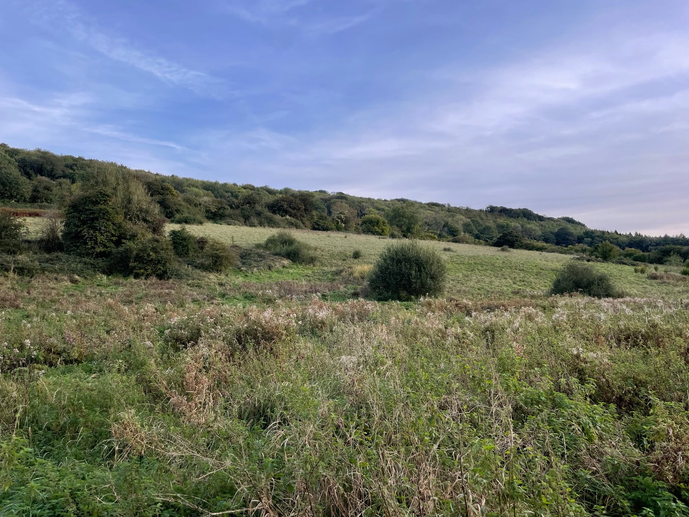

[Donate to our crowdfunder here.](https://www.crowdfunder.co.uk/p/warleigh-nature-reserve)

# Articles

Shade trees - the hidden gift to biodiversity

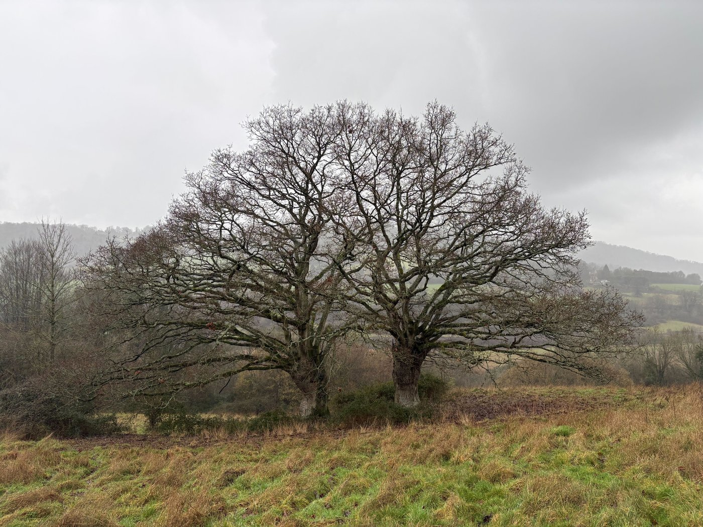

[Read more about shade trees here](https://www.protect.earth/articles/shade-trees-the-hidden-gift-to-biodiversity)

You will all have see large trees dotted around the countryside, often with cows and sheep sheltering from the rain or sun. But have you thought about how these trees can help birds, animals and invertebrates? What other benefits do shade trees bring to the environment?

Ecologist, Elena Tornberg-Lennox, explains why we need shade trees and how they help to support biodiversity.

Our hedge-laying courses and how they help the environment

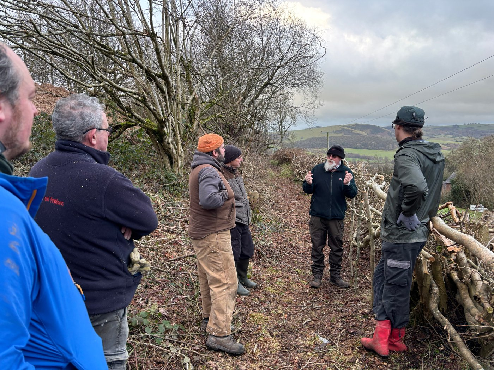

[Read why well-laid hedges are important here](https://www.protect.earth/articles/our-hedge-laying-courses-and-why-they-are-so-important)

We held four hedge-laying courses in Powys this year, which were free for anyone working in farming. The last two were fully booked. Find out in this article why we ran them and why we want to run more.

We are now looking for hedge-layers, and hedges to lay, in the rest of the UK.

If you are a hedge-layer who can run a course for us, or the owner of a hedge that badly needs some TLC, please contact Kathy, our Events Organiser, on kathy@protect.earth for more information.

# Other News

Tree Planting near Wellington

On a very wet Saturday some brave souls turned out to plant 400 trees near Wellington. (We don’t entirely blame the would-be volunteers who took one look at the weather and found something urgent that needed doing at home in the warm and dry.)

We managed to plant most of them and the landowner and friends made short work of the rest the following day.

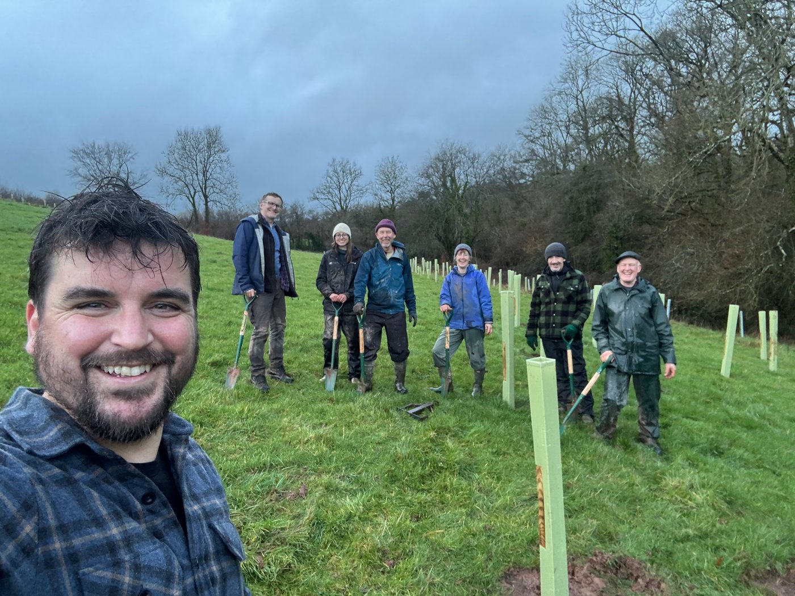

Getting married soon? Why not plant trees with your mates?

One of our regular sponsors is getting married in March and he wanted to do something special with his family and friends as part of his stag weekend. He got in touch and of course we were happy to help. They live all over the UK so we managed to find a fairly central site for them in West Hadden in Northamptonshire.

Despite torrential rain the day before, the weather was dry but chilly. Spirits were high and 225 trees were planted in good time. Then the 12 ‘stags’ carried out some maintenance of the trees we had planted on a previous visit.

Obviously, no alcohol was consumed onsite, but we hope they went off for a well-earned pint or two afterwards. They deserved it!

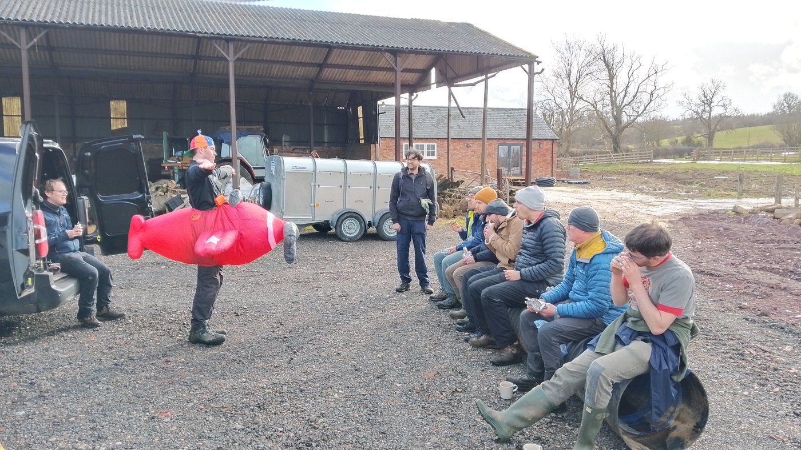

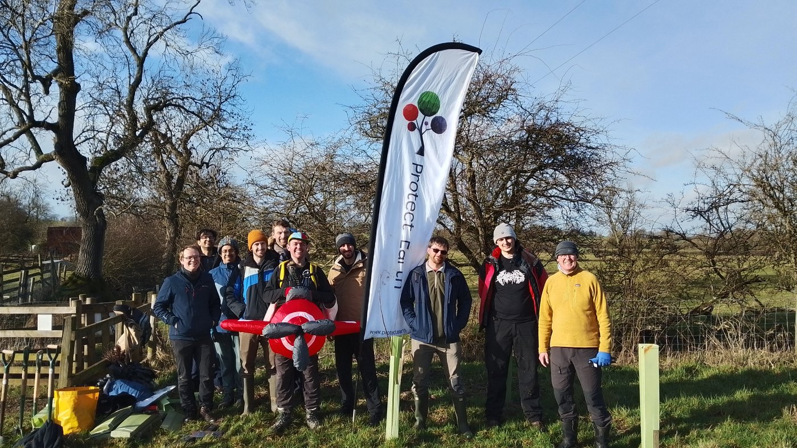

600 trees planted with the help of Mulberry and local volunteers

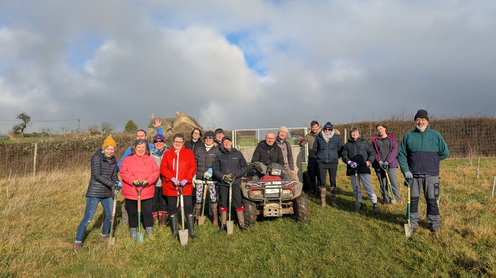

On a surprisingly sunny Wednesday we planted 600 trees on a farm near Radstock, Somerset.

Volunteers were a mix of enthusiastic corporate volunteers from Mulberry and some equally eager local volunteers. We finished in record time and even had time to admire the farm tractors before ending the day at the pub for a well earned drink.

A reporter from the Mendip Times came to interview us, so look out for the article in the March edition. It is also available online.

[Read the article here](https://mendiptimes.hflip.co/ce53f87cf5.html#page/38)

Invasive rhododendron removal and leaky dams

There’s nothing that Phil, our chairman. enjoys more that a day or two of ‘rhodo bashing’, because he knows what harm invasive rhododendron can to do a wood. (It squeezes out plants, creates too much shade, and changes the acidity of the soil, all of which reduces biodiversity.)

This was our second visit to Weston Wood near Otley, Yorkshire to help Menston Area Nature Trust. Between the two charities we raised a good number of volunteers.

Day one was wet, (of course it was!) but we still managed to remove 80% of the rhododendron remaining after our first visit.

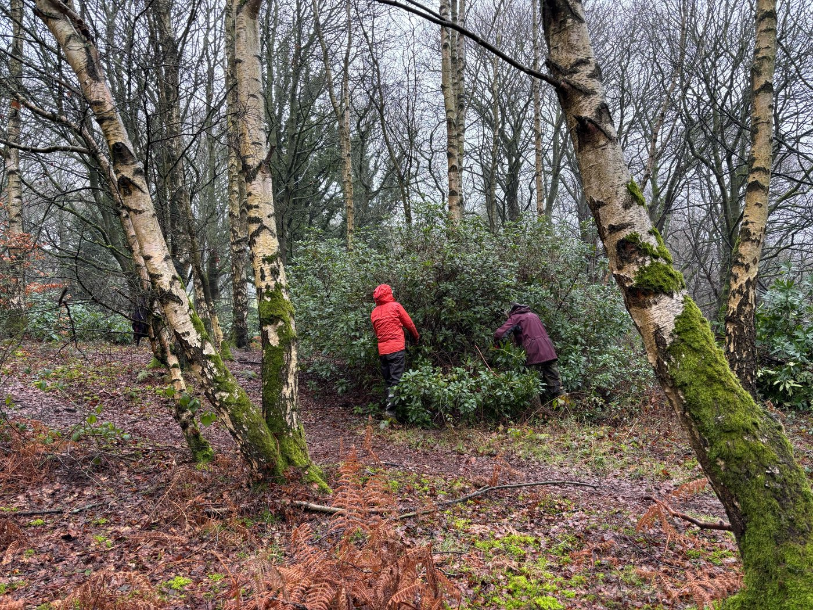

Day two was bright and brought a fresh set of willing volunteers who demolished the remainder of the rhododendron by midday. The volunteers were still keen so Phil suggested that it was a good time to make some leaky dams across the stream (think beavers, but on a smaller scale). Wood, leaves and mud were in plentiful supply. The dams were created and trenches were dug to create a mini-wetland which will increase biodiversity in the woods.

(Photo taken by Christine Bell)

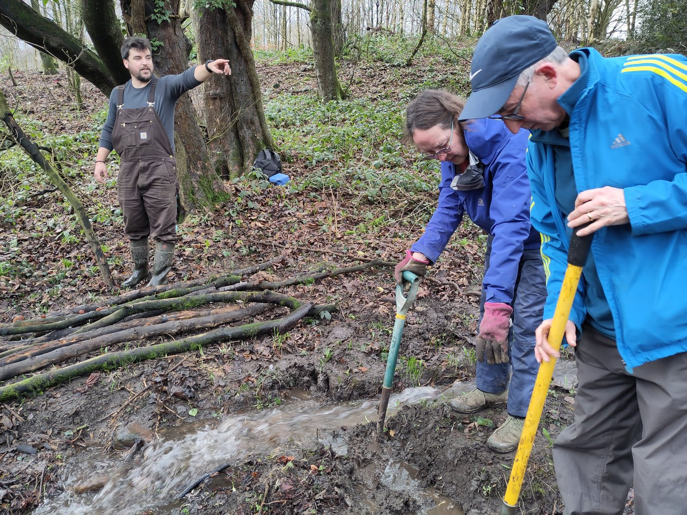

The Chair or the Menton Area Nature Trust was thrilled with how the weekend went. She said:

_“Thank you for all your hard work on our behalf - since we have owned the woods it has been amazing to have your expertise and energy helping us remove the rhododendron. Your support is really appreciated._

_Thank you for helping us channel our inner beavers and build some dams - I had a great time and was delighted we managed to alter the stream's flow so effectively._

_Looking forward to seeing you again next year.”_

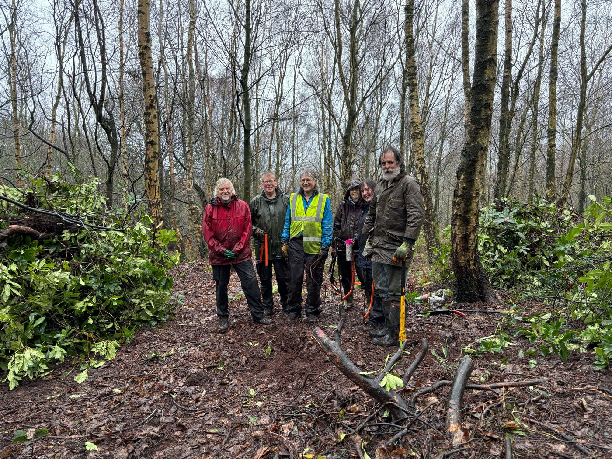

## Volunteering Opportunities

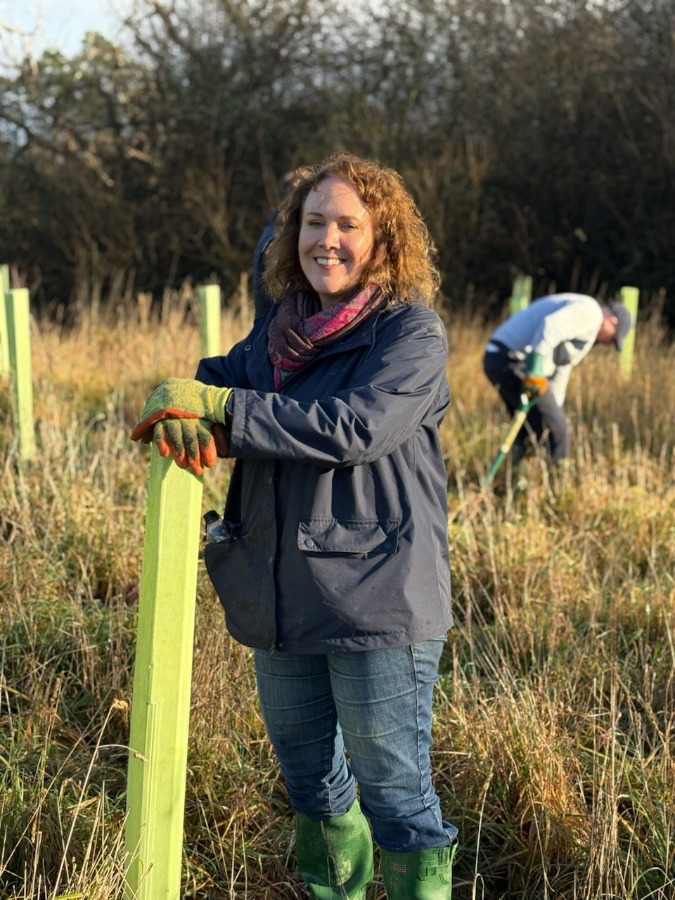

We are currently looking for tree planting volunteers near:

South Bristol - 28th February

South Molton, Devon - 6th & 7th March

Pucklechurch, South Gloucestershire - every Tuesday and Thursday until the end of March.

[Visit our events page here to find out more](https://www.protect.earth/events)
