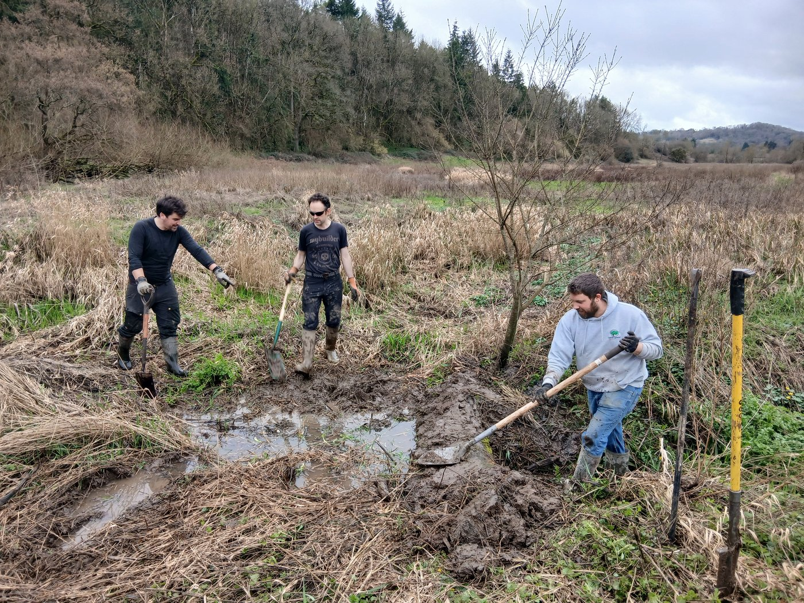
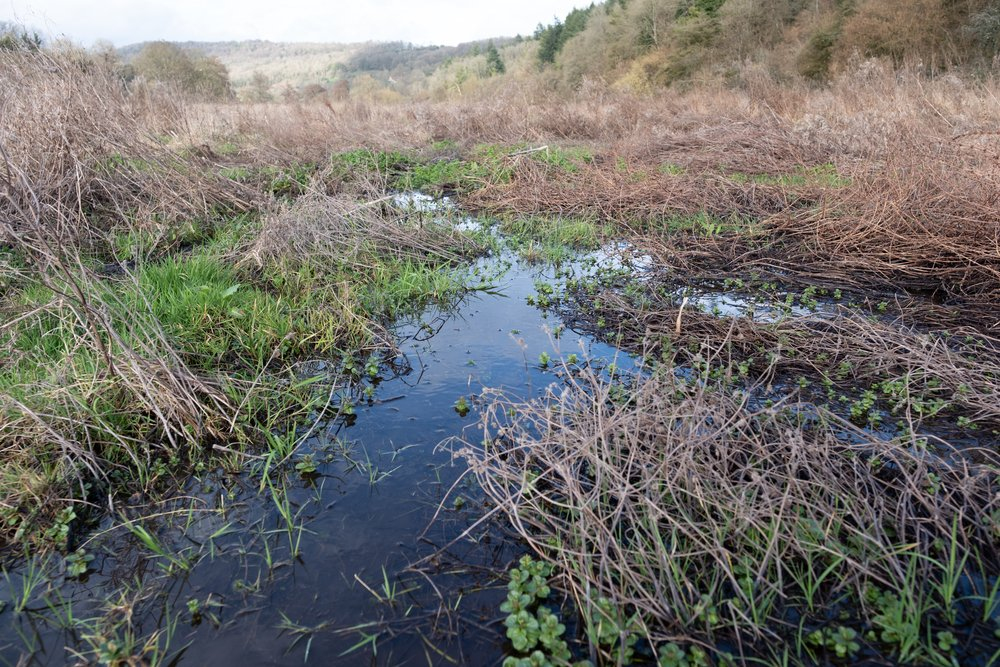
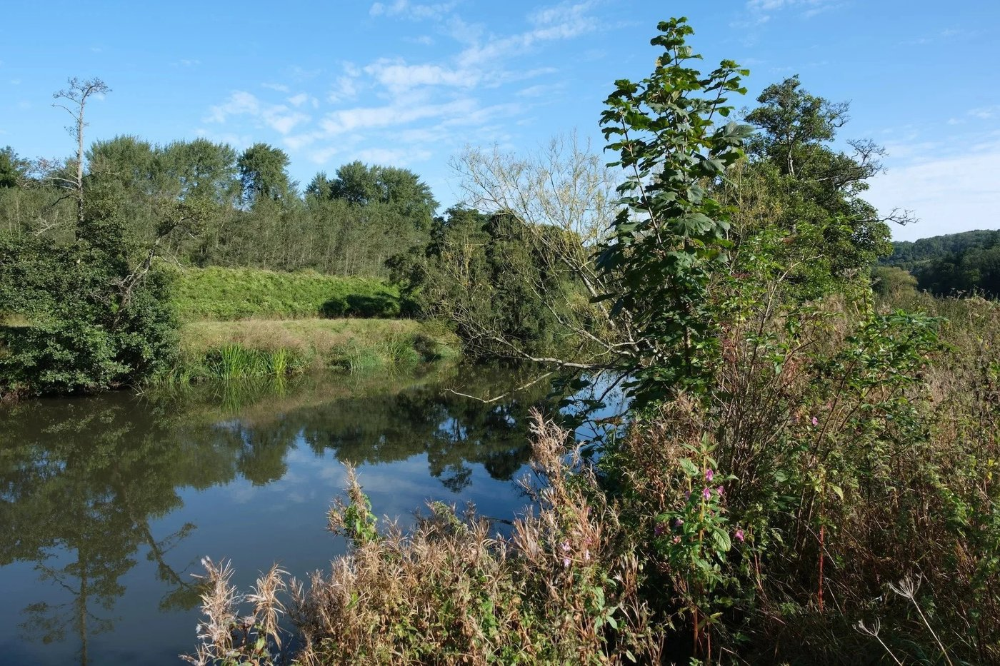
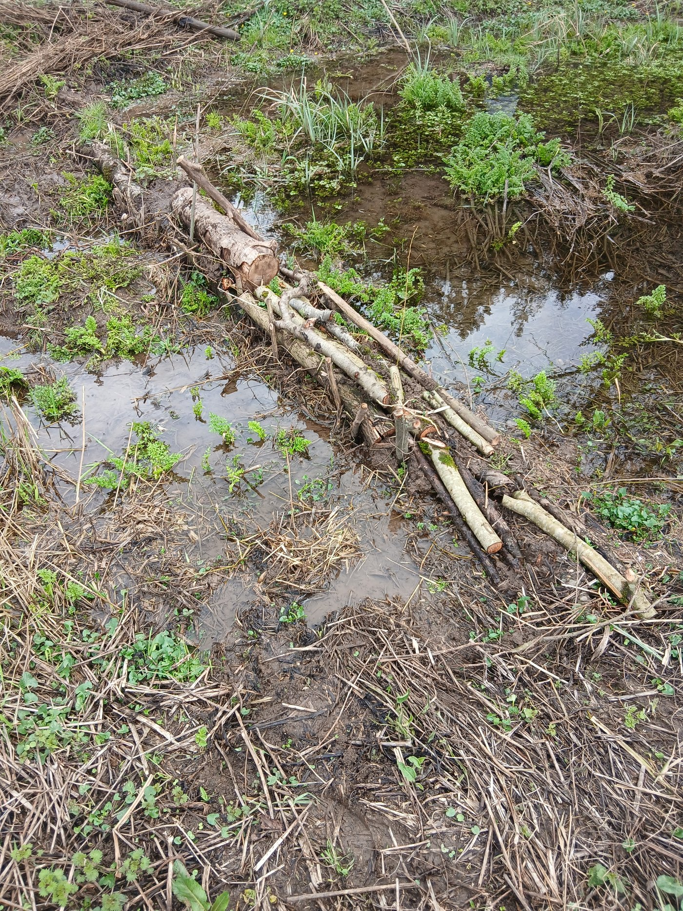
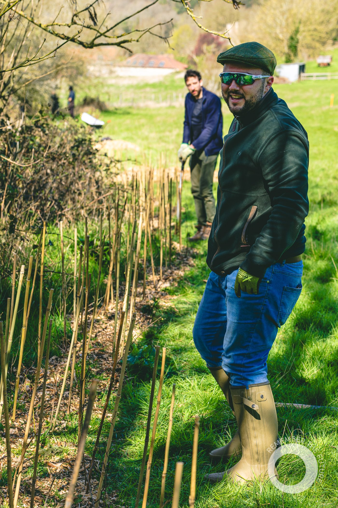
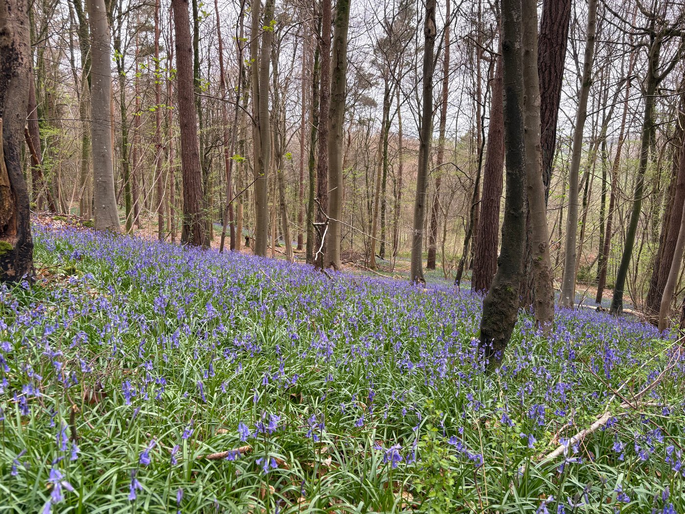
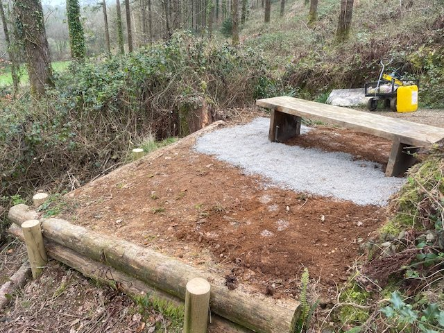
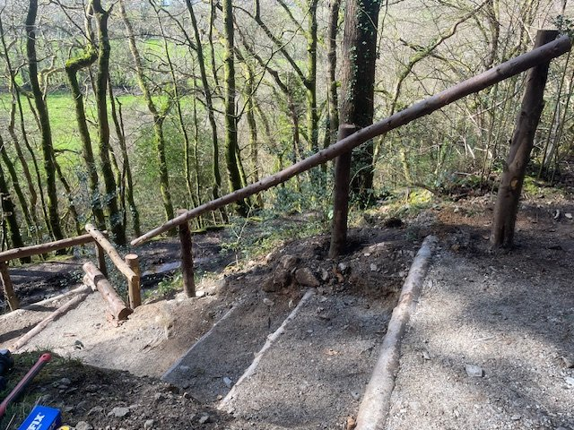
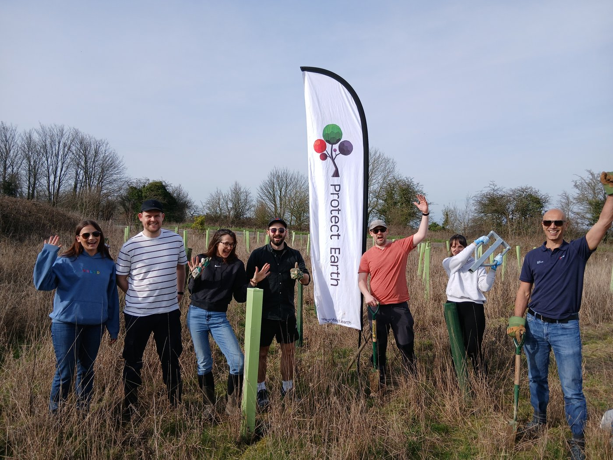

Throughout March we were very busy planting the last of the trees on sites as far apart as Devon, Northumberland and Surrey before the end of the season. We even found time to support the woodland creation near Bristol over the final two Saturdays.

In between, many team members and willing local volunteers helped out at our new Nature Reserve at Warleigh. Read more in the article and updates below and find out why wetlands are so important to the planet.

Creating the wetlands at Warleigh Nature Reserve is muddy work!

# Articles

Wetland Restoration

Wetlands are like the world’s superpower. They include peatland, the world’s best carbon sink, they protect us from flooding and drought, increase biodiversity exponentially, clean up the pollution we create, enhance human wellbeing and mental health, and boost the economy.

[Read more here](https://www.protect.earth/articles/wetland-restoration)

Warleigh Nature Reserve

Nestled along the River Avon, between Bath and Bradford-on-Avon, Protect Earth’s newest restoration project has started to come to life. Protect Earth has completed purchase of the land, creating a new haven for nature - the 81 acre Warleigh Nature Reserve.

[Read more here](https://www.protect.earth/articles/warleigh-reserve)

# Warleigh Nature Reserve Updates

We have had several work parties at Warleigh to make use of the hazel we coppiced last month. We have used some to make posts to erect a deer fence to keep deer away from the hazel as tasty new shoots are growing. Some was used to make habitat piles for invertebrates and leaky dams for the wetlands.

A leaky dam

Planting the hedgerow

Photo by Daisy Brasington

On the last Saturday of the planting season local volunteers came to plant and repair a 500m hedgerow, and down by the new wetlands we planted 100 alder and local willow cuttings.

We will be having informal drop-in work parties at Warleigh every Saturday during the Spring and Summer from 10am to around 4pm. Everyone welcome.

[Work party information here](https://www.protect.earth/events/warleigh-summer-work-parties-2026-e6rw8)

Can you make a donation?

We are still well short of our crowdfunder total. Environmental surveys cost us around £3,000 and we need to improve access with new gates and improved footpaths. We plan to install dormouse and bird boxes, new benches, and an information board. Volunteers have been amazing but we will also need to pay contractors for some jobs.

Bluebell wood, Warleigh Nature Reserve

Our new cameras show herons, deer, badgers and foxes are already visiting and we hope beavers soon make an appearance.

Please help us to improve Warleigh Nature Reserve by making a donation or sharing the link. Aviva are currently matching all donations up to £250.

[Donate to the Warleigh crowdfunder here.](https://www.crowdfunder.co.uk/p/warleigh-nature-reserve)

# High Wood Updates

Our temporary site managers, David and Richard, have been working hard this month. A local lady donated thirty oak trees to be planted in High Wood, Cornwall and they were planted there this month.

They have installed a bench for visitors and added a handrail for the recently completed steps near the southern entrance. Before this, visitors faced a tricky slope to enter High Wood .

If you live near Liskeard, make a note in your diary for our fourth High Wood Summer Fair on 14th June from 11am to 4pm. It is a great family-friendly day out with lots of free activities. There is something for environmentalists, nature lovers, historians, crafters, and even a free qigong session in the woods.

If you are able to help, either beforehand or on the day, please contact our events organiser on kathy@protect.earth

Learn more and get your free tickets here.

# Other News

Thanks are due to the following corporate groups and local volunteers who helped us plant trees at the following sites:

-   Rheal Superfoods - Haydon Bridge, Northumberland.

-   TML Partners and local volunteers near Guildford, Surrey.

-   Sozo Design corporate volunteers at Bourton-on-the-Water, Gloucestershire.

-   Sandhata corporate volunteers and local volunteers near Malmesbury, Wiltshire.

They all did a great job.

Sozo Design corporate volunteers at Bourton-on-the-Water
