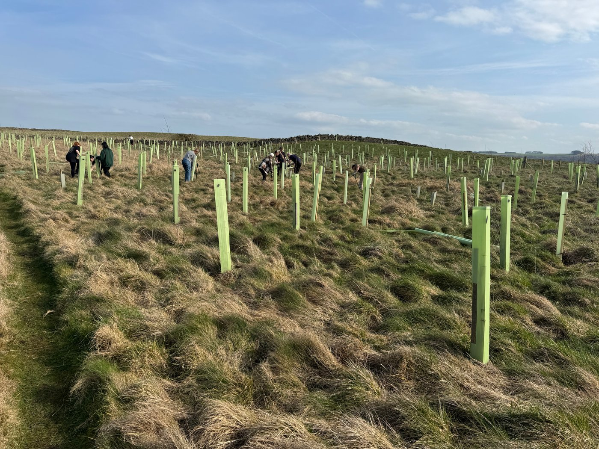
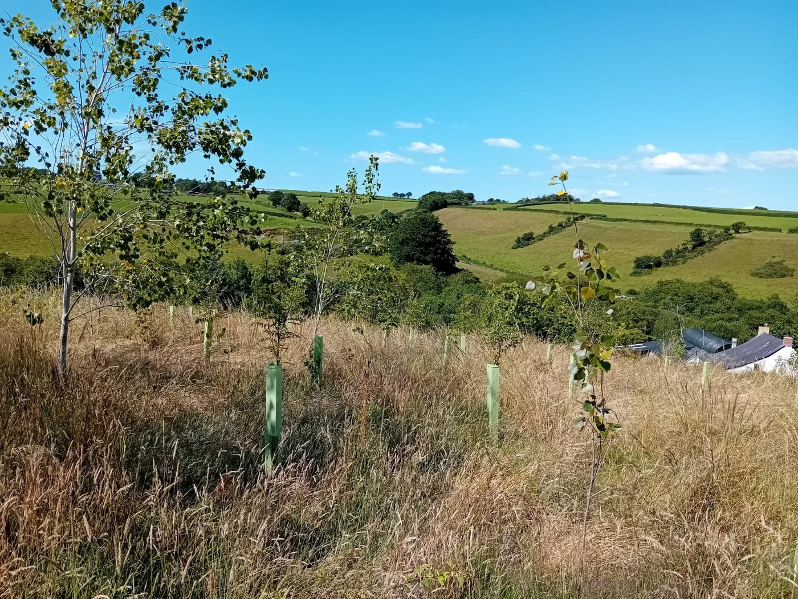
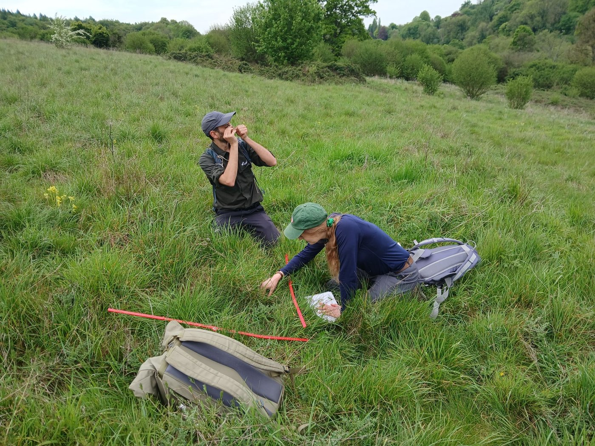
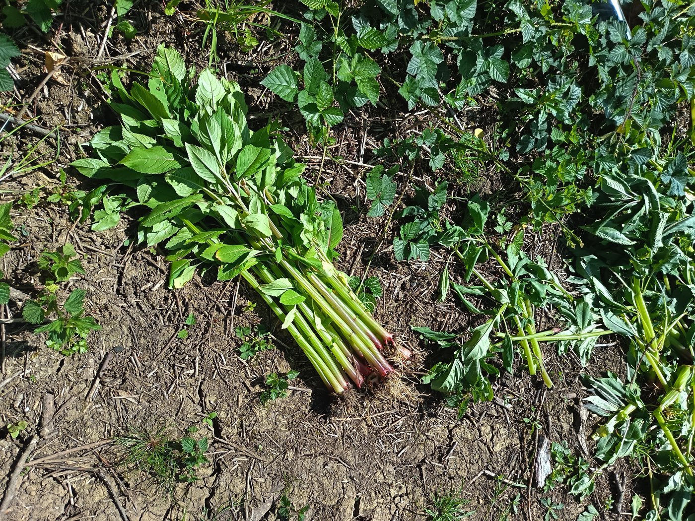
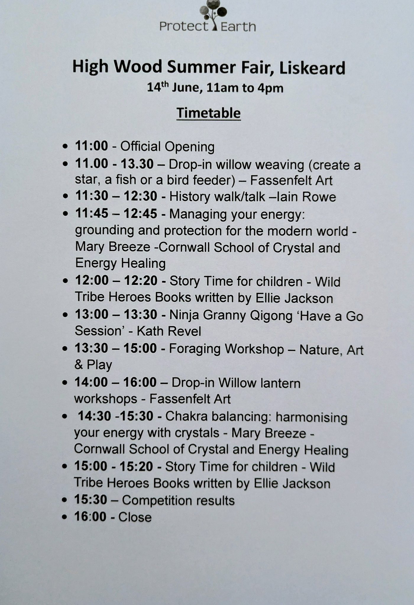

Our Spring maintenance programme is well under way. We have some corporate groups volunteering but we are also looking for members of the public to help at some of our sites. If you belong to a club, have a group of friends, or work for an environmentally-friendly company, why not bring them all along? Scouts, Guides, and other youth groups are very welcome too.

The rather extreme weather conditions most of the country has faced recently remind us that climate change is an increasing problem, and makes what we are doing ever more urgent. If you or anyone you know want help to plant a minimum of 500 trees or one acre of land please visit our website for more information.

[Information for landowners](https://protect.earth/get-involved/landowners/)

# Articles

## Spring maintenance volunteering

Everyone wants to plant trees, but really that is only the beginning of the story. The trees need a lot of care in their early years, and it is often difficult to find volunteers to help with this. Find out in our latest article why Spring maintenance is so important to the success of our projects.

[Read the article here](https://protect.earth/articles/spring-maintenance-volunteering/)

Convinced? Then look below to see if you are able to help with some Spring maintenance this year.

Volunteers needed for Spring maintenance

at the following sites:

-   Liskeard, Cornwall - 17th June

-   Newbury, West Berkshire - 27th June

-   Radstock, Somerset - July TBC - check our events page soon

Tasks could involve any or all of the following:

-   Straightening and resetting any stakes or guards which are falling over.

-   Identifying any dead saplings for replacement later.

-   Removing grass growing inside the guards, as this damages the bark and can kill the tree.

-   Putting wood chippings or mulch mats around the base of each tree to suppress grass and weeds.

[Visit our events page for more information](https://protect.earth/events/)

# Warleigh Nature Reserve Updates

Surveys have begun at Warleigh Nature Reserve!

The amazing folk at RSK Wilding have been rummaging around our woodlands, wetlands, grasslands, turning over every leaf and rock to see what's around.

We cannot wait to see the full results of what they found, but so far it sounds like our goals are compatible with reality on the ground! It was a one day visit but the same team will be coming back in June for a bio blitz.

Others will be coming to carry out other surveys very soon.

Photos above by RSK Wilding

Ecology Tours

Oscar, our ecologist, is leading Ecology Tours of Warleigh Nature Reserve. These are free as a thank you to anyone donating £60 or more to our crowdfunder.

You can still donate, then book a free crowdfunder donor ticket via the link below Alternatively book a £60 ticket direct from Eventbrite which includes their admin fee.

[Crowdfunder link](https://www.crowdfunder.co.uk/p/warleigh-nature-reserve#)

Feedback from our tours:

-   _We had a truly wonderful day on Saturday. Oscar was a very knowledgeable and charming guide, able to describe the ideas behind the project and the practical work being done in a way that drew the group into the excitement of what is being achieved._

-   _Many thanks for getting me booked on to the tour on Saturday - it was really interesting, I learned a lot and Oscar was a mine of information!_
_What a wonderful opportunity to let nature back in to those fields and woodlands and for it to be so accessible._

[Book your tour here](https://protect.earth/events/)

Work parties

Volunteers have been removing the Himalayan Balsam we mentioned last month. It’s still fairly small at the moment so it’s a good time to do it.

Photo by Samantha Davey, one of our volunteers.

# High Wood Updates

High Wood Summer Fair - 14th June 2026

Two free crystal workshops and two story time sessions have been added to our busy timetable at High Wood Summer Fair.

We will also be selling copies of The Wild Tribe Heroes books, written by Cornish author Ellie Jackson. The stories teach children about environmental issues such as plastic pollution, habitat loss and climate change, so are very appropriate for our story time sessions.

[Learn more and get your free Summer Fair tickets here.](https://protect.earth/events/high-wood-summer-fair-liskeard-cornwall-1986120946215/)
