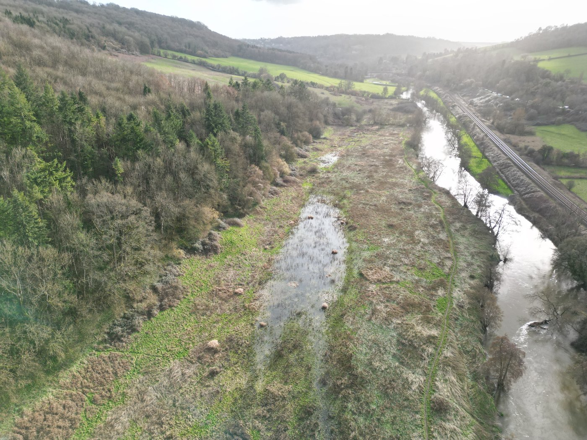
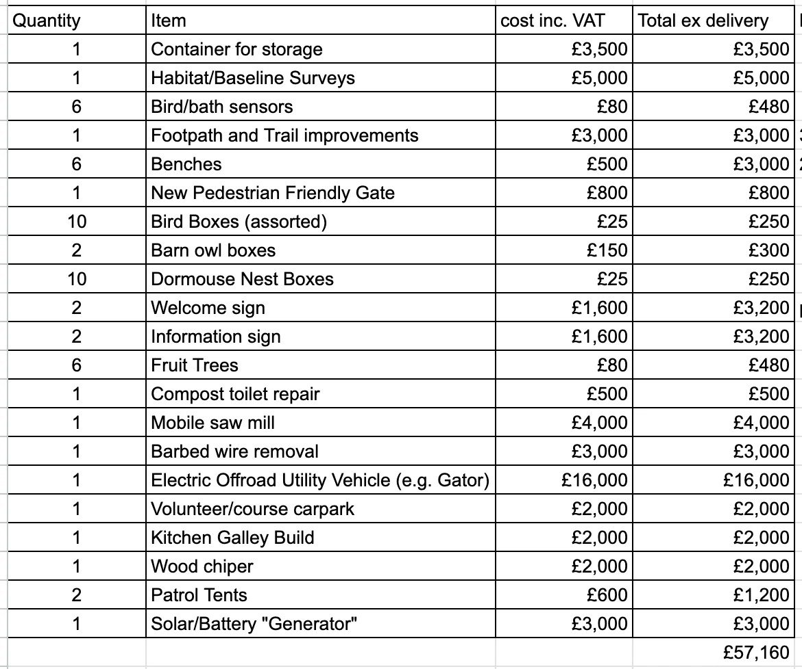
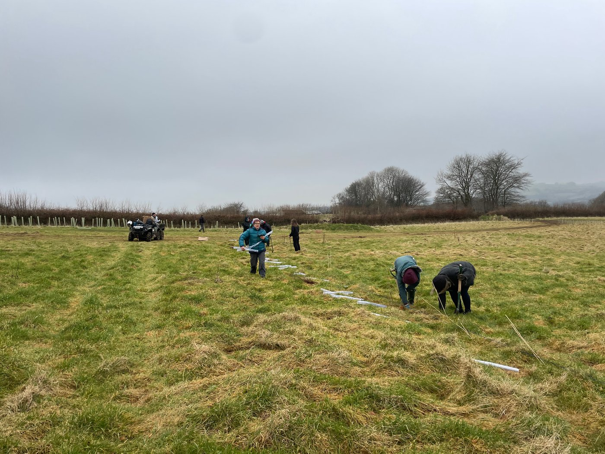
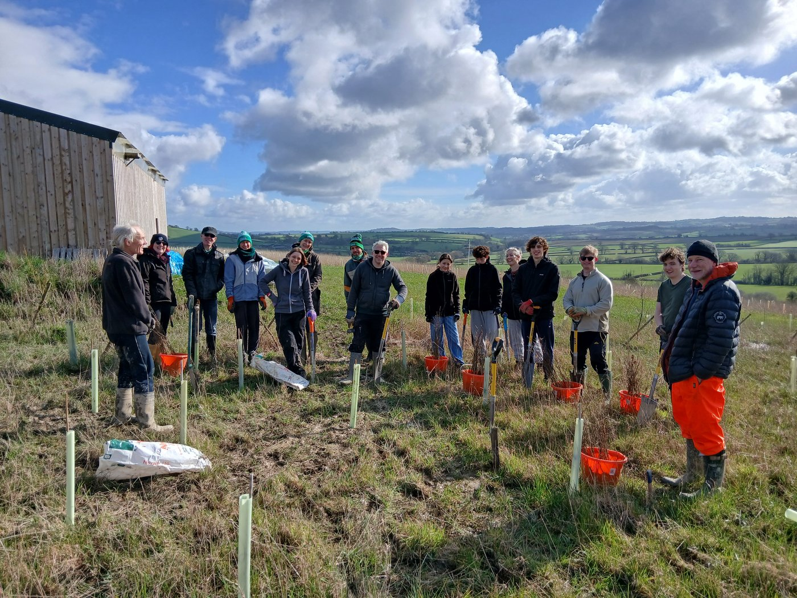
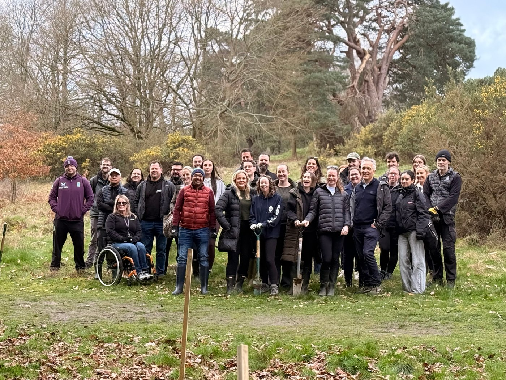
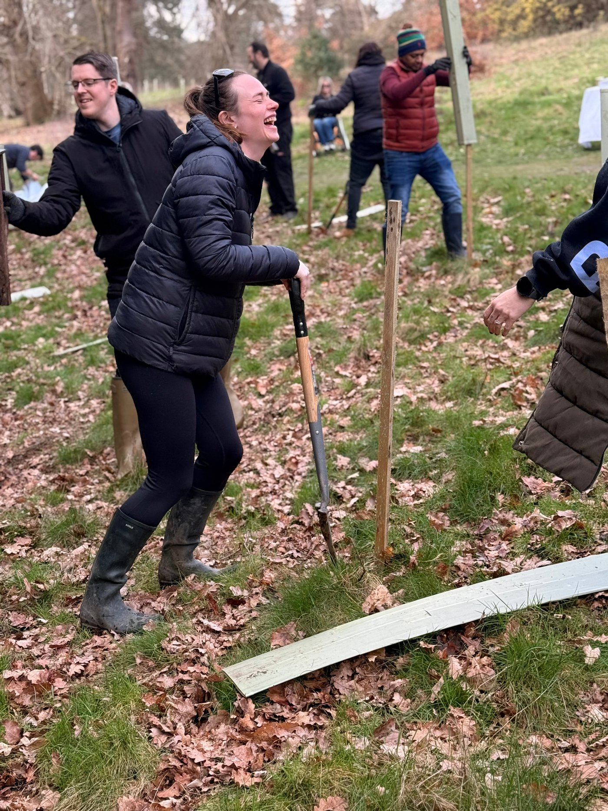

We have been very busy at our new Warleigh Nature Reserve with many enthusiastic volunteers from experts to complete beginners. All are very welcome.

We have begun developing the wetlands on the lower area nearer the River Avon. Simply by blocking some land drains on the site, ponds and streams are developing and toads are already moving in.

If you would like to receive the Warleigh Newsletter, or become a volunteer, you can sign up on the new Warleigh Nature Reserve website.

The developing wetlands

[Warleigh Nature Reserve website](https://warleighnaturereserve.org/)

Hazel requires careful management and coppicing has to be to be completed before the nesting season begins.

Lots of volunteers were keen to learn this ancient woodland management method and came along to help before the end of February.

Coppicing is a pruning method where a tree is cut to ground level, which encourages regeneration of new stems from the base and brings light into the woods. It will benefit our woodland, wildlife, and the environment.

Volunteers coppicing Hazel

The timber is being used to repair our compost toilet roof and floor, and soon work will begin on a kitchen galley so we can make tea, coffee, and even lunch for our hard working volunteers.

Below is our current wish list for Warleigh Nature Reserve

Unfortunately, as explained last month, we had to spend most of our reserves just purchasing the land itself.

Perhaps you could consider donating £25 for a dormouse nest box, £80 for a fruit tree or £500 for a bench, depending on your finances. Smaller donations will also help.

Aviva is currently matching donations up to £250.

[Donate to the Warleigh crowdfunder here.](https://www.crowdfunder.co.uk/p/warleigh-nature-reserve)

A new heritage information board for High Wood

On Saturday, 21st February, the President of the Federation of Old Cornwall Societies unveiled the new heritage information board at High Wood, Liskeard.

Local historians, Brian Oldham and Peter Murnaghan, both also pictured here, had previously asked us if they could erect an information board to explain the history of the Liskeard & Caradon Railway, and we were only too happy to oblige.

The railway line originally ran through High Wood on it’s way from the mines and quarries of Bodmin Moor to the port of Looe.

# See a close up of the information board below

[More information about the Liskeard and Caradon Railway](https://www.cornwallrailwaysociety.org.uk/liskeard-and-caradon.html)

# Other News

A New Wildlife Corridor and Woodland for a Stables in Devon

We planted a woodland and wildlife corridor at this stables before and we returned this month to plant another.

We had a good turn out of volunteers on Friday, but many of our Saturday volunteers failed to turn up. Despite that, the volunteers who did come, some at a few minutes notice in response to our urgent call for helpers, managed to complete over half of it.

We plan to complete it on 21st March so do come along if you live nearby.

[Sign up for South Molton here](https://www.protect.earth/events/wildlifecorridorsouthmolton-march-21-2026-5wzlt)

Tree Planting near Bristol

13 volunteers came to help us plant trees just south of Bristol at the end of February, and did a great job on a glorious day.

This is the second year of the landowner’s ambitious three-year plan to plant 26,000 trees to create a 34-acre woodland. We have helped a couple of times before and have two more dates this season on 21st and 28th March.

If you live in the Bristol area, come and volunteer to see the progress he has made so far.

[Sign up for the Bristol woodland event here](https://www.protect.earth/events)

Restocking a Woodland at a Hotel in Bagshot.

Acer came on a corporate volunteering day to help us restock a woodland which had suffered some losses during last year’s long, hot Summer.

It was another beautiful Spring day. Some of the staff at the Pennyhill Park Hotel also lent a hand and the hotel provided an excellent lunch for the volunteers.

Acer and hotel staff volunteers.

Photo: Pennyhill Park Hotel

# Volunteering opportunities

Photo: Pennyhill Park Hotel

Guildford, Surrey - Thursday, 19th March

South Molton, Devon - Saturday, 21st March

Malmesbury, Wiltshire - Tuesday, 24th March

Bristol Woodland, Saturday, 21st March and Saturday, 28th March

Pucklechurch, South Gloucestershire - Any Tuesday or Thursday in March

[Visit our events page for more information and to sign up](https://www.protect.earth/events)
