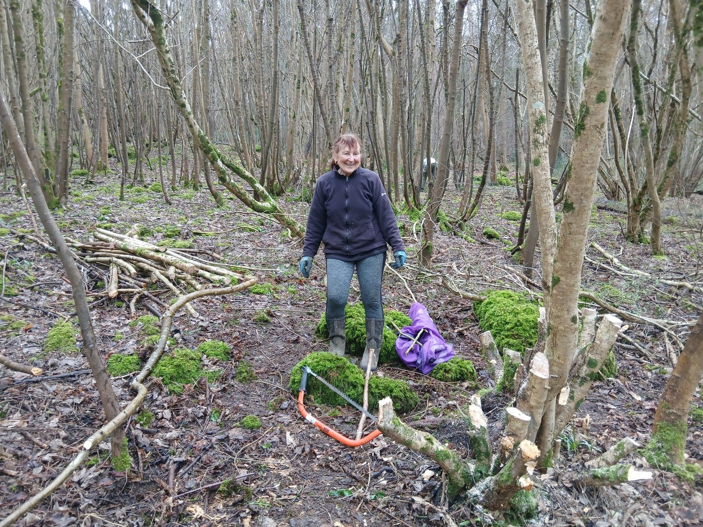
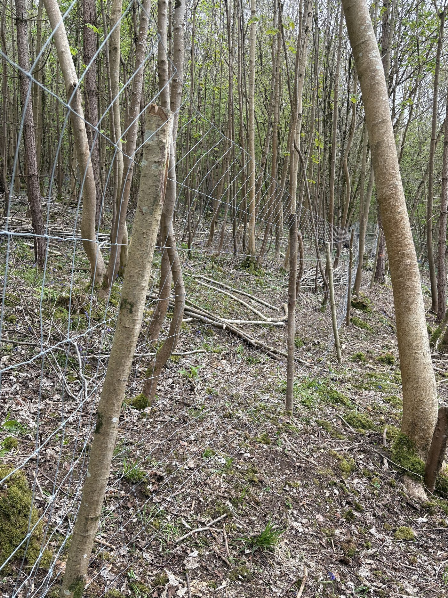
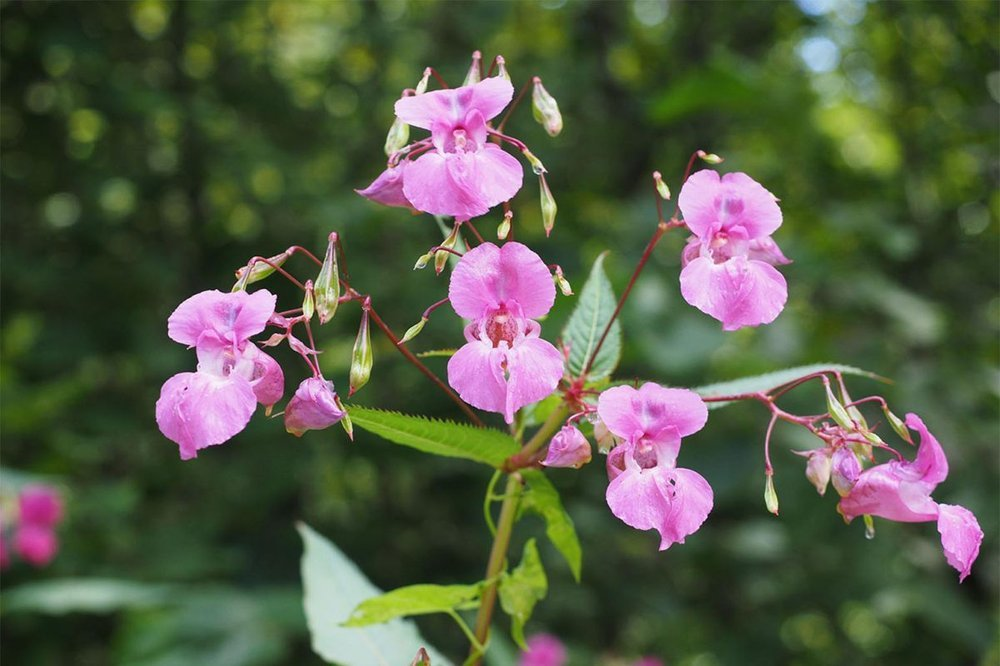
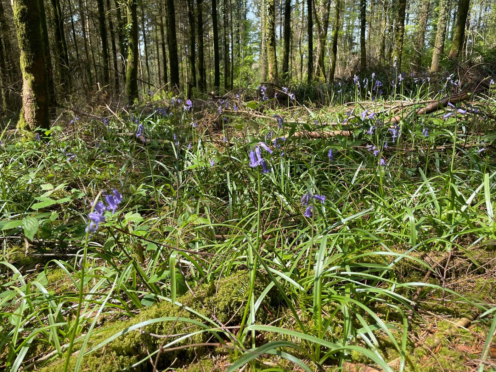
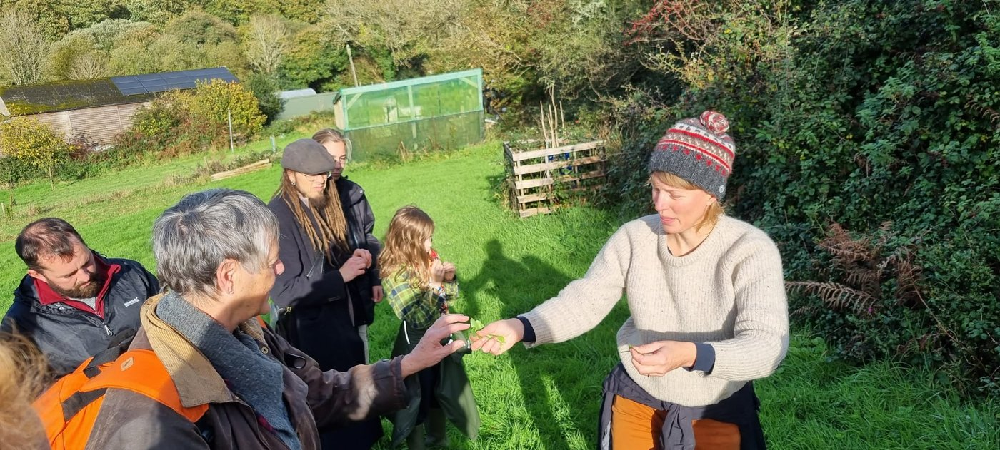

We have a new and updated website! It has taken a while but we are really pleased with the end result.

The entire website is easier to navigate. Information about all our sites should be easier to find and now include the results of our surveys so you can see how well they are doing. We aim to achieve 80% survival rate on trees at the end of the first five years, and we will restock sites that fall below this number.

It is also easier to contact us, to donate, and the most recent articles are shown on our home page.

Do have a look for yourself and see what you think. If you find any problems, please let us know.

# Articles

The Benefits of Coppicing for Biodiversity and Woodland Restoration.

Warleigh Nature Reserve has its very own hazel coppice. Cutting down trees may seem counterproductive, but this article explains the history of coppicing and how it can actually be beneficial to the environment.

If you would like to learn how to coppice - you can join a course at Warleigh, and at the same time help restore this ancient coppice to its full glory. You can sign up for updates about it here. The courses will start in September.

[Read an introduction to coppicing or sign up for courses here](https://protect.earth/articles/intro-to-coppicing/)

# Warleigh Nature Reserve Updates

This month we have finished the deer fencing which was needed to protect the new shoots sprouting from the recently coppiced hazel. We were even able to use some of the coppiced hazel as fence posts which is more natural and has the added benefit of saving money.

We were lucky enough to have trees donated to us by various local nurseries and these needed planting as a matter of urgency at the very end of the planting season. Our willing volunteers have helped us plant them and they have been well watered as the heavens opened just before (unfortunately) we had finished planting them. A majority were planted near the river or in the wetlands so the late planting shouldn’t be too much of a problem.

Deer fencing

The Himalayan Balsam has started growing several weeks earlier than usual this year and infests river bank and wetlands, as well as progressing it’s way through the scrubland towards higher ground. We have already begun to remove it by hand and with various tools but it will take some time, both this year and over the next few years, before we can clear it entirely.

Himalayan Balsam

So why all the fuss about Himalayan balsam? Well, it might look innocent enough with its pink flowers and tall stalks, but it spreads rapidly. Seeds float down the river and grow wherever they settle, causing problems for others. Worse, as an invasive species with no natural competitors, it outcompetes native plants and weakens riverbanks, contributing to erosion. Then, in the winter, it leaves the soil bare and ready to wash away.

# High Wood Updates

The bluebells at High Wood were beautiful as always.

Do you know the difference between these English bluebells and the very invasive Spanish bluebells which

can often be found in gardens? If they escape into the wild they can even mix with English bluebells to create an odd hybrid, so it is best to plant the English variety in your garden.

Bluebells at High Wood.

English bluebells have:

-   narrow leaves, about 1-1.5cm wide

-   deep violet-blue (sometimes white), narrow, tubular-bell flowers, with tips that curl back

-   flowers on one side of the stem

-   distinctly drooping stems

-   a sweet scent

-   cream-coloured pollen inside

Spanish bluebells have:

-   broad leaves, about 3cm wide

-   pale blue (often white or pink), conical-bell flowers, with spreading and open tips

-   flowers all around the stem

-   upright stems

-   no scent

-   blue- or pale green-coloured pollen inside

High Wood Summer Fair - 14th June 2026

Family days out can be expensive. At High Wood the following are all FREE:

-   visit the owls and polecat

-   Qigong lesson,

-   scavenger hunts,

-   play traditional games

-   colourings for younger children

-   guided history walk with local historian and author Iain Rowe

-   and more!

Paid activities include willow weaving, face painting, foraging walk, and food, craft and charity stalls.

[Learn more and get your free tickets here.](https://www.protect.earth/events/high-wood-summer-fair-14th-june-2026)

If you live in Cornwall and can help on the day, even if only for an hour or two, please get in touch with our events organiser on kathy@protect.earth

Try foraging in High Wood during a guided session with Nature, Art and Play. Gabrielle is an experienced forager and artist who runs foraging, art and nature workshops in mid-Cornwall. The course starts at the Protect Earth stand at High Wood from 13:30 to 15:00. Pre-book here or pay in cash on the day.

Cost: adults - £6.00, children - free.

[Book foraging walk here](https://nature-art-play.square.site/)
