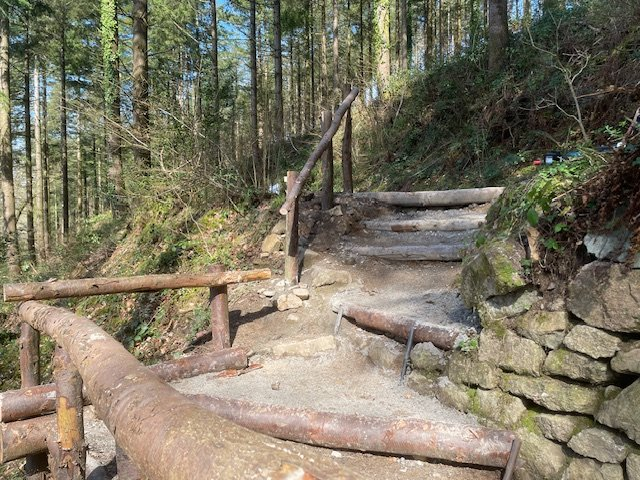
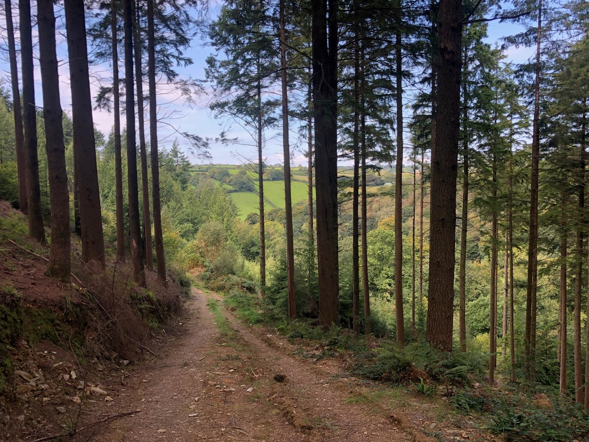
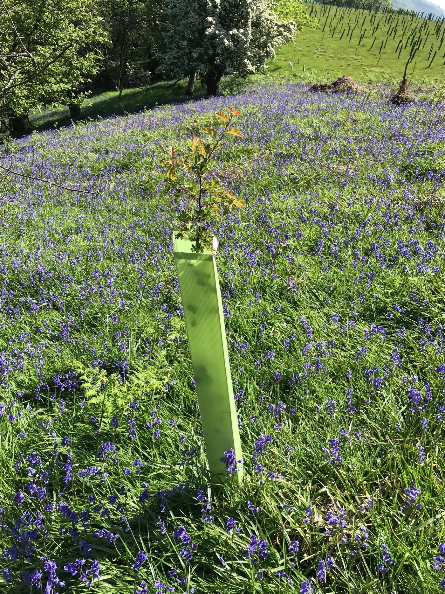
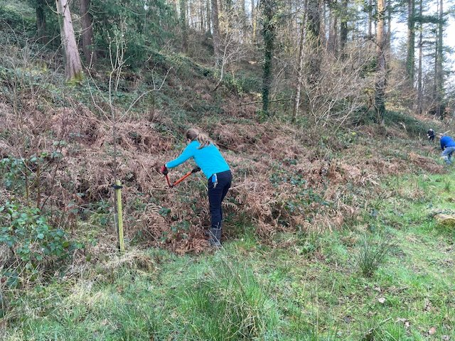
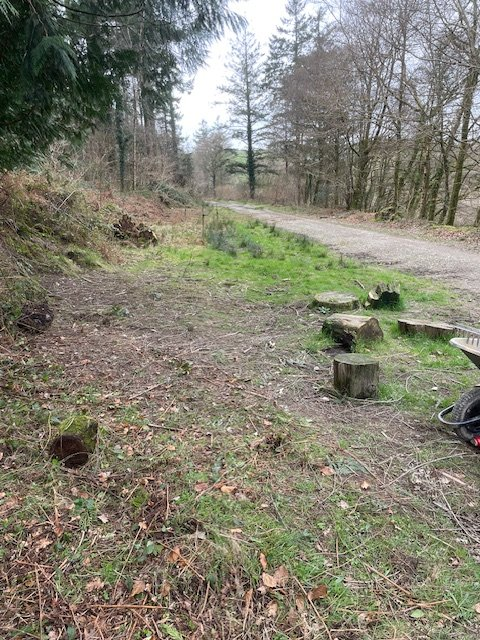
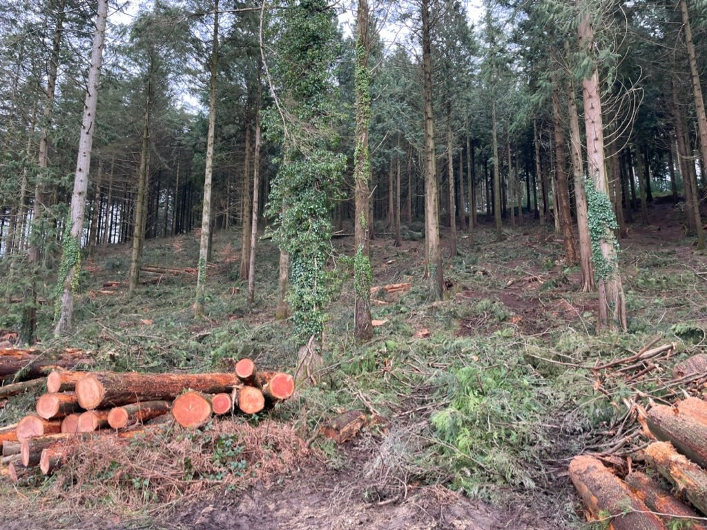
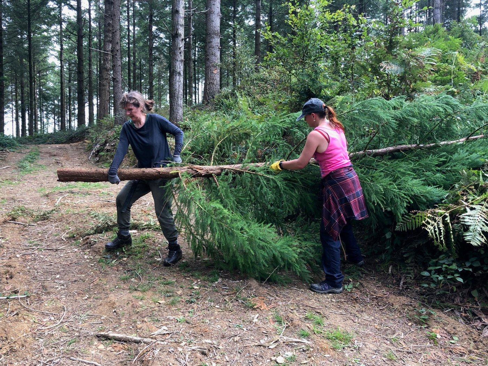

Welcome to our April newsletter. We have several items of good news to share.

A local lady donated thirty oak trees to High Wood which she had grown from acorns. Richard and David, our site managers, wasted no time in planting them, so look out for them next time you visit.

David and Richard have installed a new bench so that visitors can enjoy a rest while listening to the birds and enjoying the view.

Our new bench

Finally, Richard and David have erected a handrail for the new steps at the Looe Mills entrance to High Wood. Originally, there was a very tricky scramble up the bank to get into High Wood and onto the main track. Our work party helped to dig out a slope, and the steps themselves were finished last month.

The steps from the bottom

and looking down

# High Wood Three Years Ago

As we have had quite a few new friends and supporters join us recently, it seems a good time to have a quick look back in time. You can visit our website and watch the video to see what High Wood looked like in 2023. Old friends might like to spot the changes we have already made.

Protect Earth bought High Wood in 2022 to restore it back to the temperate rainforest it had been before the commercial conifer plantation took over in the 1960s.

High Wood has a long history, with the old Caradon Mining Railway running through the middle of the land. Look out for the new heritage board unveiled last month for more information.

Dog walkers and horse riders love it, there are mountain bike trails, and there is huge potential here for restoring the woodland to its former glory.

[Read more and watch the video here](https://www.protect.earth/projects/high-wood)

# High Wood Summer Fair 2026

The above poster was designed by Becky, one of our High Wood volunteers. A very big thank you to her.

We still have room for a few more stalls. If you would like to have one, or know someone who would, please contact me on kathy@protect.earth Stalls are free but we would appreciate a donation if you have a good day. You would need to bring your own table etc. We do not expect a donation from charity stalls.

Ideas for fundraising activities would also be appreciated, especially if you are able to run it for at least part of the day. We have two tombola (one for adults and one for children) and a ‘Guess the Name of the Soft Toy’ so far.

We would also be glad of help advertising the fair either by putting up a poster in your local shop, school, church, etc. or if you have contacts with local newsletters. An advert is already going in St. Ive parish magazine.

Finally, if you are able to help put up signs and bunting on Saturday or help on the day by relieving a Protect Earth member on a stall for an hour, acting as a greeter and giving out programmes on the gate, helping with Blue Badge parking, or clearing up at the end please email Kathy as above.

[More information about the Summer Fair here](https://www.protect.earth/events/high-wood-summer-fair-14th-june-2026)

# You may also be interested in…

Did you know that you can sponsor a tree with Protect Earth from as little as £5?

In return you will receive a certificate with a What3Words location so you know exactly where your tree has been planted. Currently we are planting them at our nature reserve at Warleigh, near Bath.

Custom certificates are also available at no extra cost. These make ideal gifts to celebrate a birth, wedding or anniversary, or as a memorial for a loved one. Simply email help@protect.earth after purchase to agree the wording.

[Visit our shop here](https://shop.protect.earth/)

# Work Parties

### March Work Party

Thank you to Matthew and Suzy, two new volunteers, who helped to clear the brambles around the picnic table in time for the better weather. See before and after pictures below. I think you will agree that they did a great job.

### April work party

The next work party will be on Saturday, 18th April starting at 10am. We will be cutting back and clearing the edges of the main tracks ready for strimming, as everything is starting to grow again now that the weather is getting warmer. We need to keep this area under control so that there is plenty of room for the stalls at the Summer Fair.

Knowing how many people are coming helps us to plan tasks and ensure that we have sufficient tools for everyone. Please let us know you are coming, either via the task force WhatsApp group (see below to join), or email kathy@protect.earth - whichever you prefer.

_Details of how to find us and what to bring can be found at the bottom of this email. New members including complete beginners are very welcome. Tools are provided._

## WhatsApp High Wood Task Force

To join the WhatsApp Task Force, use this link

[https://chat.whatsapp.com/I1NRH6TQnujABCSKNaoQAE?mode=gi\_t](https://chat.whatsapp.com/I1NRH6TQnujABCSKNaoQAE?mode=gi_t)

or the QR Code shown in this email.

Here you can let us know if you plan to come and help this month.

_If you don’t want to be part of the WhatsApp group please email kathy@protect.earth to let us know when you are coming to a work party session._

## Help make High Wood even better!

[Donate here towards the restoration of High Wood](https://www.protect.earth/high-wood)

Any money donated through this link will only be used for the benefit of High Wood.

# Photos of High Wood

Removing large conifers in 2023 to let more daylight down to the woodland floor to increase biodiversity.

Some of our work party members removing

smaller conifers in September 2023.

_If you visit High Wood and you have photos you would like to share, please send them to kathy@protect.earth and we will put them in a future newsletter. Plants, wildlife, views or photos of yourself enjoying High Wood are all welcome._

# Volunteering & coming to events

## Dates of Work Parties for 2026

Saturday, 18th April

-   Sunday, 17th May

-   Saturday, 20th June

-   Sunday, 19th July

-   Saturday, 15th August

-   Sunday, 20th September

-   Saturday, 17th October

-   Sunday, 15th November

-   Saturday, 12th December (2nd weekend)

## Finding us

PARKING:

Looe Mills entrance

[https://w3w.co/louder.reactions.unites](https://w3w.co/louder.reactions.unites)

50.456595, -4.491764

[https://maps.app.goo.gl/1WSBUGtmkRR3Dv959](https://maps.app.goo.gl/1WSBUGtmkRR3Dv959)

We meet here by the container near the Looe Mills entrance:

What3words/coordinates link [https://w3w.co/busy.chosen.reseller](https://w3w.co/busy.chosen.reseller)

Coordinates 50.458913, -4.491077

[Google maps https://maps.app.goo.gl/eMcRz3vHLpQq2kg5A](https://maps.app.goo.gl/eMcRz3vHLpQq2kg5A)

Walk past a house called The Bungalow and then turn right up the steps. At the top turn right again.

## More information

We start at 10 am and finish around 4pm depending on what we are doing. You can come for half a day or stay all day, whatever suits you. We want you to enjoy volunteering with us, so remember to take a break when you feel tired, drink plenty of liquids and don’t feel guilty about going home when you have had enough.

We’ll provide equipment, tea, coffee and biscuits but please bring the following:

-   Gardening gloves - the sturdier the better (We have a few pairs you can borrow)

-   Sturdy footwear - preferably boots or wellies

-   Weather appropriate clothing – layers and long sleeves are best, waterproof clothing, a hat. (Jeans/cotton clothing are best avoided if it is likely to rain as they take ages to dry out.)

-   A packed lunch if you plan to stay all day, and water in a refillable water bottle

-   Hand sanitiser

-   Sunblock if likely to be a sunny day – (it is possible to burn when working outside all day, even in winter)

-   Insect repellent in summer as ticks can be around in the woods during the warmer months.

Health and Safety

-   Do not come if you feel unwell, especially if you are likely to be contagious.

-   You are reminded to take breaks as and when you need to, and stop when you have had enough.

-   Maintain a comfortable temperature and bring waterproof clothing.

-   Drink water regularly in addition to tea and coffee to keep hydrated.

-   Take care when using tools, keep them below shoulder level where possible and place them where other people will not trip over them.

-   Ask another volunteer to help rather than lifting heavy items by yourself.

-   Protect your face and eyes from branches, etc.
