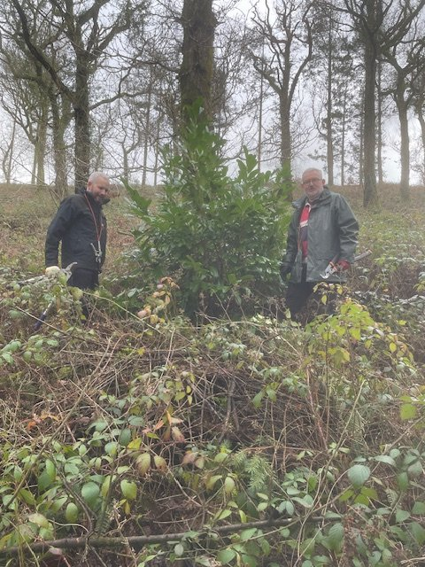
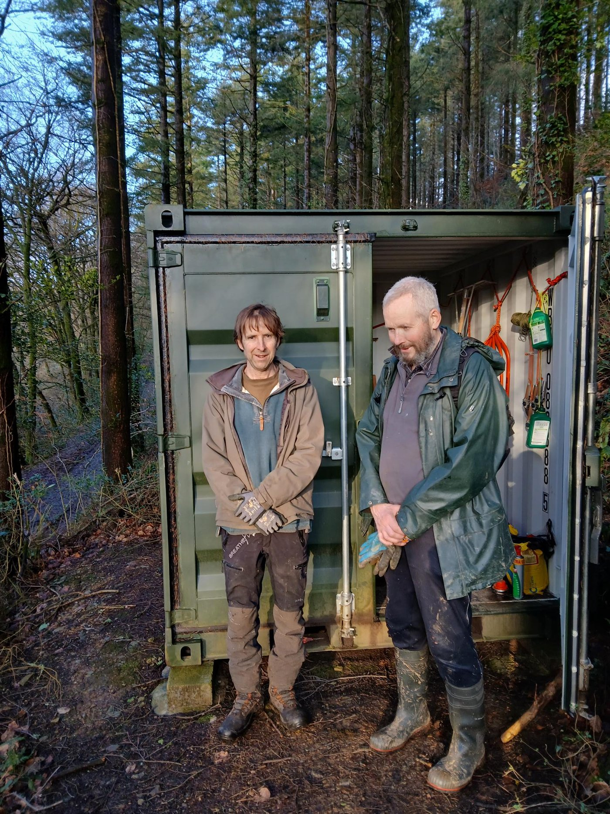
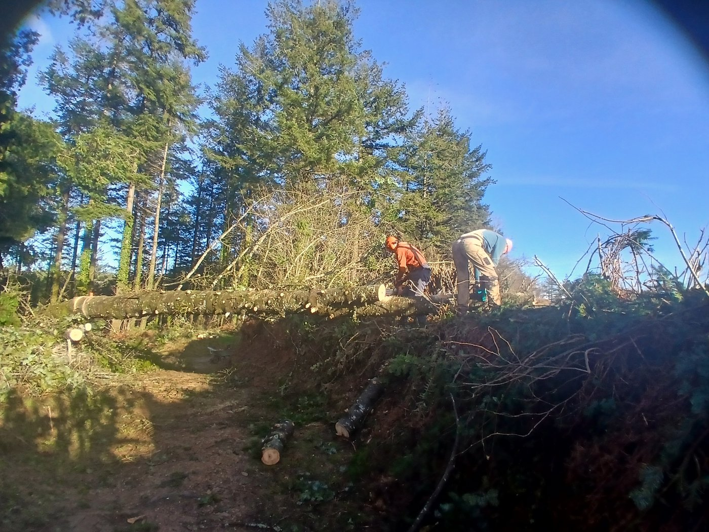
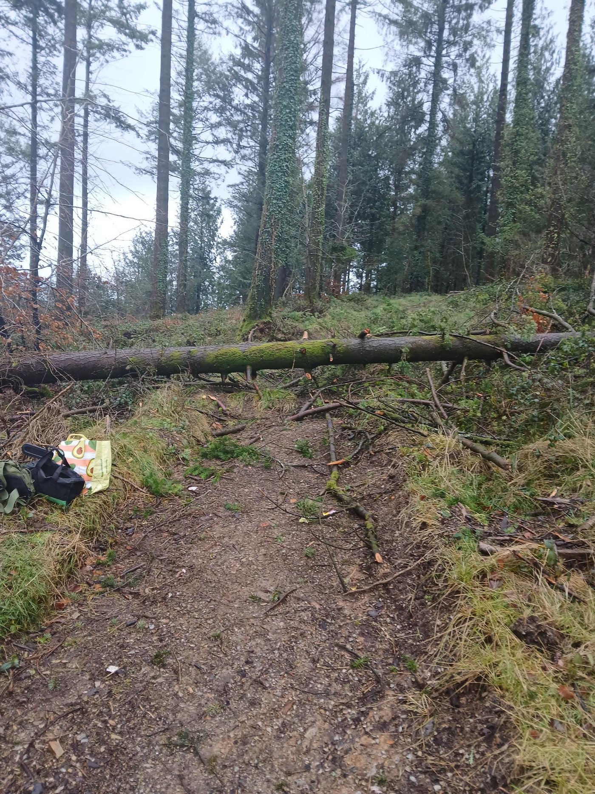
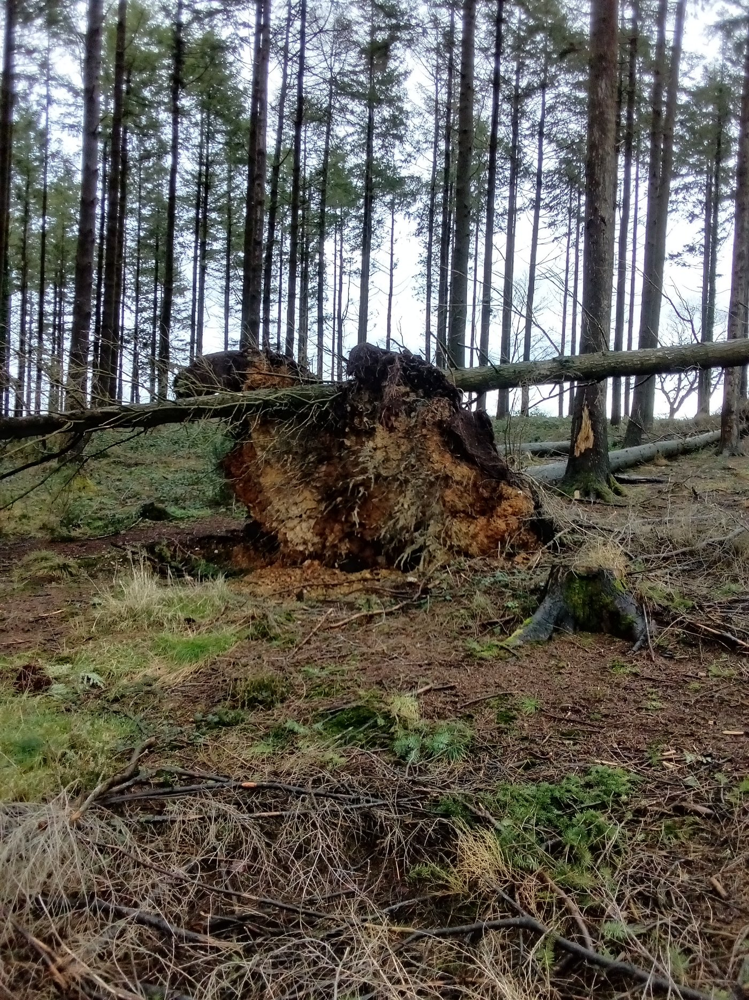
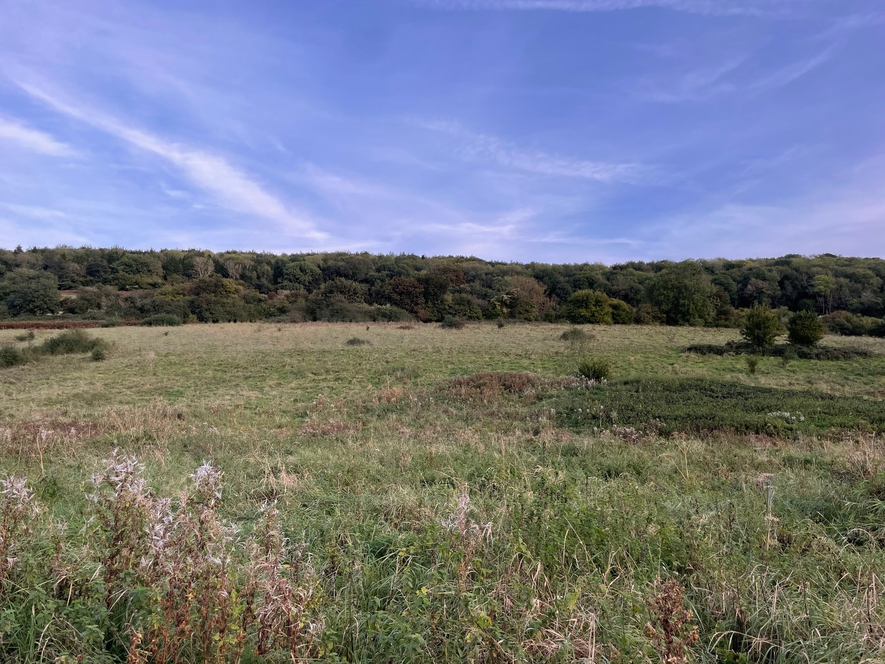

Welcome to David (left) and Richard (right) who are our new temporary site managers at High Wood, They are pictured here preparing to remove an invasive laurel bush this week.

Some of you will already know them as regular members of the High Wood work party.

They have been working with Ian to get to know the job a little better. Do look out for them when you visit High Wood and say hello.

# Work Parties

### February Work Party

Our next work party is on Saturday, 21st February from 10am when

the main task will be drainage ditch clearance and associated path clearing. Depending on time and volunteer numbers we may also continue to clear more conifers before nesting season begins.

Details of how to find us and what to bring can be found at the bottom of this email. We provide all the tools. New members are very welcome.

The following work party will be on Sunday, 22nd March which is the 4th weekend to avoid Mothering Sunday the week before.

## WhatsApp High Wood

## Task Force

It can be difficult to make plans when we aren’t sure how many people are coming. If you enjoy coming to work party sessions you might like to join the WhatsApp High Wood Task Force group.

Here you can talk to each other, make suggestions, and let us know if you plan to come and help this month. The normal newsletter will continue for everyone as before.

To join the WhatsApp Task Force, use this link

[https://chat.whatsapp.com/I1NRH6TQnujABCSKNaoQAE?mode=gi\_t](https://chat.whatsapp.com/I1NRH6TQnujABCSKNaoQAE?mode=gi_t)

or the QR Code shown in this email.

_If you don’t want to be part of the WhatsApp group please email kathy@protect.earth to let us know when you are coming to a work session._

### January work party

After Storm Goretti there was a lot of tidying up to do.

David and Kevin both came and helped Ian to clean up all the fallen branches around the full perimeter of the woodland. Then they went into the three fields and cleared all the fallen branches there. It was a long day but they got it all finished before it got dark.

Storm Chandra followed close behind Goretti, with quite a few more conifers falling.

Ian was out clearing them as soon as the weather improved.

There have been a lot of storms recently. Do take care entering any woodland immediately after a storm. It’s best to wait a few days for owners to make sure there are no more trees or loose branches about to come crashing down.

# Photos of High Wood

Some of the storm damage at High Wood, taken after the January storms.

If you visit High Wood and you have photos you would like to share, please send them to kathy@protect.earth with the date you took them and we will put them in a future newsletter.

[Donate here towards improvements at High Wood](https://www.protect.earth/high-wood)

Any money donated through this link will only be used for High Wood

and not for any of our other projects.

# You may also be interested in…

Thanks to generous donations, Protect Earth has just purchased 81 acres of land on the outskirts of Bath which we are renaming Warleigh Nature Reserve. The land has been neglected for some years. The River Avon runs through the land and is prone to flooding, especially further downstream.

We will be developing a mix of woodland, wetlands and grassland to increase biodiversity.

We are currently developing a new website, [Warleigh Nature Reserve](https://warleighnaturereserve.org/) which has more information.

# Volunteering & coming to events

## Dates of Work Parties for 2026

-   Saturday, 21st February

-   Sunday, 22nd March (4th Sunday)

-   Saturday, 18th April

-   Sunday, 17th May

-   Saturday, 20th June

-   Sunday, 19th July

-   Saturday, 15th August

-   Sunday, 20th September

-   Saturday, 17th October

-   Sunday, 15th November

-   Saturday, 12th December (2nd weekend)

## Finding us

PARKING:

Looe Mills entrance

[https://w3w.co/louder.reactions.unites](https://w3w.co/louder.reactions.unites)

50.456595, -4.491764

[https://maps.app.goo.gl/1WSBUGtmkRR3Dv959](https://maps.app.goo.gl/1WSBUGtmkRR3Dv959)

We meet here by the container near the Looe Mills entrance:

What3words/coordinates link [https://w3w.co/busy.chosen.reseller](https://w3w.co/busy.chosen.reseller)

Coordinates 50.458913, -4.491077

Google maps [https://maps.app.goo.gl/eMcRz3vHLpQq2kg5A](https://maps.app.goo.gl/eMcRz3vHLpQq2kg5A)

## More information

Thank you for volunteering here at High Wood, we really value your help.

We start at 10 am and finish around 4pm depending on what we are doing. You can come for a couple of hours or stay all day, whatever suits you. We want you to enjoy volunteering with us, so remember to take a break when you feel tired, drink plenty of liquids and don’t feel guilty about going home when you have had enough.

We’ll provide equipment, tea, coffee and biscuits but please bring the following:

-   Gardening gloves - the sturdier the better (We have a few pairs you can borrow)

-   Sturdy footwear - preferably boots or wellies

-   Weather appropriate clothing – layers and long sleeves are best, waterproof clothing, a hat. (Jeans/cotton clothing are best avoided if it is likely to rain as they take ages to dry out.)

-   A packed lunch if you plan to stay all day, and water in a refillable water bottle

-   Hand sanitiser

-   Sunblock if likely to be a sunny day – (it is possible to burn when working outside all day, even in winter)

-   Insect repellent in summer as ticks can be around in the woods during the warmer months.

Health and Safety

-   Do not come if you feel unwell, especially if you are likely to be contagious.

-   You are reminded to take breaks as and when you need to, and stop when you have had enough.

-   Maintain a comfortable temperature and bring waterproof clothing.

-   Drink water regularly in addition to tea and coffee to keep hydrated.

-   Take care when using tools, keep them below shoulder level where possible and place them where other people will not trip over them.

-   Ask another volunteer to help rather than lifting heavy items by yourself.

-   Protect your face and eyes from branches, etc.

# What are we doing elsewhere in the UK?

If you would like to know more about our work across the rest of the UK, sign up for our national monthly newsletter at the bottom of our events page.

We never share your contact details with anyone else and you can unsubscribe at any time.

[Sign up for our national monthly newsletter here](https://www.protect.earth/events)
