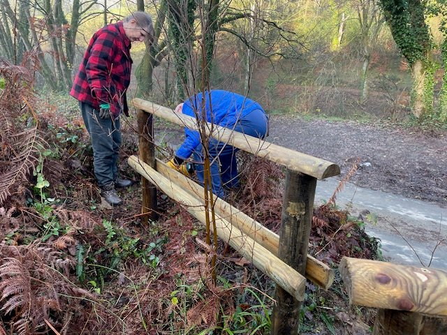
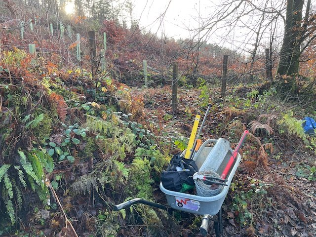
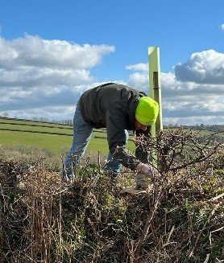
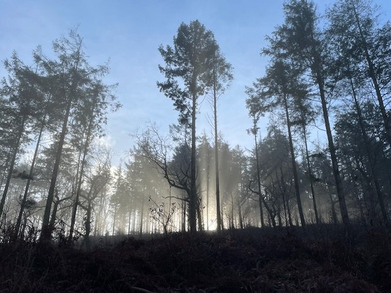
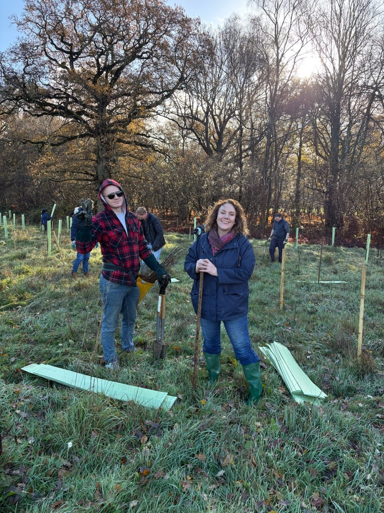

We hope that you all had a good Christmas and New Year break.

This is a photo the Tap House Community Centre sent us of the quirky Christmas tree we donated to them from High Wood.

We also donated trees to Hugs Horse Rescue Centre and Liskerrett Community Centre, who both supported us at our Summer Fair this year.

# Work Parties

### January Work Party

Our next work party is on Sunday, 18th January from 10am when we hope to

clear the area east of the picnic bench by cutting all the brambles back to the original wall. Please remember to bring gloves for this.

The following work party will be on Saturday, 21st February.

You can find the other dates for 2026 work parties below. Please note that the March work party is on the 4th weekend of the month to avoid Mothering Sunday and the December one is the 2nd weekend to avoid the busy weekend before Christmas.

### December work party

A big thank you to David, Richard and Julia for turning up on a very cold morning to build some new zig-zag fencing opposite the small layby just down the road from the East gate.

A little further along, the original fence post and barbed wire had rotted and fallen down so these have now be replaced with new posts and wire.

[Donate here towards improvements at High Wood](https://www.protect.earth/high-wood)

Any money donated through this link will only be used for High Wood

and not for any of our other projects.

# You may also be interested in…

The St Cleer Environmental Group are working with the parish’s farmers to plant new hedgerow trees to reduce the impact of ash die back disease which is thought could kill up to 80% of our native ash.

For the next few winters they hope to be able to work on as many of the parish’s farms as possible, planting 25 trees on each and are looking for volunteers. Planting on each farm should take about 3 hours.

If you think you would be able to help please contact Chris Ullman on [chrisullman297@gmail.com](mailto:chrisullman297@gmail.com) who will be able to tell you the dates when they need volunteers. Most are Saturdays.

# Photos of High Wood

A beautiful, atmospheric photograph of High Wood on a cold December day, taken by Ian.

# Volunteering & coming to events

## Dates of Work Parties for 2026

-   Sunday, 18th January

-   Saturday, 21st February

-   Sunday, 22nd March (4th Sunday)

-   Saturday, 18th April

-   Sunday, 17th May

-   Saturday, 20th June

-   Sunday, 19th July

-   Saturday, 15th August

-   Sunday, 20th September

-   Saturday, 17th October

-   Sunday, 15th November

-   Saturday, 12th December (2nd weekend)

## Finding us

PARKING:

Looe Mills entrance

[https://w3w.co/louder.reactions.unites](https://w3w.co/louder.reactions.unites)

50.456595, -4.491764

[https://maps.app.goo.gl/1WSBUGtmkRR3Dv959](https://maps.app.goo.gl/1WSBUGtmkRR3Dv959)

We meet here by the container near the Looe Mills entrance:

What3words/coordinates link [https://w3w.co/busy.chosen.reseller](https://w3w.co/busy.chosen.reseller)

Coordinates 50.458913, -4.491077

Google maps [https://maps.app.goo.gl/eMcRz3vHLpQq2kg5A](https://maps.app.goo.gl/eMcRz3vHLpQq2kg5A)

## More information

Thank you for volunteering here at High Wood, we really value your help.

We start at 10 am and finish around 4pm depending on what we are doing. You can come for a couple of hours or stay all day, whatever suits you. We want you to enjoy volunteering with us, so remember to take a break when you feel tired, drink plenty of liquids and don’t feel guilty about going home when you have had enough.

We’ll provide equipment, tea, coffee and biscuits but please bring the following:

-   Gardening gloves - the sturdier the better (We have a few pairs you can borrow)

-   Sturdy footwear - preferably boots or wellies

-   Weather appropriate clothing – layers and long sleeves are best, waterproof clothing, a hat. (Jeans/cotton clothing are best avoided if it is likely to rain as they take ages to dry out.)

-   A packed lunch if you plan to stay all day, and water in a refillable water bottle

-   Hand sanitiser

-   Sunblock if likely to be a sunny day – (it is possible to burn when working outside all day, even in winter)

-   Insect repellent as ticks can be around in the woods during the warmer months.

Health and Safety

-   Do not come if you feel unwell, especially if you are likely to be contagious.

-   You are reminded to take breaks as and when you need to, and stop when you have had enough.

-   Maintain a comfortable temperature and bring waterproof clothing.

-   Drink water regularly in addition to tea and coffee to keep hydrated.

-   Take care when using tools, keep them below shoulder level where possible and place them where other people will not trip over them.

-   Ask another volunteer to help rather than lifting heavy items by yourself.

-   Protect your face and eyes from branches, etc.

# What are we doing elsewhere in the UK?

If you would like to know more about our work across the rest of the UK, sign up for our national monthly newsletter at the bottom of our events page.

We never share your contact details with anyone else and you can unsubscribe at any time.

[Sign up for our national monthly newsletter here](https://www.protect.earth/events)
