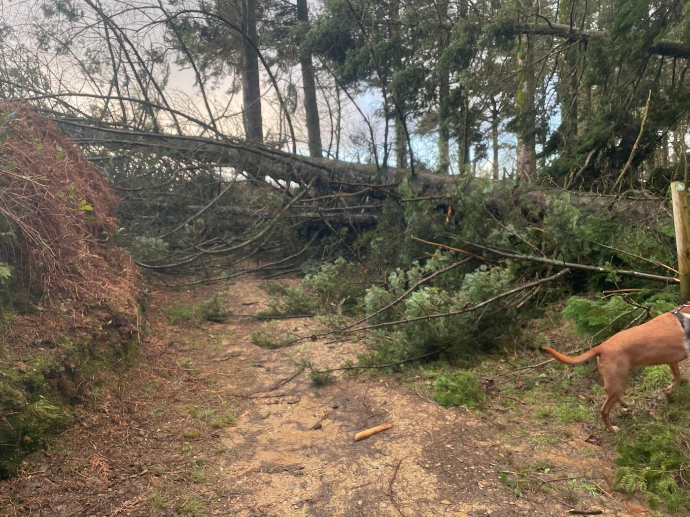
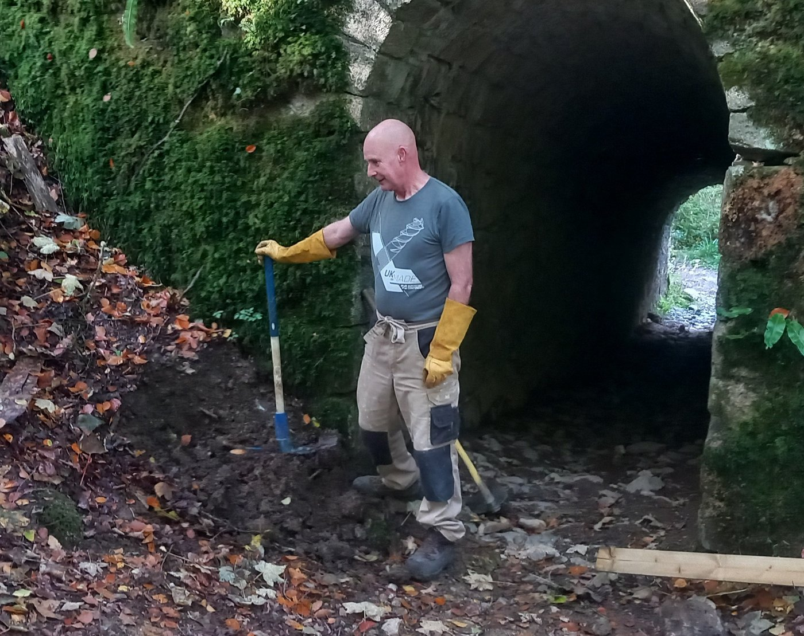

### January Work Party - Sunday, 18th January

I’m sure all of you remember Storm Goretti blowing through Cornwall last week. High Wood was affected, although not as badly as some places. Our oaks are still standing but we lost some conifers, one falling across the path as you can see from the photograph below, taken by Gareth Price.

This means that there will be a lot of extra work to do to rectifying the damage so we are postponing our previous plans for this Sunday, 18th January. We would really appreciate 'all hands on deck’ to help tidy up so if you can come on Sunday to lend a hand, even if you can only stay for a couple of hours or so, we would be very grateful.

If you are not a regular helper, please look below for all the details oh how to volunteer at High Wood.

This will also be Ian’s last work party as site manager as he will be leaving us at the end of this month.

Ian has been extremely supportive in the time he has been with us, going above and beyond what his job entails. We shall miss him enormously.

We are looking for a qualified first aider for this Sunday please.

If you can help, please email kathy@protect.earth as soon as possible.

# Photos of High Wood

Apologies:

This beautiful, atmospheric photograph of High Wood was actually taken by Richard Morton, one of our work party members. Sorry Richard.

## Finding us

PARKING:

Looe Mills entrance

[https://w3w.co/louder.reactions.unites](https://w3w.co/louder.reactions.unites)

50.456595, -4.491764

[https://maps.app.goo.gl/1WSBUGtmkRR3Dv959](https://maps.app.goo.gl/1WSBUGtmkRR3Dv959)

We meet here by the container near the Looe Mills entrance:

What3words/coordinates link [https://w3w.co/busy.chosen.reseller](https://w3w.co/busy.chosen.reseller)

Coordinates 50.458913, -4.491077

Google maps [https://maps.app.goo.gl/eMcRz3vHLpQq2kg5A](https://maps.app.goo.gl/eMcRz3vHLpQq2kg5A)

## More information

Thank you for volunteering here at High Wood, we really value your help.

We start at 10 am and finish around 4pm depending on what we are doing. You can come for a couple of hours or stay all day, whatever suits you. We want you to enjoy volunteering with us, so remember to take a break when you feel tired, drink plenty of liquids and don’t feel guilty about going home when you have had enough.

We’ll provide equipment, tea, coffee and biscuits but please bring the following:

-   Gardening gloves - the sturdier the better (We have a few pairs you can borrow)

-   Sturdy footwear - preferably boots or wellies

-   Weather appropriate clothing – layers and long sleeves are best, waterproof clothing, a hat. (Jeans/cotton clothing are best avoided if it is likely to rain as they take ages to dry out.)

-   A packed lunch if you plan to stay all day, and water in a refillable water bottle

-   Hand sanitiser

-   Sunblock if likely to be a sunny day – (it is possible to burn when working outside all day, even in winter)

-   Insect repellent as ticks can be around in the woods during the warmer months.

Health and Safety

-   Do not come if you feel unwell, especially if you are likely to be contagious.

-   You are reminded to take breaks as and when you need to, and stop when you have had enough.

-   Maintain a comfortable temperature and bring waterproof clothing.

-   Drink water regularly in addition to tea and coffee to keep hydrated.

-   Take care when using tools, keep them below shoulder level where possible and place them where other people will not trip over them.

-   Ask another volunteer to help rather than lifting heavy items by yourself.

-   Protect your face and eyes from branches, etc.

## Dates of Work Parties for 2026

-   Sunday, 18th January

-   Saturday, 21st February

-   Sunday, 22nd March (4th Sunday)

-   Saturday, 18th April

-   Sunday, 17th May

-   Saturday, 20th June

-   Sunday, 19th July

-   Saturday, 15th August

-   Sunday, 20th September

-   Saturday, 17th October

-   Sunday, 15th November

-   Saturday, 12th December (2nd weekend)
