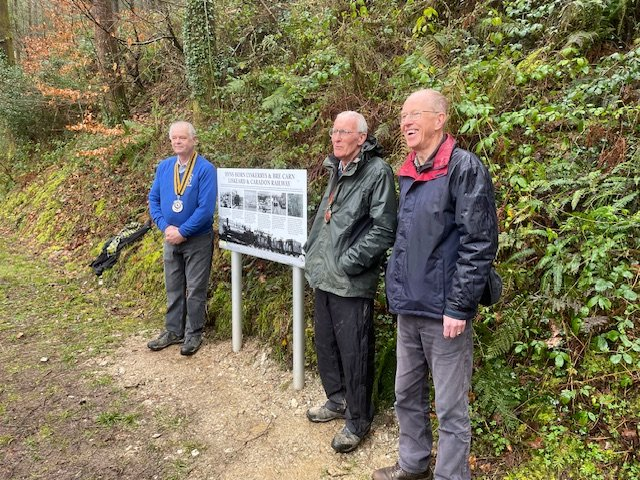
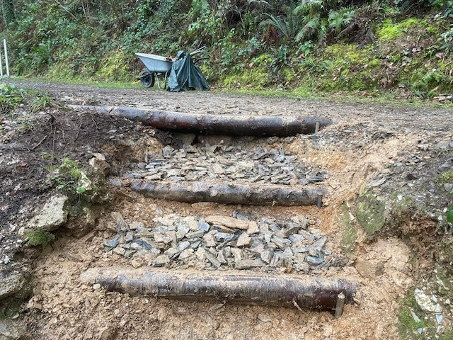
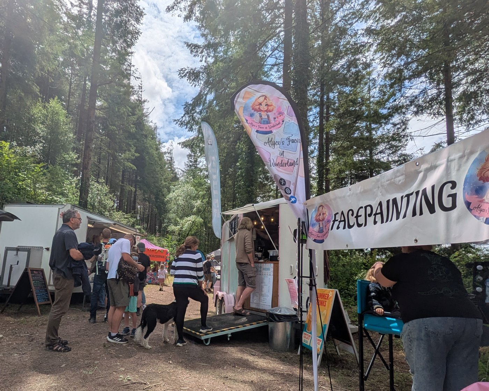
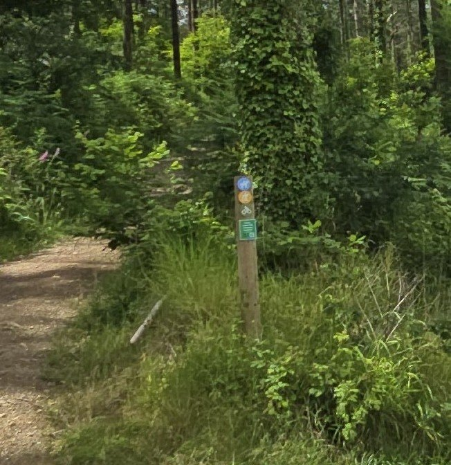
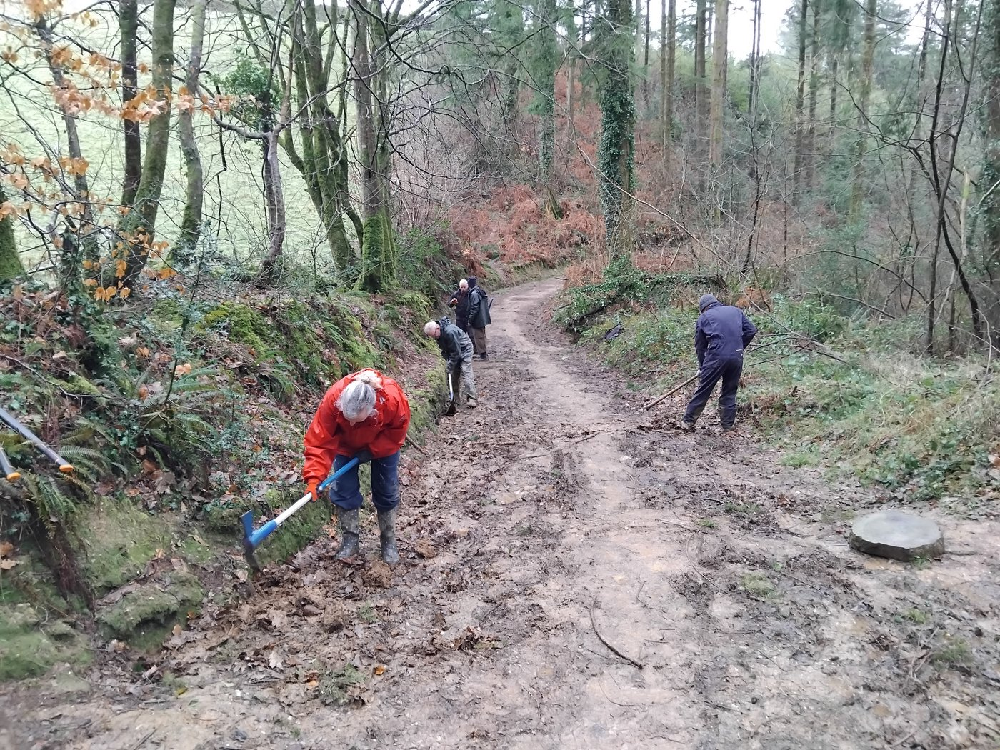
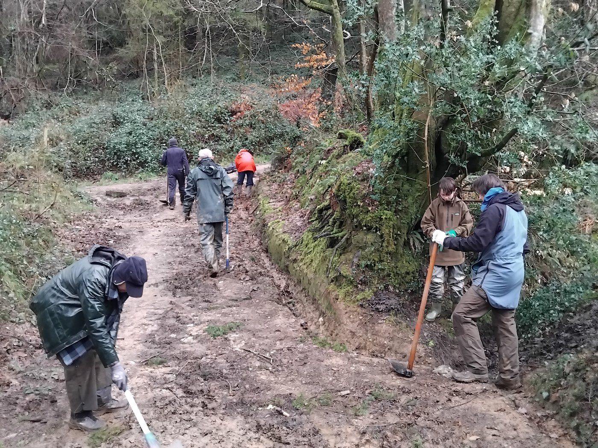
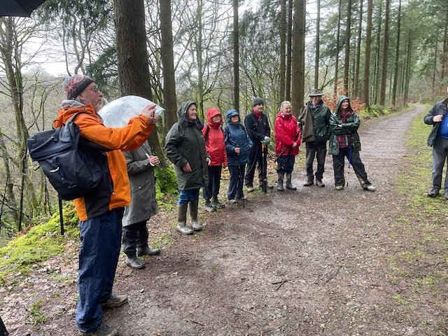
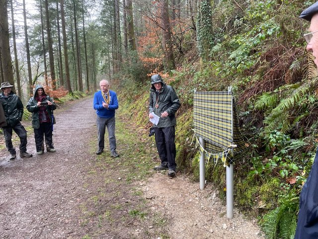
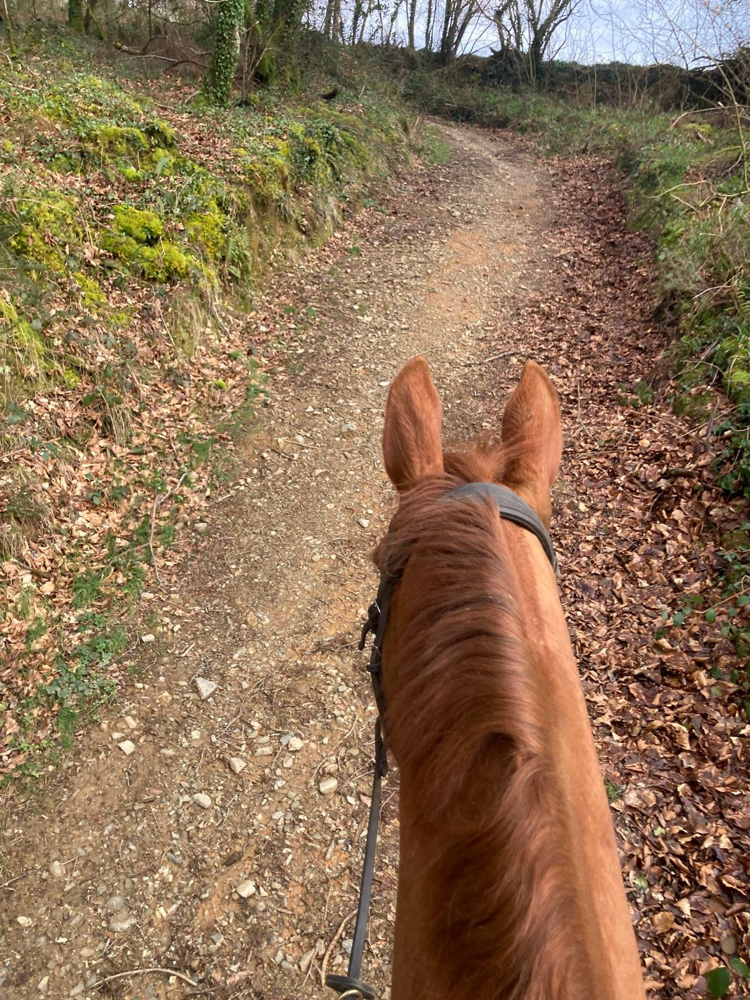
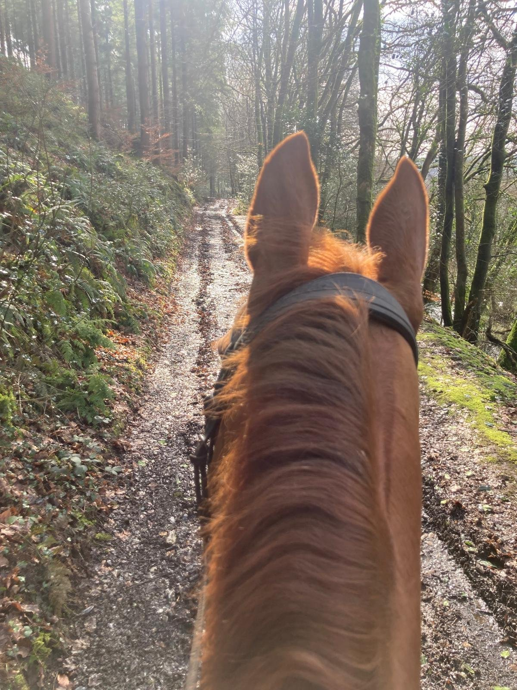

On Saturday, 21st February, the President of the Federation of Old Cornwall Societies unveiled the new heritage information board at High Wood.

Local historians, Brian Oldham and Peter Murnaghan, both also pictured here, had previously asked us if they could erect an information board to explain the history of the Liskeard & Caradon Railway, and we were only too happy to oblige.

The railway line originally ran through High Wood on it’s way from the mines and quarries of Bodmin Moor to the port of Looe.

[Learn more about the Liskeard and Caradon Railway here](https://www.cornwallrailwaysociety.org.uk/liskeard-and-caradon.html)

# Close up of the Heritage information Board below

Steps

Richard and David have worked really hard to complete the steps on the slope up to the main track.

One horse rider tells us that her horse loves the steps, so others should have no difficulty using them either.

A date for your diary

This year’s Summer Fair will be on 14th June from 11:00 to 16:00 and is planned to be bigger and better than ever. More details to follow.

### We welcome visitors to High Wood and

### we want you to enjoy this beautiful place.

We just ask that everyone respects the wood when they visit, particularly clearing up after their dogs (so others don’t have to!) and not leaving litter behind. Both are harmful to wildlife. There is a dog bin located by the parking area at the Looe Mill entrance.

We have asked the council about the possibility of having a dog bin at the Venslooe Hill entrance but the council have quoted an annual figure of £1057.44 excluding VAT which is rather a lot for a small charity like ourselves.

High Wood trails

Walking paths and mountain bike routes are marked for everyone’s safety. Look out for posts with pedestrian, bike and horse symbols. Please keep to the appropriate paths to avoid accidents.

# Work Parties

### February Work Party

We welcomed two new volunteers to our February work party. Thank you for coming and we hope you will come again. Four of our regulars also turned up to help David and Richard.

It was yet another wet day but everyone set to with a will to clear the drainage ditches, an important job, especially with all the rain we have been having, as it helps to reduce flooding on the paths.

_Both photos by Julia H._

### March work party

The next work party will be on Sunday, 22nd March which is the 4th weekend to avoid Mothering Sunday the week before.

We will be clearing the brambles and undergrowth from around the picnic table area and (if time and numbers allow) we hope to trim back the hedge line along the top path.

Knowing how many people are coming helps us to plan tasks and ensure that we have sufficient tools for everyone. Please let us know you are coming, either via the task force WhatsApp group, or email kathy@protect.earth , whichever you prefer.

_Details of how to find us and what to bring can be found at the bottom of this email. We provide all the tools. New members are very welcome._

## WhatsApp High Wood

## Task Force

It can be difficult to make plans when we aren’t sure how many people are coming. If you enjoy coming to work party sessions you might like to join the WhatsApp High Wood Task Force group.

Here you can let us know if you plan to come and help this month.

To join the WhatsApp Task Force, use this link

[https://chat.whatsapp.com/I1NRH6TQnujABCSKNaoQAE?mode=gi\_t](https://chat.whatsapp.com/I1NRH6TQnujABCSKNaoQAE?mode=gi_t)

or the QR Code shown in this email.

_If you don’t want to be part of the WhatsApp group please email kathy@protect.earth to let us know when you are coming to a work party session._

# Photos of High Wood

More photos of the unveiling of the heritage information board in February.

So lucky to have these tracks in High Wood to trot around.

_Photos and comment by Ann K._

_If you visit High Wood and you have photos you would like to share, please send them to kathy@protect.earth and we will put them in a future newsletter._

[Donate here towards improvements at High Wood](https://www.protect.earth/high-wood)

Any money donated through this link will only be used for High Wood improvements.

# You may also be interested in…

We have been busy teaching volunteers to coppice hazel at our new nature reserve near Bath. This is a useful source of wood for use around the site and also allows light to the woodland floor to improve biodiversity, just like the thinning of conifers has done at High Wood.

We have also started working on developing the wetlands near the River Avon which borders our land. This is especially important after discovering evidence of beavers in the area.

# Volunteering & coming to events

## Dates of Work Parties for 2026

Sunday, 22nd March (4th Sunday)

-   Saturday, 18th April

-   Sunday, 17th May

-   Saturday, 20th June

-   Sunday, 19th July

-   Saturday, 15th August

-   Sunday, 20th September

-   Saturday, 17th October

-   Sunday, 15th November

-   Saturday, 12th December (2nd weekend)

## Finding us

PARKING:

Looe Mills entrance

[https://w3w.co/louder.reactions.unites](https://w3w.co/louder.reactions.unites)

50.456595, -4.491764

[https://maps.app.goo.gl/1WSBUGtmkRR3Dv959](https://maps.app.goo.gl/1WSBUGtmkRR3Dv959)

We meet here by the container near the Looe Mills entrance:

What3words/coordinates link [https://w3w.co/busy.chosen.reseller](https://w3w.co/busy.chosen.reseller)

Coordinates 50.458913, -4.491077

Google maps [https://maps.app.goo.gl/eMcRz3vHLpQq2kg5A](https://maps.app.goo.gl/eMcRz3vHLpQq2kg5A)

## More information

We start at 10 am and finish around 4pm depending on what we are doing. You can come for half a day or stay all day, whatever suits you. We want you to enjoy volunteering with us, so remember to take a break when you feel tired, drink plenty of liquids and don’t feel guilty about going home when you have had enough.

We’ll provide equipment, tea, coffee and biscuits but please bring the following:

-   Gardening gloves - the sturdier the better (We have a few pairs you can borrow)

-   Sturdy footwear - preferably boots or wellies

-   Weather appropriate clothing – layers and long sleeves are best, waterproof clothing, a hat. (Jeans/cotton clothing are best avoided if it is likely to rain as they take ages to dry out.)

-   A packed lunch if you plan to stay all day, and water in a refillable water bottle

-   Hand sanitiser

-   Sunblock if likely to be a sunny day – (it is possible to burn when working outside all day, even in winter)

-   Insect repellent in summer as ticks can be around in the woods during the warmer months.

Health and Safety

-   Do not come if you feel unwell, especially if you are likely to be contagious.

-   You are reminded to take breaks as and when you need to, and stop when you have had enough.

-   Maintain a comfortable temperature and bring waterproof clothing.

-   Drink water regularly in addition to tea and coffee to keep hydrated.

-   Take care when using tools, keep them below shoulder level where possible and place them where other people will not trip over them.

-   Ask another volunteer to help rather than lifting heavy items by yourself.

-   Protect your face and eyes from branches, etc.
