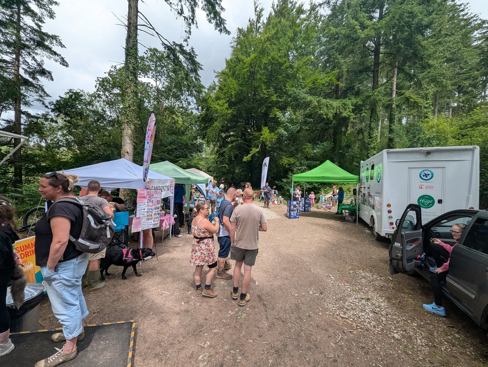
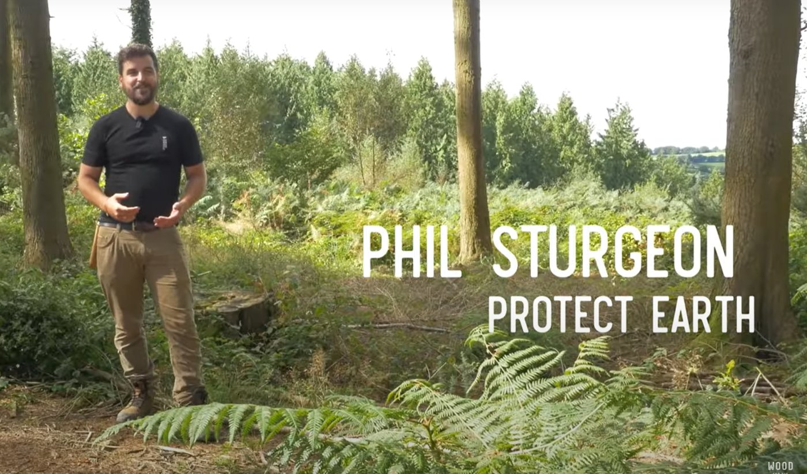
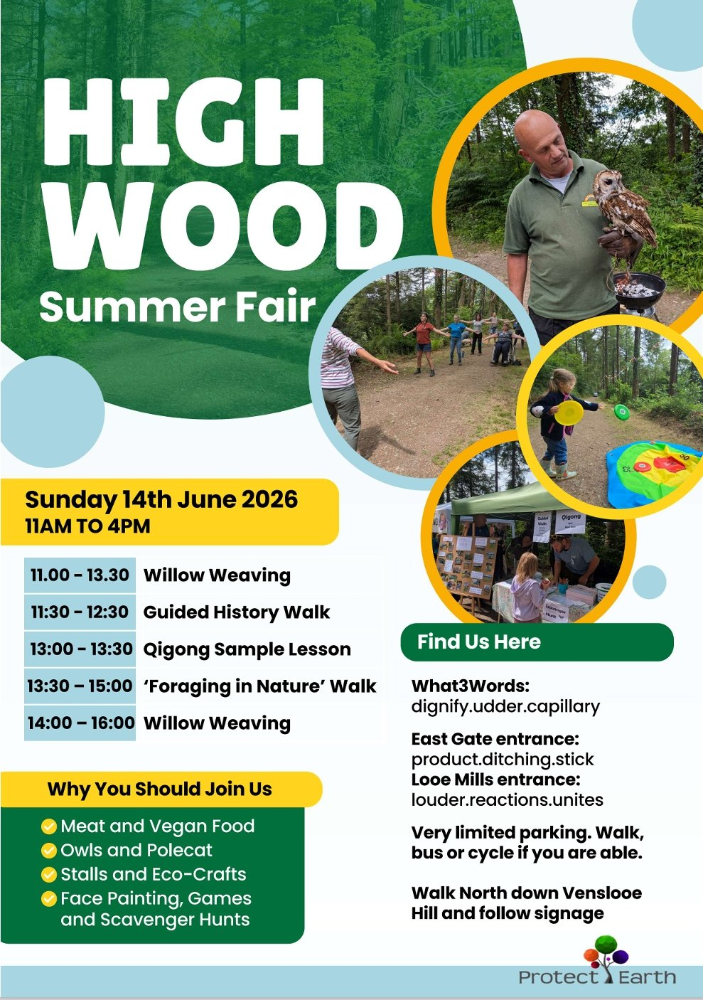
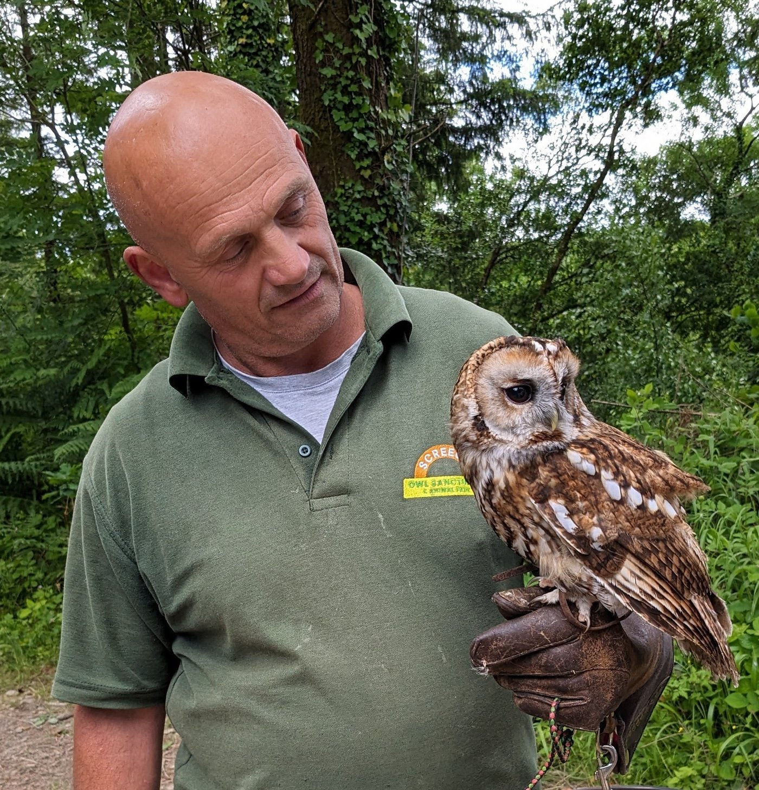
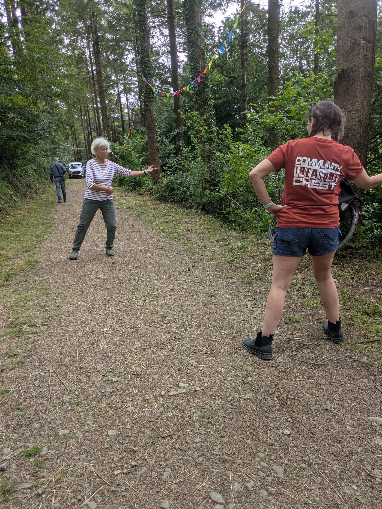
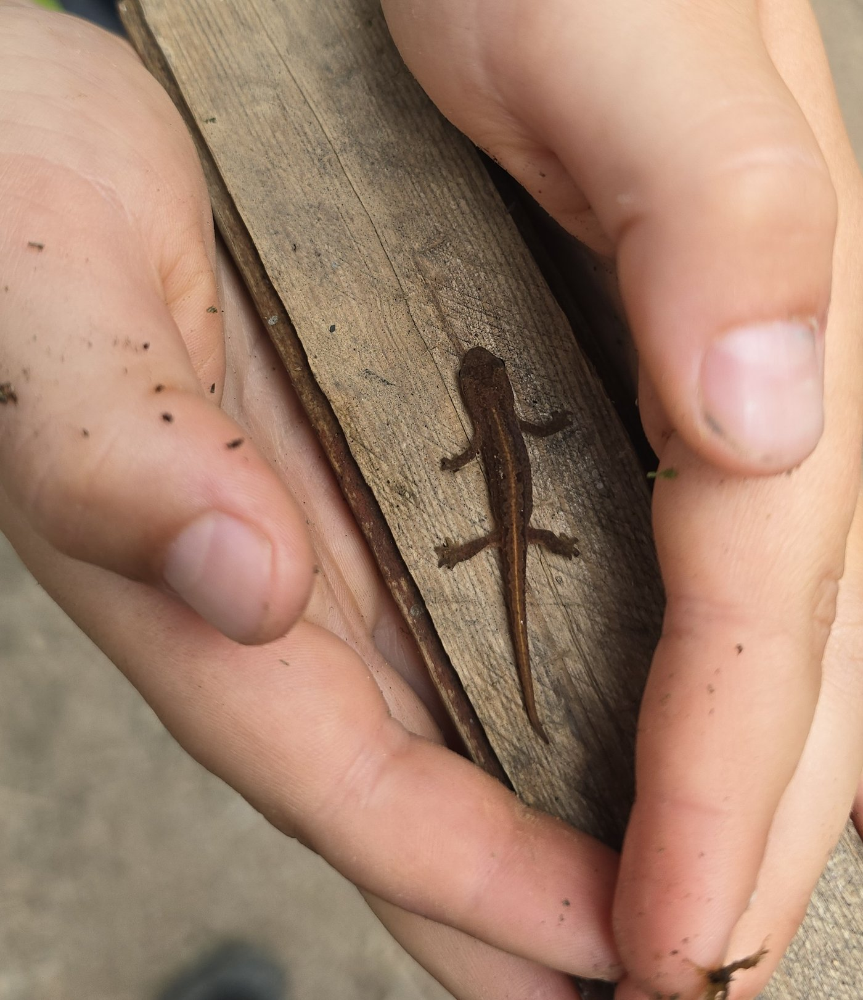
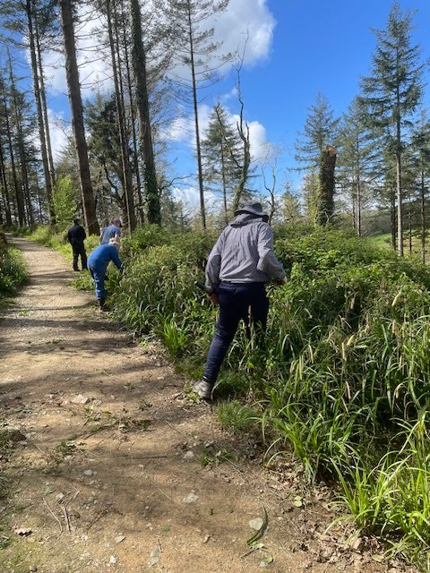

Welcome to our May newsletter.

The highlight of the year is almost upon us. Make a note in your diary for this year’s Summer Fair on 14th June from 11am to 4pm and tell your friends.

We still have room for a few more free stalls. Contact Kathy, our events organiser, at kathy@protect.earth for more information.

Last year’s Summer Fair

## High Wood Two Years Ago

Protect Earth is part of a growing movement of people who believe ancient woodlands aren't just nice to have—they're non-negotiable. Alongside scientists, campaigners, and communities across the UK, we're advocating and working to protect, restore, and extend these rare ecosystems, just like the one here at High Wood.

Two years ago Protect Earth and The Woodland Trust were both featured in a film by Wood for the Trees, a beautifully shot documentary that compares what we are doing here at High Wood with The Woodland Trust’s work at Millook.

Phil, our chairman, talks about our plans for High Wood and why we have done things the way we have.

You can also sponsor a square metre of High Wood here.

[Read more and watch the video here (entitled Ancient Woodland Restoration)](https://www.protect.earth/articles/deep-roots-ancient-woodlands-matter)

## High Wood Summer Fair - 14th June 2026

We hope you are able to come to the Summer Fair this year.

We would appreciate help running the tombola and book stalls, even if only for an hour or two.

We also need people to give out programmes at the two entrances on a rota basis.

Times:

10:30 - 12:00

12:00 - 13:00

13:00 - 14:30

14:30 - 15:45

Please let Kathy know which time slot you would prefer if you can help. kathy@protect.earth

The foraging workshop runs from 13:30 to 15:00 and costs £6 for adults, bookable in advance or pay in cash on the day. Accompanied children are free.

Gabrielle is an experienced forager and artist who runs regular workshops throughout mid-Cornwall.

[Book your foraging workshop here](https://nature-art-play.square.site/)

SB Jewellery

Screech Owl Sanctuary and Animal Park

Qigong with Ninja Granny

Traditional games

Don’t miss out on the free guided history walk with Iain Rowe, a local historian and author who will tell you why High Wood is part of a UNESCO World Heritage Site.

[Click here for more information about the Summer Fair and to book your free tickets](https://www.protect.earth/events/high-wood-summer-fair-14th-june-2026)

Dog mess continues to be an issue at High Wood. We have been trying to get a dog bin outside the Venslooe Hill entrance for some time but cost has been the problem as we have been quoted £1057 +VAT per year which we can’t really afford. We have been looking for alternative options including grants but this takes a long time. We will keep trying.

## You may also be interested in…

The Wildlife Trust have a challenge for you and your family.

30 Days Wild is a nature challenge. This June, choose one wild thing a day (or a few each week) - from giving nature a helping hand to simply noticing the wild on your doorstep.

Sign up to receive your free pack in the post and by email. Join thousands of people connecting with nature, feeling better and making a positive difference for nature.

[Sign up for the 30 Days Wild challenge here.](https://www.wildlifetrusts.org/30dayswild)

## Photos of High Wood

Bluebells at High Wood

These are English bluebells but they are threatened throughout the UK by the hardier Spanish bluebells which were brought to Britain by the Victorians and can often be found in gardens. If they escape into the wild they can even mix with English bluebells to create an odd hybrid, so it is best to plant the English variety in your garden. But do you know the difference?

#### English bluebells have:

-   narrow leaves, about 1-1.5cm wide

-   deep violet-blue (sometimes white), narrow, tubular-bell flowers, with tips that curl back

-   flowers on one side of the stem

-   distinctly drooping stems

-   a sweet scent

-   cream-coloured pollen inside

#### Spanish bluebells have:

-   broad leaves, about 3cm wide

-   pale blue (often white or pink), conical-bell flowers, with spreading and open tips

-   flowers all around the stem

-   upright stems

-   no scent

-   blue- or pale green-coloured pollen inside

_If you visit High Wood and you have photos you would like to share, please send them to kathy@protect.earth and we will put them in a future newsletter. Plants, wildlife, views or photos of yourself enjoying High Wood are all welcome._

# Work Parties

April Work Party

Six volunteers plus David and Richard had a productive day clearing the track edges on a beautiful sunny day. The volunteers were Brian, Maggie, Rachel, Matthew, Paul & Lee and we would like to thank them for all their help.

### May work party

The next work party will be on Sunday, 17th May starting at 10am. We plan

to cut back small branches overhanging the main tracks around the wood using loppers and secateurs. This helps keeps the tracks accessible, with views across the rest of the wood.

All are welcome, including families. No previous experience is necessary. Come for the morning or stay all day. Please bring food and drink including a flask if you want a hot drink as we are unfortunately unable to provide tea and coffee at the moment.

## WhatsApp High Wood Task Force

Knowing how many people are coming helps us to plan tasks and ensure that we have sufficient tools for everyone. Please let us know you are coming, either via the task force WhatsApp group (see below to join), or email kathy@protect.earth

To join the WhatsApp Task Force, use this link

[https://chat.whatsapp.com/I1NRH6TQnujABCSKNaoQAE?mode=gi\_t](https://chat.whatsapp.com/I1NRH6TQnujABCSKNaoQAE?mode=gi_t)

or the QR Code shown in this email.

# Volunteering & coming to events

## Dates of Work Parties for 2026

Sunday, 17th May

-   Saturday, 20th June

-   Sunday, 19th July

-   Saturday, 15th August

-   Sunday, 20th September

-   Saturday, 17th October

-   Sunday, 15th November

-   Saturday, 12th December (2nd weekend)

## Finding us

PARKING:

Looe Mills entrance

[https://w3w.co/louder.reactions.unites](https://w3w.co/louder.reactions.unites)

50.456595, -4.491764

[https://maps.app.goo.gl/1WSBUGtmkRR3Dv959](https://maps.app.goo.gl/1WSBUGtmkRR3Dv959)

We meet here by the container near the Looe Mills entrance:

What3words/coordinates link [https://w3w.co/busy.chosen.reseller](https://w3w.co/busy.chosen.reseller)

Coordinates 50.458913, -4.491077

[Google maps https://maps.app.goo.gl/eMcRz3vHLpQq2kg5A](https://maps.app.goo.gl/eMcRz3vHLpQq2kg5A)

Walk past a house called The Bungalow and then turn right up the steps. At the top turn right again.

## More information

Everyone welcome.

We start at 10 am and finish around 4pm depending on what we are doing. You can come for half a day or stay all day, whatever suits you. We want you to enjoy volunteering with us, so remember to take a break when you feel tired, drink plenty of liquids and don’t feel guilty about going home when you have had enough.

We’ll provide equipment, tea, coffee and biscuits but please bring the following:

-   Gardening gloves - the sturdier the better (We have a few pairs you can borrow)

-   Sturdy footwear - preferably boots or wellies

-   Weather appropriate clothing – layers and long sleeves are best, waterproof clothing, a hat. (Jeans/cotton clothing are best avoided if it is likely to rain as they take ages to dry out.)

-   A packed lunch if you plan to stay all day, water and a hot drink in a flask.

-   Hand sanitiser

-   Sunblock if likely to be a sunny day – (it is possible to burn when working outside all day, even in winter)

-   Insect repellent in summer as ticks can be around in the woods during the warmer months.

Health and Safety

-   Do not come if you feel unwell, especially if you are likely to be contagious.

-   You are reminded to take breaks as and when you need to, and stop when you have had enough.

-   Maintain a comfortable temperature and bring waterproof clothing.

-   Drink water regularly in addition to tea and coffee to keep hydrated.

-   Take care when using tools, keep them below shoulder level where possible and place them where other people will not trip over them.

-   Ask another volunteer to help rather than lifting heavy items by yourself.

-   Protect your face and eyes from branches, etc.
