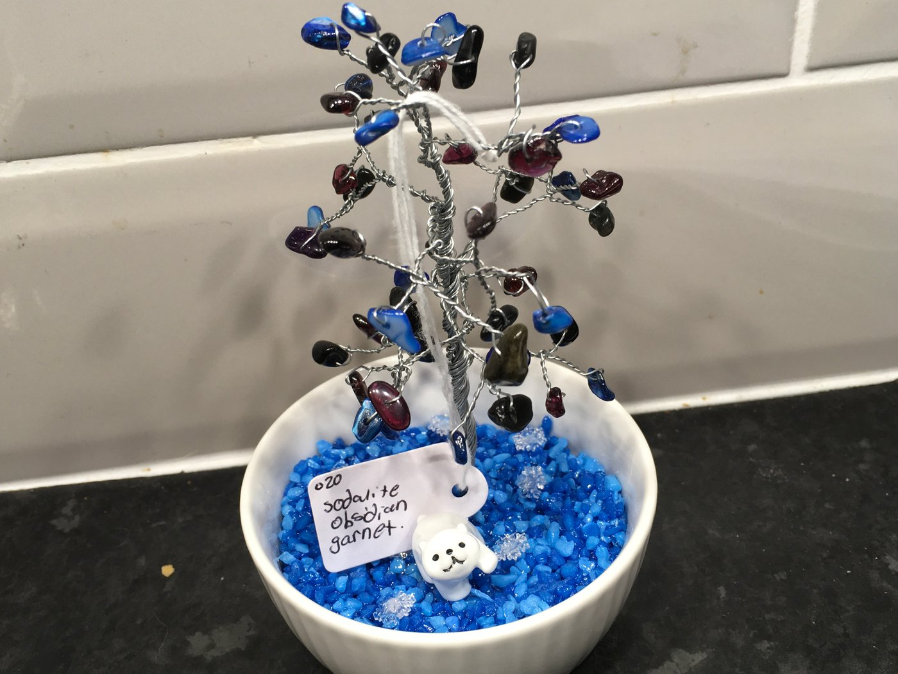
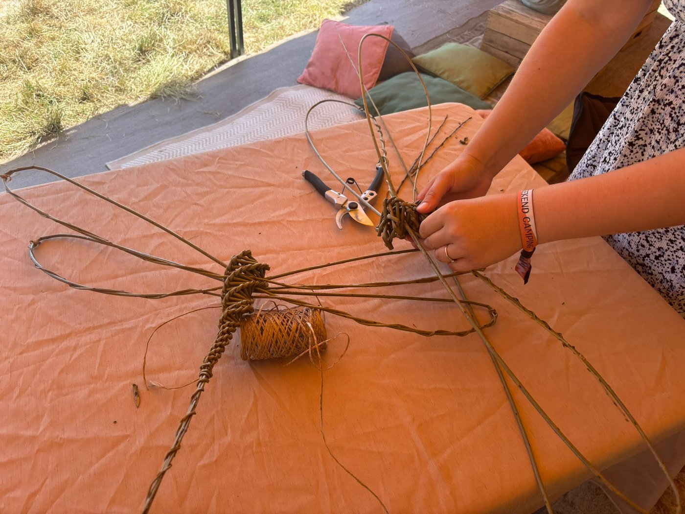
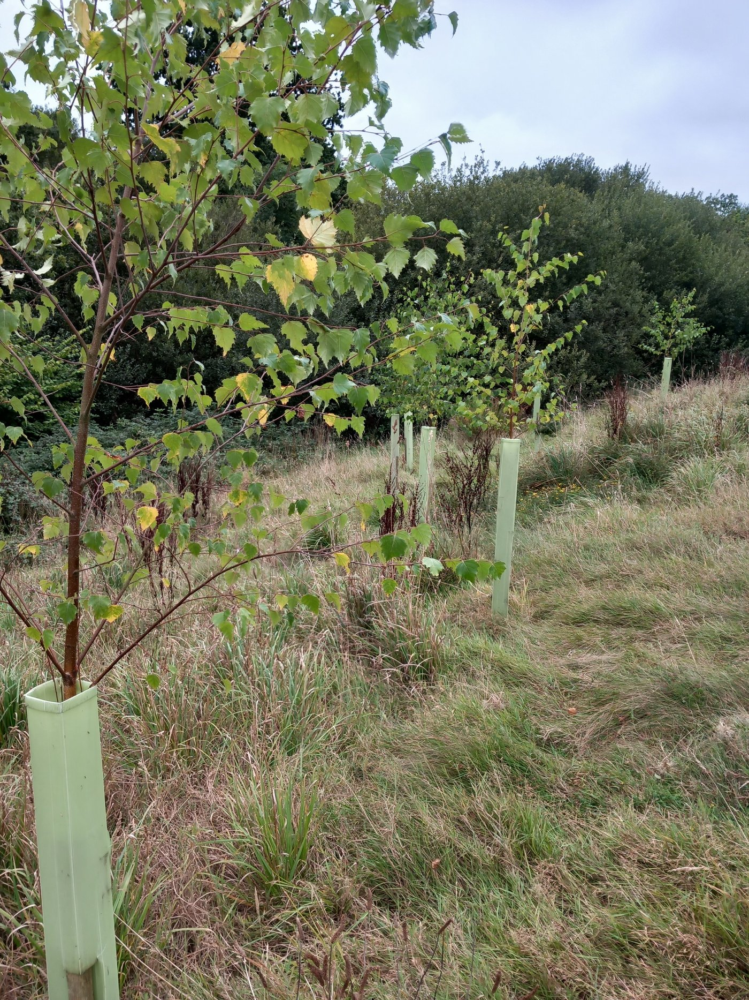

Welcome to our June newsletter. We hope you are able to come to High Wood Summer Fair on 14th June and we look forward to seeing you there. You will be in good company as the new Liskeard Mayor has accepted our invitation to attend. Do call in at the Protect Earth stalls to say hello to the Protect Earth members, and maybe put a comment in the comments box.

As usual, there are so many free activities it is possible to have a completely free day out. Find out more about the RiverFly Foundation and what lives in the local river, or visit the owls from the Screech Owl Sanctuary and Animal Park. Try out Qigong with Ninja Granny or let your children play traditional games or take part in a scavenger hunt. Or maybe have a rest whilst doing some colouring.

Late additions to the timetable are two free crystal workshops, and two free story time sessions for children. See the updated timetable below.

Don’t miss out on the free guided history walk with Iain Rowe, a local historian and author. No need to book, just turn up on the day and find out why High Wood is part of a UNESCO World Heritage Site.

_Why is the main track through the High Wood part of a World Heritage Site?_

_Join Iain Rowe, an experienced walk leader and historian from Caradon Archaeology, for a walk of discovery which will explore the fascinating story of the former railway line and the mining boom that saw it built. Plus, find out about the mystery tunnel and the pre-railway transport routes and industrial activities throughout the wood. Walk is liable to be slippery and will be uneven underfoot with some steep assents and descents. Please wear footwear and clothing suitable for the weather conditions on the day._

Environmentally-friendly craft stalls include…

Cornish Treasures - handmade wooden games

KatyFrank Fine Art - animal portraits

House of Canine - handmade coats, leads. etc. for dogs

Witchcrafty Creations - crystal trees. minature landscapes, etc.

Please bring some cash as not all stalls can accept cards.

Food and drink will be provided by Oshibuns, Olive & Co. Cafe and Nanny Crumbs.

Face painting by Changing Faces

Blue badge parking via Venslooe Hill East gate entrance. Toilets available.

The foraging workshop runs from 13:30 to 15:00 and costs £6 for adults, bookable in advance or pay in cash on the day. Accompanied children are free.

[Book your foraging workshop here](https://nature-art-play.square.site/)

Have a try at willow weaving at the drop- in sessions. Easier and harder items to suit children and adults.

Prices vary depending on what you choose to make. No need to book.

[Click here for more information about the Summer Fair and to book your free tickets](https://protect.earth/events/high-wood-summer-fair-liskeard-cornwall-1986120946215/)

## You may also be interested in…

Volunteers needed near Liskeard.

We planted a small woodland and hedgerow near Pengover Green, Liskeard in 2023. We are returning to give the trees a little TLC on Wednesday, 17th June between 10am and 4pm. Nothing too difficult and lunch is provided. If you are free midweek we would be very glad of your help, even if only for half a day. You can find out more by clicking the button or by replying to this email.

[Find out more or sign up here](https://www.eventbrite.co.uk/e/volunteers-wanted-to-give-our-trees-some-tlc-near-liskeard-cornwall-tickets-1990483691303?aff=oddtdtcreator&_gl=1*fui1ln*_up*MQ..*_ga*MTg1MTczOTYxOS4xNzgwMTUzMDI2*_ga_TQVES5V6SH*czE3ODAxNTMwMjUkbzEkZzAkdDE3ODAxNTMwMjUkajYwJGwwJGgw)

_If you visit High Wood and you have photos you would like to share, please send them to kathy@protect.earth and we will put them in a future newsletter. Plants, wildlife, views or photos of yourself enjoying High Wood are all welcome._

# Work Parties

May Work Party

Thank you to Brian and Maggie, very regular volunteers who helped David clear the paths this month. The weather was better than forecast with only one brief shower so they were able to get plenty done.

### June work party

The next work party will be on Saturday, 20th June starting at 10am. This will be a general maintenance session as there are a few smaller jobs to be done.

Volunteer numbers have been much smaller recently, so if you haven’t been before, why not give it a try? If you know anyone who might be interested in volunteering with us please send them the link to our website where they can sign up.

[Sign up here for work parties](https://protect.earth/high-wood/)

All are welcome, including families. No previous experience is necessary. Come for the morning or stay all day. Please bring food and drink including a flask if you want a hot drink as we are unfortunately unable to provide tea and coffee at the moment.

## WhatsApp High Wood Task Force

Knowing how many people are coming helps us to plan tasks and ensure that we have sufficient tools for everyone. Please let us know you are coming, either via the task force WhatsApp group (see below to join), or email kathy@protect.earth

To join the WhatsApp Task Force, use this link

[https://chat.whatsapp.com/I1NRH6TQnujABCSKNaoQAE?mode=gi\_t](https://chat.whatsapp.com/I1NRH6TQnujABCSKNaoQAE?mode=gi_t)

or the QR Code shown in this email.

# Volunteering & coming to events

## Dates of Work Parties for 2026

Saturday, 20th June

-   Sunday, 19th July

-   Saturday, 15th August

-   Sunday, 20th September

-   Saturday, 17th October

-   Sunday, 15th November

-   Saturday, 12th December (2nd weekend)

## Finding us

PARKING:

Looe Mills entrance

[https://w3w.co/louder.reactions.unites](https://w3w.co/louder.reactions.unites)

50.456595, -4.491764

[https://maps.app.goo.gl/1WSBUGtmkRR3Dv959](https://maps.app.goo.gl/1WSBUGtmkRR3Dv959)

We meet here by the container near the Looe Mills entrance:

What3words/coordinates link [https://w3w.co/busy.chosen.reseller](https://w3w.co/busy.chosen.reseller)

Coordinates 50.458913, -4.491077

[Google maps https://maps.app.goo.gl/eMcRz3vHLpQq2kg5A](https://maps.app.goo.gl/eMcRz3vHLpQq2kg5A)

Walk past a house called The Bungalow and then turn right up the steps. At the top turn right again.

## More information

Everyone welcome.

We start at 10 am and finish around 4pm depending on what we are doing. You can come for half a day or stay all day, whatever suits you. We want you to enjoy volunteering with us, so remember to take a break when you feel tired, drink plenty of liquids and don’t feel guilty about going home when you have had enough.

We’ll provide equipment, tea, coffee and biscuits but please bring the following:

-   Gardening gloves - the sturdier the better (We have a few pairs you can borrow)

-   Sturdy footwear - preferably boots or wellies

-   Weather appropriate clothing – layers and long sleeves are best, waterproof clothing, a hat. (Jeans/cotton clothing are best avoided if it is likely to rain as they take ages to dry out.)

-   A packed lunch if you plan to stay all day, water and a hot drink in a flask.

-   Hand sanitiser

-   Sunblock if likely to be a sunny day – (it is possible to burn when working outside all day, even in winter)

-   Insect repellent in summer as ticks can be around in the woods during the warmer months.

Health and Safety

-   Do not come if you feel unwell, especially if you are likely to be contagious.

-   You are reminded to take breaks as and when you need to, and stop when you have had enough.

-   Maintain a comfortable temperature and bring waterproof clothing.

-   Drink water regularly in addition to tea and coffee to keep hydrated.

-   Take care when using tools, keep them below shoulder level where possible and place them where other people will not trip over them.

-   Ask another volunteer to help rather than lifting heavy items by yourself.

-   Protect your face and eyes from branches, etc.
