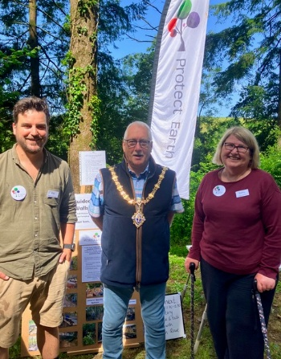
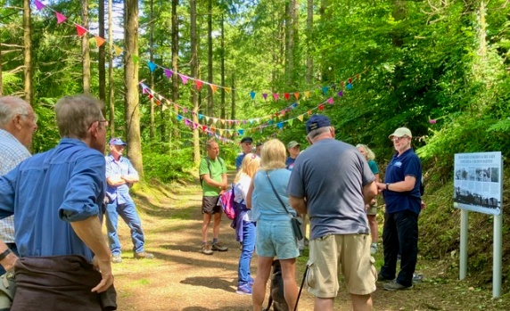
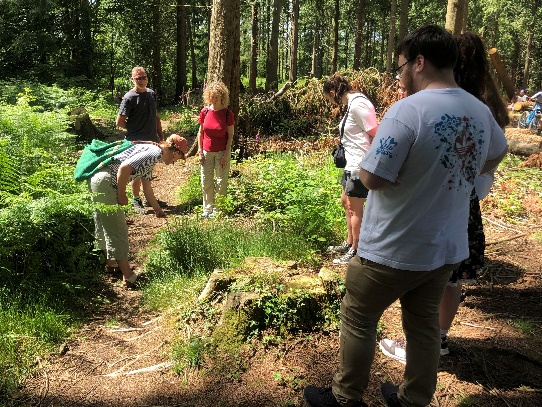
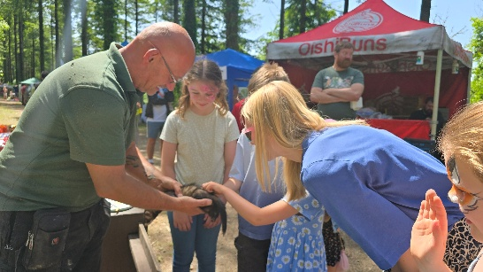
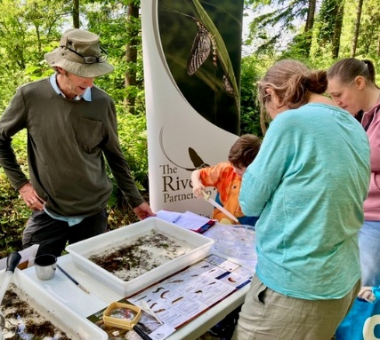
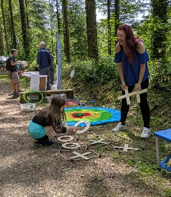

Liskeard's new mayor, Cllr David Braithwaite, very kindly opened High Wood's fourth Summer Fair for us on 14 June. In his speech he described High Wood as a wonderful amenity for the people of Liskeard, thanked us for the work we are doing, and spent several hours at the fair learning more about our temperate rainforest restoration.

The weather had been cold and wet in the run-up to the event, but the weekend brought sunshine and pleasant temperatures.

_Phil (Chairman) and Kathy (Events Organiser) with Liskeard's mayor._

## Walks, Foraging, and Hands-On Learning

Iain Rowe, an experienced walk leader and historian from Caradon Archaeology, led a discovery walk exploring the former railway line and the mining boom that saw it built. Visitors heard about the mystery tunnel, pre-railway transport routes, and industrial activity throughout the wood, all part of why High Wood sits within a UNESCO World Heritage setting. Visitors were also interested in the new heritage board installed by the Old Cornwall History Society.

Gabrielle from Nature, Art and Play, who has been foraging wild food for more than 20 years, led an enthusiastic group around High Wood to identify berries, plants, nuts, and mushrooms, alongside safe recipes to try at home.

Others took part in scavenger hunts with different difficulty levels, from very young children through to adults who did not want to miss out, and each completed hunt came with a small prize.

_Visitors taking part in guided and family activities in High Wood_

## Crafts, Wildlife, and Community Stalls

A variety of Cornish craftspeople joined to demonstrate or sell beautifully made products, including bags made from pre-loved materials, wood carvings, animal portraits, toys made from corn starch, jewellery, dream catchers, and more. Children also had the chance to make environmentally friendly posters, bookmarks, and simple willow weaving items.

Other local charities, including Cornwall Wildlife Trust, came to raise awareness of their work. The Screech Owl Sanctuary and Animal Park entertained a spellbound audience with their owls and a very cheeky polecat who quickly became a crowd favourite.

One of our work party members and a colleague showcased work from the RiverFly Partnership, a network that supports citizen scientists to monitor river invertebrates and produce long-term water-quality indicators. They brought water samples from the river beside High Wood, complete with a fascinating range of invertebrates that captivated children and adults alike. All invertebrates were safely returned to the river at the end of the day.

_Local groups and educators sharing practical conservation knowledge._

_Families enjoying stalls and activities throughout the fair._

Excellent food and drinks were provided by local caterers. Protect Earth also ran children and adult tombolas with support from our work party members and site managers, alongside a range of traditional games.

## Why We Hold the Summer Fair

Our aim is less about raising money, though that certainly helps, and more about raising awareness of Protect Earth and the restoration work we are doing on the outskirts of Liskeard. Many visitors at our Summer Fair have never heard of High Wood before, or did not know where it is.

We are now beginning to see returning visitors and growing interest through our monthly newsletter, and we would love to welcome more volunteers at our work party days.

While inviting people into the woods can be a delicate balance, educating visitors about our work helps build respect for both the site and nature more broadly. As the mayor said, this is a wonderful amenity for the people of Liskeard. We welcome horse riders, dog walkers, bird watchers, and mountain bike riders (on designated routes), and we ask everyone to leave the woods as they found them and keep to paths so natural regeneration can continue.

_Demonstrations and talks helped visitors connect with woodland restoration._

_The fair brought together local residents, visitors, volunteers, and partner organisations._
