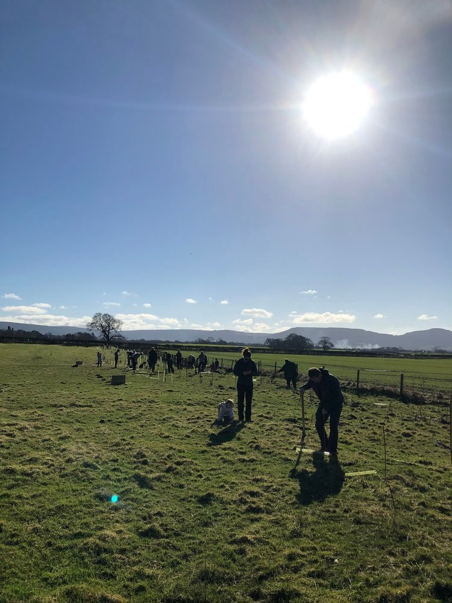
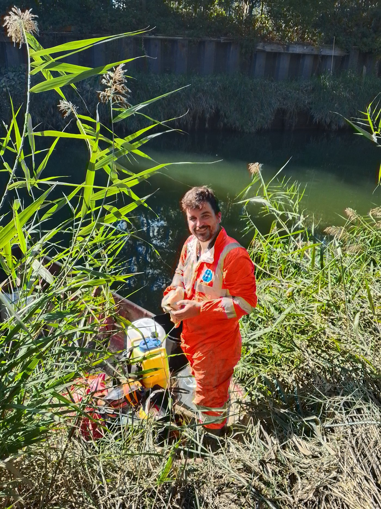
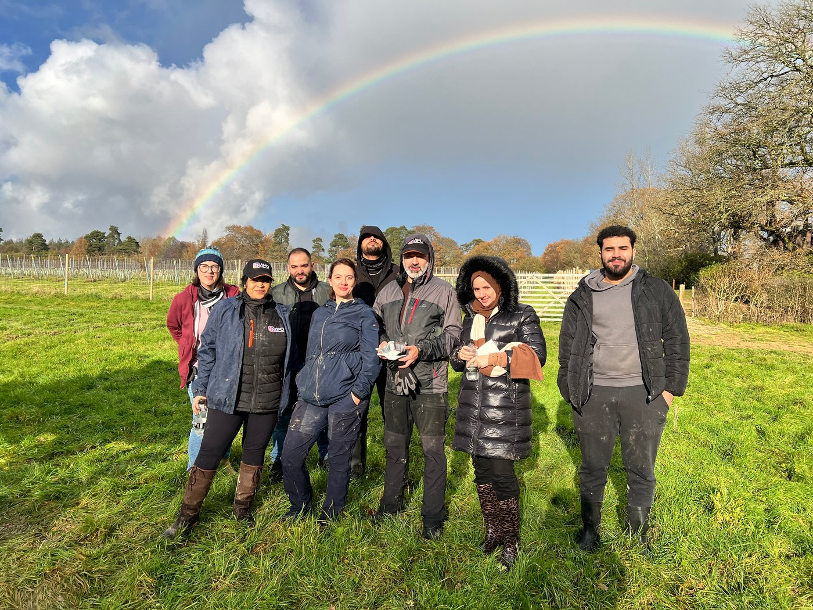
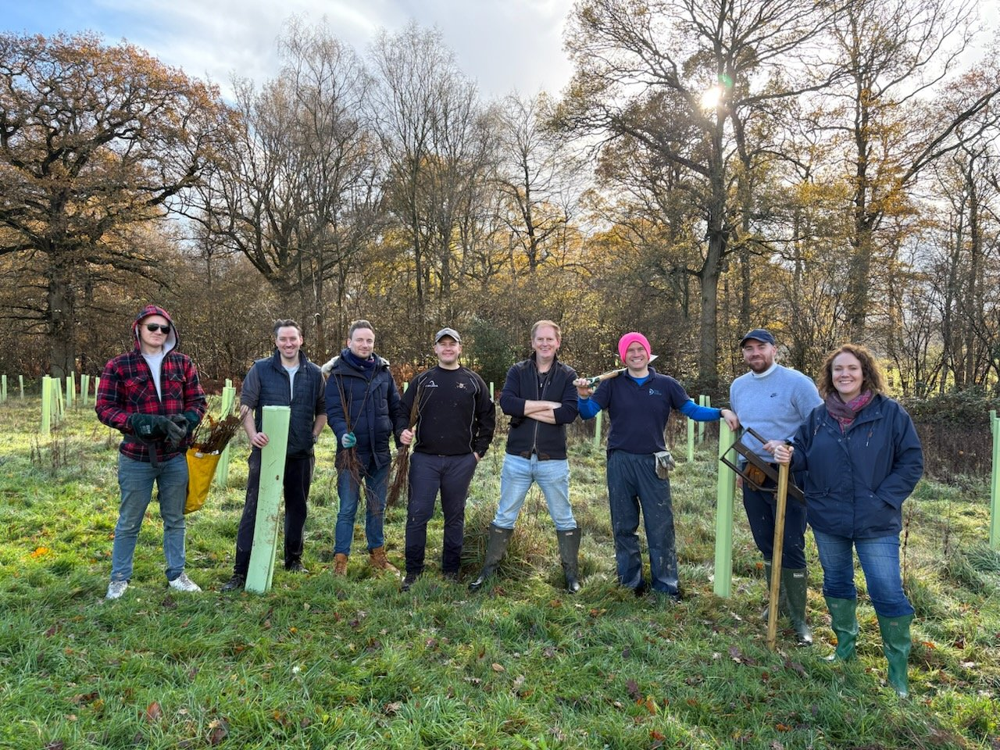
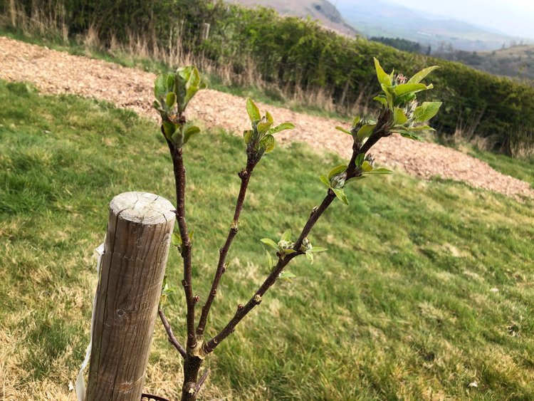
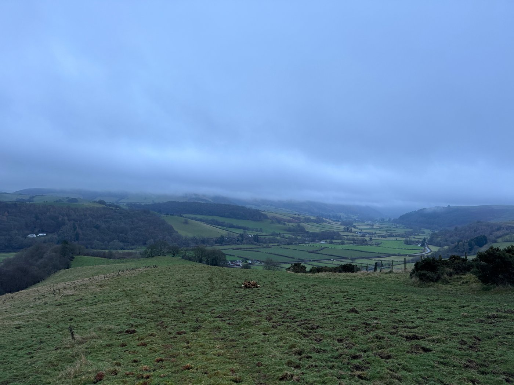
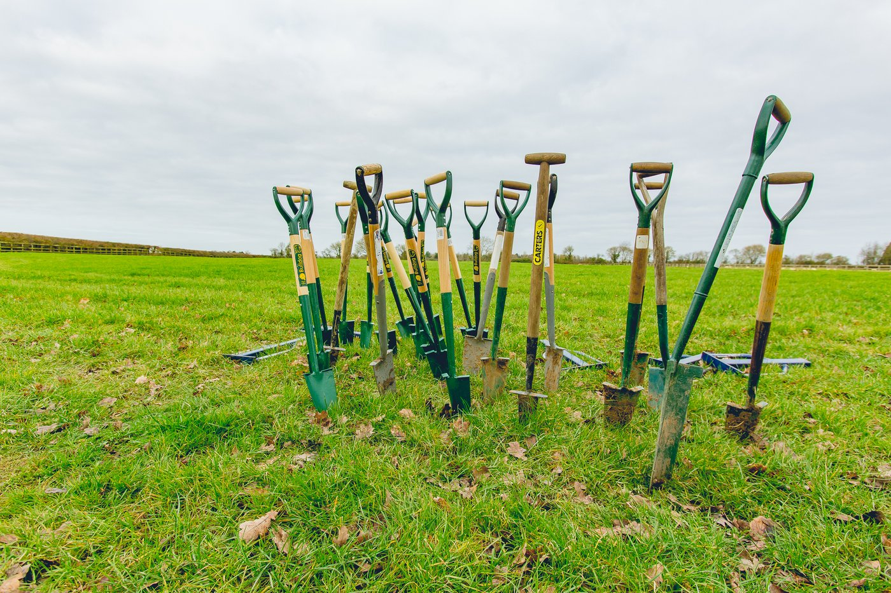
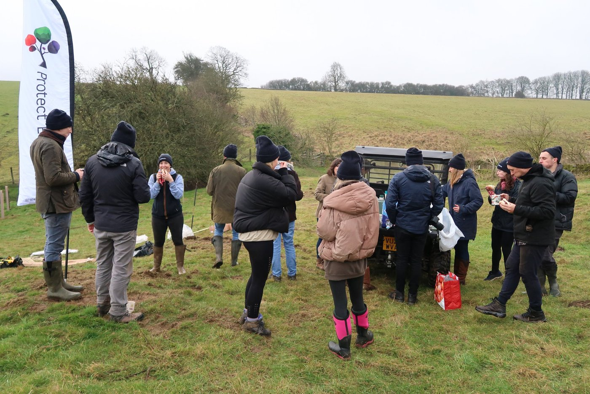
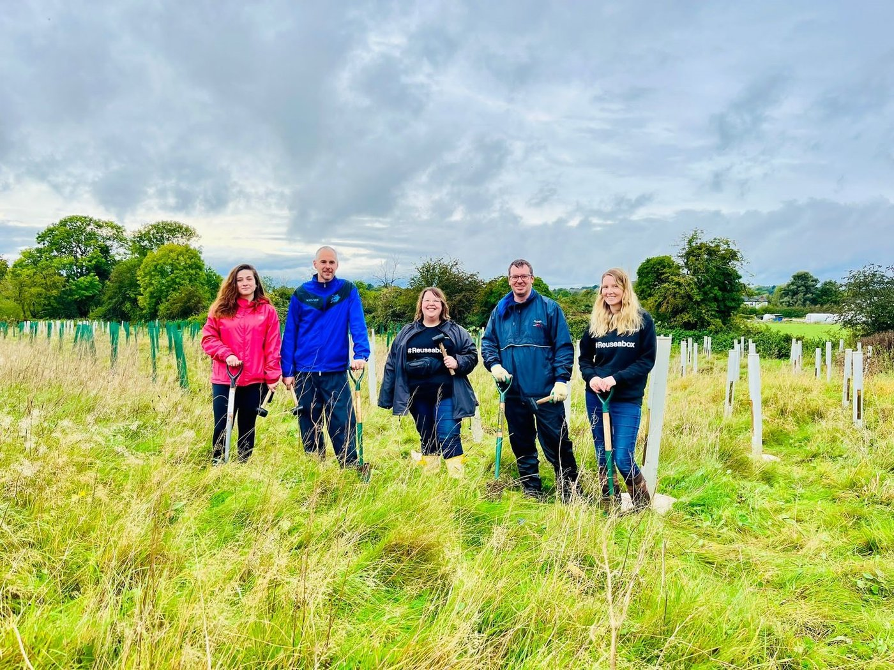

A note from our Chair

January is usually a time of reflection, thinking back to the last year and focusing on what the new year is going to bring. On this theme, we have two exciting announcements to share.

Firstly, we've spent the summer traipsing through tick infested long grass from Cornwall to East Ayrshire and all over Wales, inspecting and surveying sites from the last five years. We hired ecologist and writer Elena Tornberg-Lennox to collate all of this data and write a report for us, showing what has gone well, what has gone poorly, and what lessons we have learned from our success and our failure. This took a lot of work and we need to get better at gathering this data, but we've always been a little too busy in the field to focus on spreadsheets. This will change going forwards as our team grows and we scale out of headless chicken mode.

Secondly, we have just purchased 81 acres of land in Warleigh, Bath, which we are calling the Warleigh Nature Reserve. Writing this does not feel real, because we have been working on this land purchase for over two years! I first went to visit this site in October 2023, and there have been more ridiculous twists and turns than a Dan Brown novel, but we got there at 15:17 on January 20th to the joy of the local area and all the volunteers and donors that made it happen. You'll hear a lot more about this over the coming weeks and months, but we are getting stuck in right away to take full advantage of the last part of winter. To learn more about the project here's [a video we recorded](https://www.youtube.com/watch?v=2raJT5RM6mE) for the original crowdfunder that covers some of the plan.

With the stress of this prolonged purchase out of the way, the whole team can focus a whole lot more on doing what we do best. Helping landowners restore nature, and building amazing communities of volunteers around our sites, for the good of people, nature, and carbon sequestration.

Phil Sturgeon

# Other News

#### 2025 Annual Report - Looking back at 2025

In the midst of our fifth planting season Protect Earth is looking back at the 2024/25 season, to take a look at all our sites.

We have had many successes, and a few failures - the hot, dry Summer of 2025 was not kind to little saplings.

If you love data, there is lots of that, but plenty of other information in the report too, which makes interesting reading.

[Read more here](https://www.protect.earth/articles/2025-annual-report-looking-back-at-2025)

#### Labour’s Attack on Nature

One of the tiers of ELMS, and the most accessible, the Sustainable Farming Incentive (SFI), was closed back in March, leaving people that have been diligently working to increase biodiversity on their land high and dry. With many multi-year agreements coming to an end this month, and no prospect of being able to apply again until at least April, many farmers now feel that they [have no option](https://www.fwi.co.uk/news/defra-funding-gap-threatens-vital-farmland-habitats?fw_source=home_latestnews) except to destroy habitat on their land to try and squeeze out every drop of profit.

This, and other policy changes, make it much harder for charities like Protect Earth to do our work.

[Read more here and find out what you can do to help](https://www.protect.earth/articles/labours-attack-on-nature)

#### Japanese Knotweed

#### and the River Rhoding

Back in September Phil, our Chairman, and Michael, our Project Manager, faced one of their biggest challenges yet. The River Roding has a severe problem with Japanese Knotweed in London and Protect Earth were called in to help. Both Phil and Mike are fully qualified so, after consultation with the Environment Agency, they set off to do battle.

[Find out how it went here.](https://www.protect.earth/articles/protecting-river-roding-from-japanese-knotweed)

#### A Corporate Volunteering Day

In December we had a wonderful day at South Lodge Hotel, one of the Exclusive Hotels chain, in West Sussex. We had planted trees here before, but the hot, dry Summer of 2025 meant that some did not survive. Together with two corporate groups we headed off to plant 500 new saplings. Despite the weather forecast, the day was dry and sunny and AMO Consultancy (left) and TML Partners (right) planted the trees in record time. Was there a touch of friendly rivalry?

After an excellent lunch provide by the hotel, both teams did a little maintenance on the trees we has planted previously then headed off home, tired but happy.

Feedback from both groups:

AMO Consultancy: The whole day was very well organised and Phil was a great host. All the information and communication provided by Kathy ahead of the planting day was very useful.

TML Partners: An excellent and very well organised day. Phil was a superb host, provided safety first instructions and motivated us throughout the day. Many thanks to Kathy, Phil and the whole team.

## Volunteering Opportunities

Please check our events page to see if we have any volunteering opportunities near you.

[Find out more and sign up here](https://www.protect.earth/events)

## Ways you can help fund future projects.

Visit our shop to sponsor trees, hedgerows or woodland restoration. Donate to our land fund so that we can buy more land to restore, or make a general donation towards equipment or anything else we need to keep the charity going.

[Visit our shop](https://shop.protect.earth/)

[Donate to our Land Fund](https://www.protect.earth/act-now/land-fund)

[Donate to our General Fund](https://www.protect.earth/act-now/general-donation)

## The company you work for could help too.

Your company could donate some profits, or offer employee matched donations. They can support us via 1% for the Planet, Powered by Percent, CAF, or BrightFunds.

Or your company can sign up for corporate volunteering with us.

You will all have a fun, team-building day while helping the environment. Some companies use volunteering with us as a mental health day. Take photos to put on your social media posts or on your website.

Donations towards our expenses are appreciated.

[Find out about Corporate Volunteering or Sponsorship here](https://www.protect.earth/get-involved/businesses)
