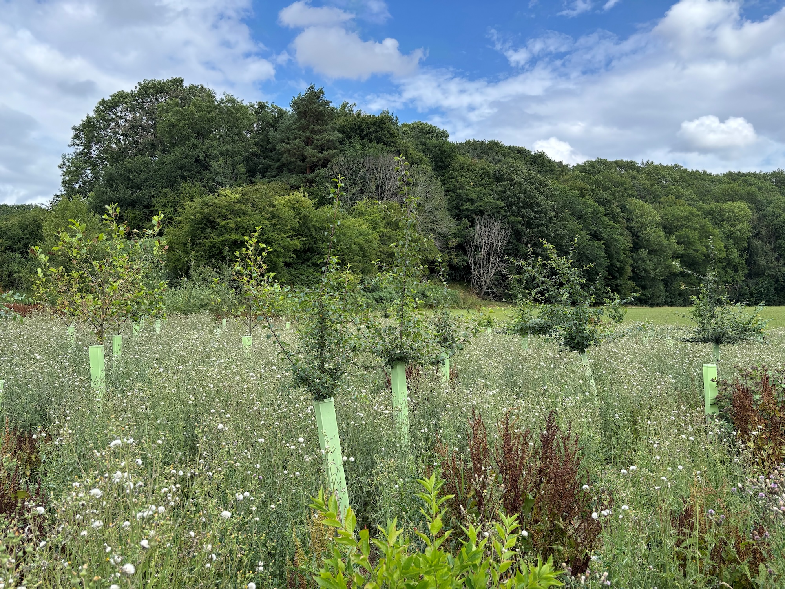
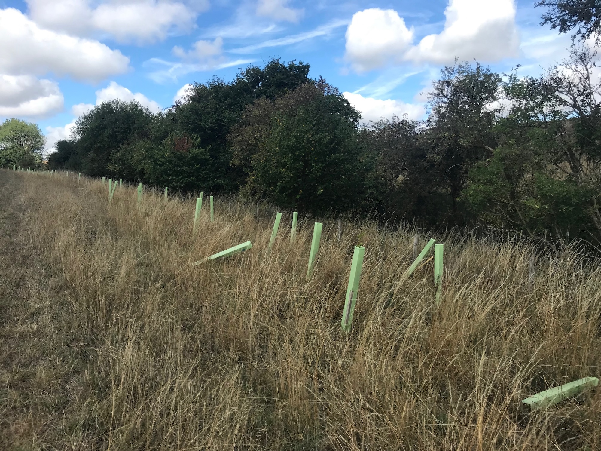
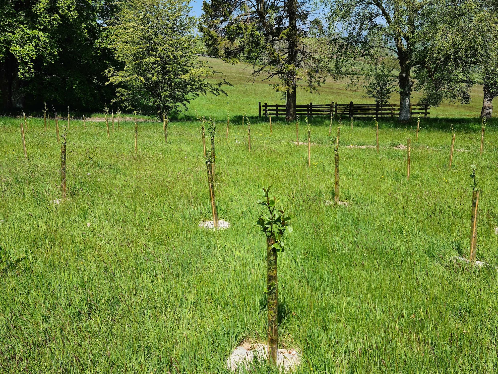
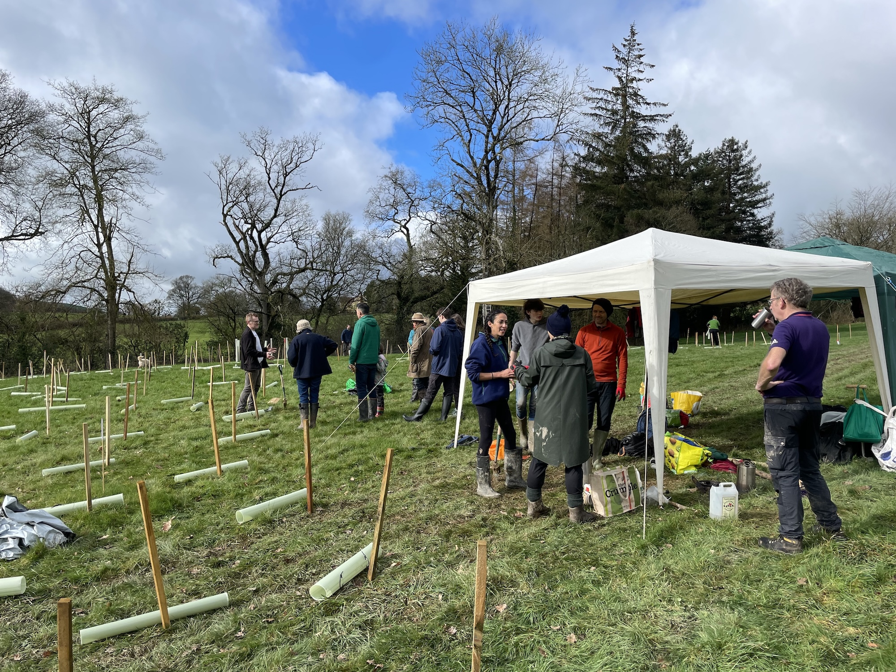

import { YouTube } from "astro-embed";

You finish a day volunteering on planting trees, and look out to see many young trees reaching hopefully for the sky. They are bereft of leaves at the moment, but you could feel the life in their supple trunks as you dug them in. It is probably cold, and maybe damp, and you head on home feeling proud of a job well done.

But then what?

These young trees, the woodlands of the future, need continued care to get away, to root into the earth and unfurl fresh leaves to the sun. With rabbits, voles, deer, drought, mowing damage and competing vegetation, saplings need help to establish themselves.

Come the spring, when the cold weather has turned into something gentler and warmer and the planting season is over, the work has only just begun. We must support our saplings as they face various trials and tribulations. It's fairly normal for 10-15% to fail in their first year, so we need to do all we can to ensure that the numbers don't get any worse. This involves a range of different tasks, and needs a lot of time and attention to get the saplings away.

## Weeding

Perhaps surprisingly, the main cause of failure is competing vegetation. Grass is extremely efficient at extracting nutrients from the soil, as are a number of plants traditionally considered 'weeds', that thrive on disturbed soil (for example where the tree was planted!). Ideally a 1 metre diameter circle around the tree would be kept free of competing plants for 3 or 4 years. This can require a lot of attention in the growing season, but it can radically improve the growth speed of the young sapling, and increase the survival rates.

Unfortunately, the tubes that are there to guard them from deer and rabbits, can cause other problems. They can act like greenhouses, meaning grass and plants like thistles, dock and other grassland species can grow very well. The guards need to be checked, and anything else growing in there needs to be pulled out gently by hand.

Here is a handy demonstration on what you might find, and how to clear around the tree!

<YouTube id="https://youtu.be/vXbSG4xvL_E" />

Mulching

Ideally, to save on the intensive labour of weeding (which, as we all know, isn't just one and done), mulching helps stop competing vegetation, while providing food for our growing trees. It's not a guarantee for no weeding - but it will cut down on the time needed!

Mulching can be done, either with wood chips and bark, or with mulch mats. This helps to keep soil moist even in hot and dry conditions in summer, and allows water to reach the roots when it rains. Our co-founder Phil, talks about the difference between plastic and hemp mulch mats in more depth in an article [here](https://protect.earth/articles/biodegradeable-mulch-mats-b6nb2/), explaining why we at Protect Earth use hemp mats or woodchip over plastic or chemicals as a part of the way we operate.

When spring rolls around, there's often many of our plantings that don't yet have any kind of mulch, so we need volunteers to help in this next stage of the planting, keeping an eye on the mat or woodchip - especially since if mulch is too close to the trunk it can cause rot! It needs redoing every year or two, so keeping an eye on the condition of the mulch is also very important to the continued success of a planting.

And if you're on the lookout for your own trees, then you can often get [free mulch here](https://freewoodchips.co.uk/).

## Guards and Stakes

The guards and stakes that went in with planting don't always stay exactly where they were put when they were planted. Often they can end up leant over or have a gap at the bottom where growing vegetation has pushed the guard up. They can also get damaged left in the open come rain or shine. They are there to help the sapling, to prevent it from being eaten or harmed in its vulnerable first years, so checking the guards and stakes is really important.

They should really be in place and doing their job for around 3 to 5 years, so this is long-term ongoing maintenance. If they have fallen to an angle, they need to be straightened. If there are gaps at the bottom, rabbits and voles can get underneath and nibble the tree. If anything is broken, it needs to be marked and replaced as soon as possible.

## Survival Surveys

It's vitally important to monitor how the trees are surviving. A normal level of loss is about 10-15% in the first year, and if there are extreme weather events such as storms, droughts or flooding, then this could be higher. Understanding the survival rates helps to prepare the team for any restocking (planting more trees to replace the losses), and keep the young woodland or shelterbelt strong as it grows together.

There are ways of checking, as trees can seem dead when they're still hanging on in there. The best method is to wait until May to see if the sapling has leaves out. Checking before May can give false negatives, as some species will not have their leaves out just yet, especially if the saplings were only recently planted that winter. Leaves being out is a good sign, but leaves not being out does not mean dead.

You can check by scratching a tiny piece of bark away, to see what colour it is underneath. If it's green, the tree is still going, and if it's brown that part of the tree is dead. An easy mistake to make is scratching too high up, because some trees will "dead head" themselves during droughts, then they can still send up new shoots from the roots. Checking as low to the ground as possible helps avoid this mistake. Either way, it's best to leave dead trees where they are as they may make a comeback. If you need to reuse the guard for the newly planted trees and that sapling does end up coming back, it will become food for a plethora of animals who will appreciate it.

We have a handy guide [here](https://www.notion.so/protectearthcio/SPRING-MAINTENANCE-GUIDE-058e7dc6657c8207b8b7813ee7f97eae) if you want to know more about planting maintenance.

## Spring and Summer Maintenance

All of this spring maintenance (and continuing through the summer) greatly increases the chance of success of the planting. As a charity, we are aware of the money donated to do our work; bringing back nature, planting trees and restoring wetlands. We want to make every single penny count, and preventable losses make a big dent in such a small organisation. More money, more team time and resources replacing what could have survived mean that those resources can't be put elsewhere, expanding our work. Aside from that, any tree dying unnecessarily is a shame, and we feel we have a moral obligation to do everything possible to ensure that the living trees we plant flourish.

Tree-planting days are great fun. They bring people together, and there is a great sense of accomplishment when people can look out and see the soon-to-be woodland standing where before there was just grass or earth. But then the maintenance needs to happen, the going back regularly to check, the ongoing care and relationship with the young trees as they spread into earth and sky. They still need us when they're so vulnerable, but we really struggle to get people signing up to help with this long-term care.

We desperately need people that can undertake this work, the monitoring for survival, the checking during droughts, the righting of fallen stakes and closing of gaps under guards, the gentle weeding and tending. This kind of ongoing care creates a deeper relationship with the trees and the land. Tree planting is so satisfying, and we are genuinely overjoyed by how many people bring their time, their energy and their love to those often cold days out, planting new life. But we also need long-term guardians for our plantings too, who can ensure all that good work of tree planting actually grows into majestic mature trees.

## Volunteering Benefits

The benefits of volunteering and the benefits of spending time in nature have been explored extensively in science, even to the point where you can be prescribed both for various health issues. This [study](https://pmc.ncbi.nlm.nih.gov/articles/PMC10159229/) shows that volunteering can even make you live longer! Mental health [improves](https://www.sciencedirect.com/science/article/pii/S2667321522000233), physical health improves, community is built, and a deep sense of belonging can grow.

Being a long-term guardian of a planting can help a woodland to come into being, you get to see all the changes that come with the passing of the seasons, and as the trees grow taller and stronger. New insects, birds and mammals arrive, and you get to be the one to see all of that. The Wildlife Trust's [report](https://www.wildlifetrusts.org/sites/default/files/2018-05/r3_the_health_and_wellbeing_impacts_of_volunteering_with_the_wildlife_trusts_-_university_of_essex_report_3_0.pdf) said that nature volunteering gave people a sense of purpose - something we all need in our lives.

You have the ability to make a real and solid change for the better through taking on this role, supported by us, and flexible to adapt to your life and schedule. You can help Protect Earth to do exactly what it says on the tin - protect the earth.

If you want to sign up to volunteer with us, please check out our events and [sign up](/events/) to keep informed here. If you are in a particular area, please let us know in the sign up form, and we'll reach out to you to see where we can put your skills to use!
