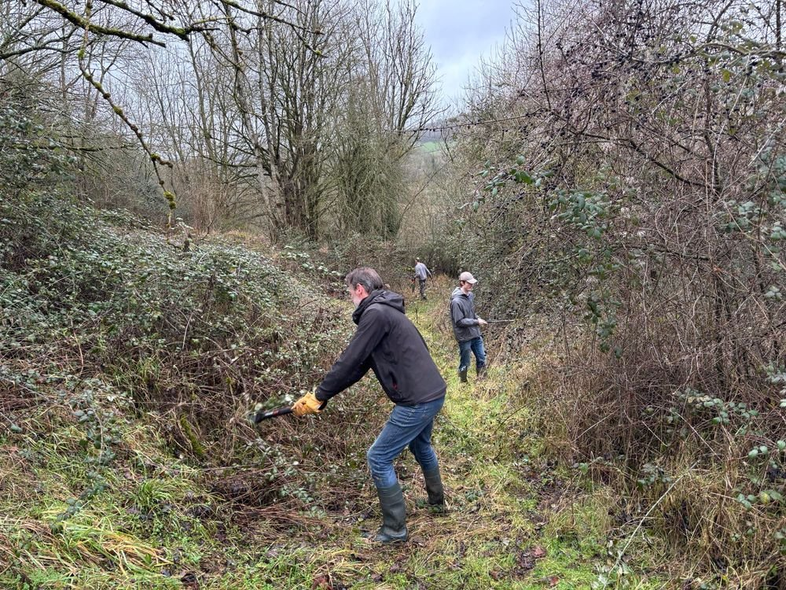
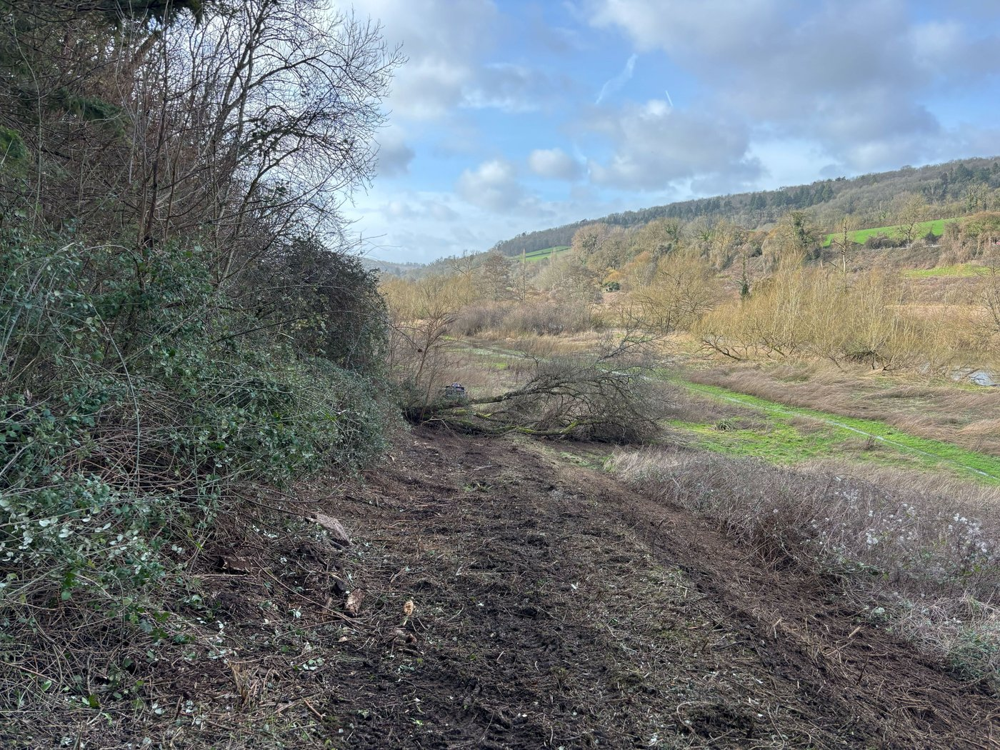
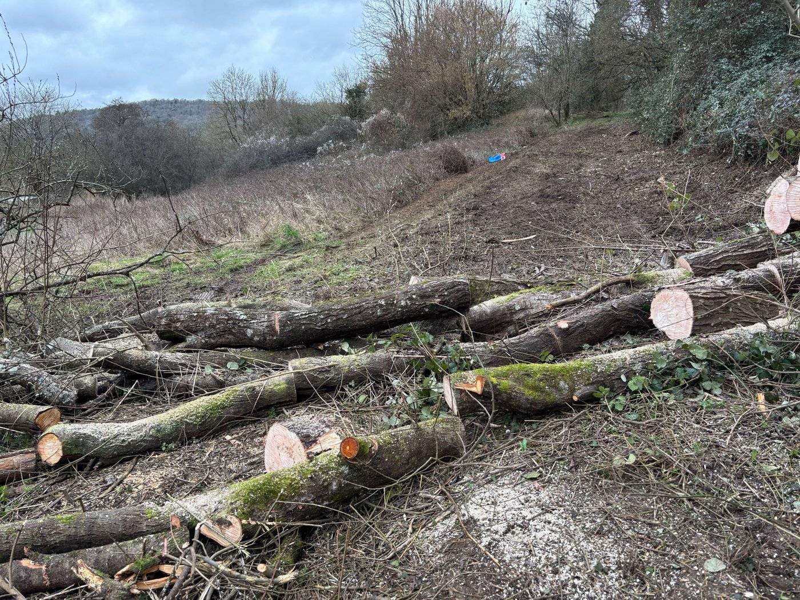
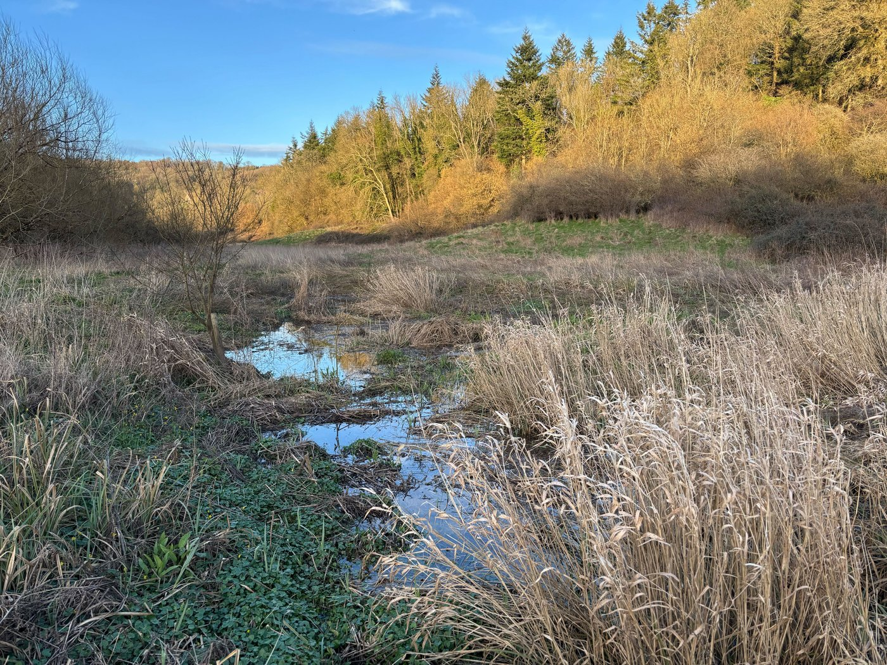
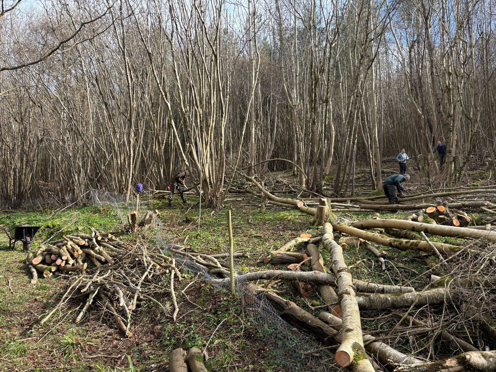
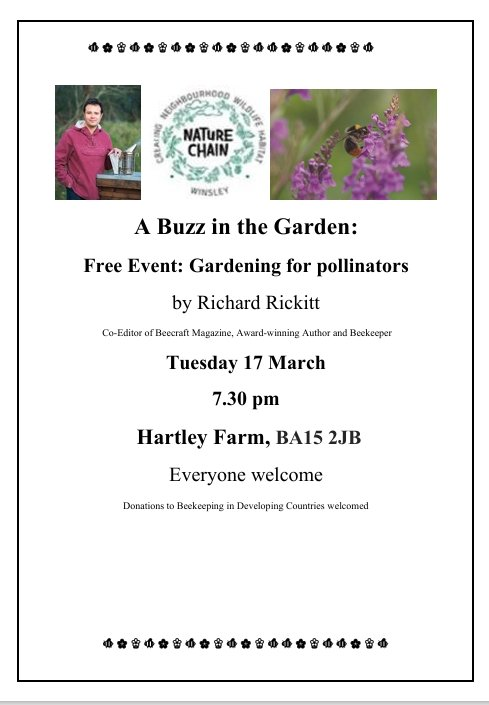
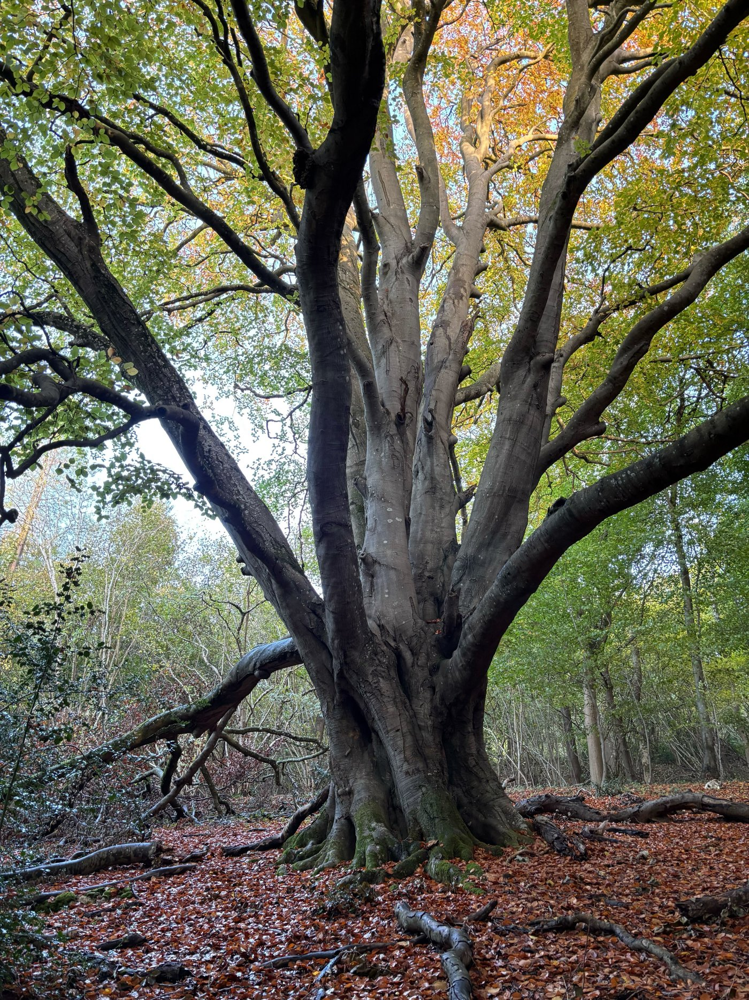

The Warleigh Nature Reserve is blessed with a lot of excited, skilful, and experienced volunteers. From the Warleigh Task Force, a group of folks from ecologists to foresters to carpenters, and the wonderful local community of folks who appear like angels from Facebook and Eventbrite, we have been able to solve a lot of problems in a very short space of time. Barbed wire removals have been ongoing.

We've reopened an old vehicle track that we are slowly turning into a far nicer walk than a section of the public footpath that's a narrow slip and slide amongst blackthorn and barbed wire fencing off our boundary.

We coppiced a willow tree that fell across the track and turned it into 100 cuttings that have been spread around, and some larger chunks that were used to make leaky dams that we fully expect to regrow, to make living beaver dams to continue our ponds and feed our beaver population.

Leaky dams have been built to slow down more water and we have already established ponds which toads are getting busy turning into a home. Land drains have been found and blocked, causing more water to stay on the low-lying bits of the land (away from the footpath) and we are already talking to the council about getting broadwalks and better bridges on the wettest, least navigable parts of the public footpath.

Dangerous ash trees near the tracks and communal areas have been felled, and the old Hazel coppice has its first compartment brought back into rotation. The timber from both are being used to repair our compost toilet roof and floor after winter nearly finished it off, and soon work will begin on a kitchen galley so we can make tea, coffee, and even lunch for our hard working volunteers.

We are also planning to create some parking for volunteers when they come to help us.

So much has been done in a short space of time with barely any budget, but the enthusiasm and dedication of our community has made it all possible.

The bigger work needs some time, some ecological surveys, and a bit more equipment. You can see our wish list here and our crowdfunder is off to a good start to get us there.

If you are able to contribute towards a dormouse nest box - £25, a fruit tree -£80 or a new bench - £500, for example, we would be very grateful. Smaller donations soon mount up, so whatever you can spare will make a difference.

[Donate to our crowdfunder here](https://www.crowdfunder.co.uk/p/warleigh-nature-reserve)

# You might also be interested in…

If you are a gardener you might be interested in this free talk about gardening for pollinators on 17th March.

Richard Rickitt, one of the UK’s best-known beekeepers and co-editor of BeeCraft magazine, will be joining Winsley Nature Chain at Hartley Farm to share ways in which we can help save the bees.

[Click here for more information](https://www.hartley-farm.co.uk/event/a-buzz-in-the-garden-gardening-for-pollinators-with-richard-rickitt/)

# Photos of Warleigh Nature Reserve

A beautiful old beech tree at Warleigh.

_This photo was taken on a visit last Autumn._

If you visit Warleigh Nature Reserve and you have photos you would like to share, please send them to kathy@protect.earth with any comments and we will put them in a future newsletter.

Parking for visitors to Warleigh Nature Reserve

We recommended parking (paid) at Brassknocker Basin car park near the Angelfish Cafe, and enjoying the beautiful view as you walk across Dundas Aqueduct.

The section of the ordnance survey map below shows Dundas Aqueduct near the bottom left. From there, go down the steps and follow the footpath (green dotted line) with the river to your left. Enter Warleigh Nature Reserve via the pedestrian entrance here:

Google maps link: https://maps.app.goo.gl/i48HByjvAaeVTHuV7

What3Words: career.pack.fame

Coordinates: 51.364853, -2.307189

Sheephouse Farm, near the top of the map, is at the far entrance of the nature reserve.

# Volunteering & coming to events

# Work Parties

This month we will be completing our tree planting commitments in various parts of the UK, from Devon to Northumberland, then most members of the team usually take a well earned holiday.

We know lots of you are keen to get started, so more volunteering events will appear here as soon as possible after that.
