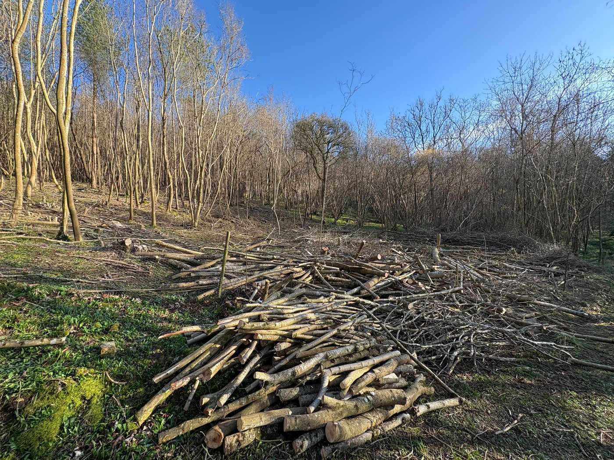
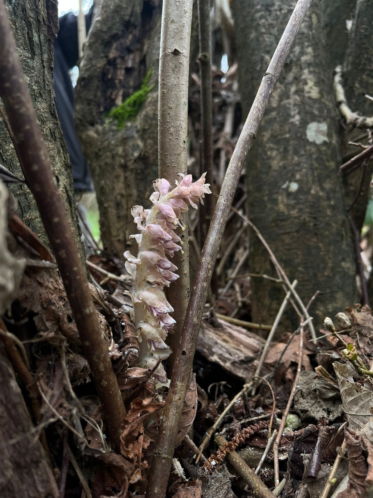
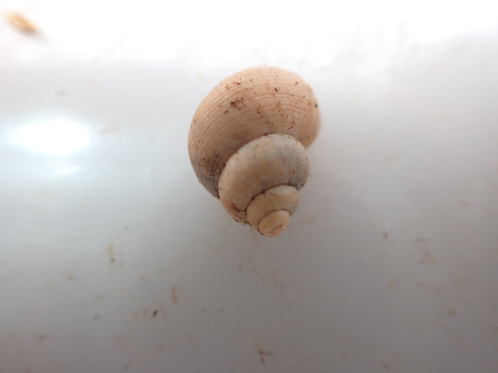
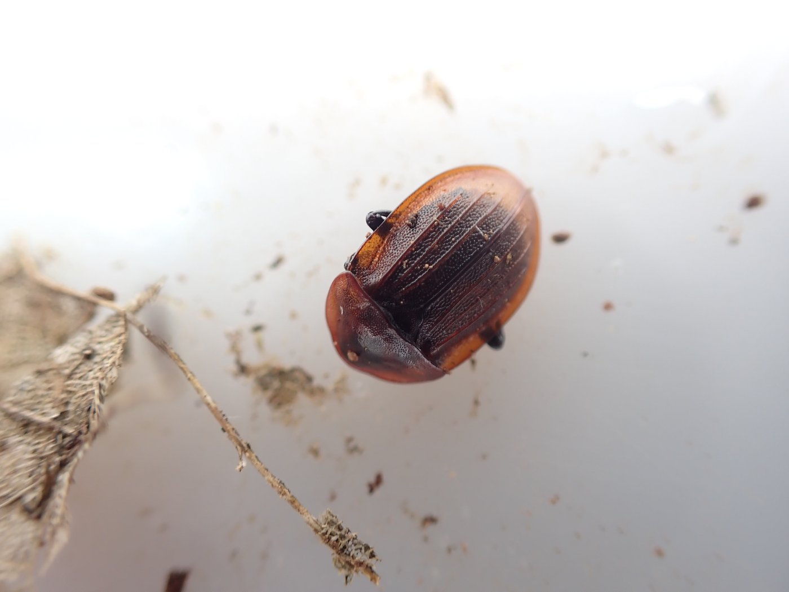
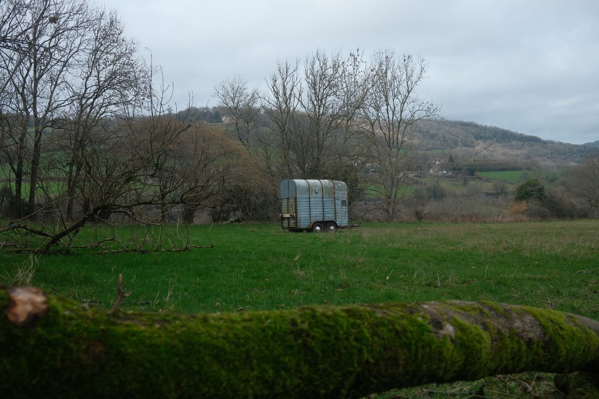

New trees and work party dates

# April 2026

# Warleigh Nature Reserve Newsletter

Hello everyone, welcome to our April newsletter.

We recently installed some cameras and we have already been lucky enough to see heron visiting our new wetland area. Other visitors include a badger, a fox and a roe deer.

Using the coppiced wood

Coppicing provided us with lots of wood. Volunteers attending our work parties have been helping us make good use of it.

Some was used to make posts for the deer fencing we need to protect the recently coppiced hazel from deer nibbling the new shoots.

We demonstrated 'Tipi making', 'brashing' up of some Hazel coppice stools which is another way of protecting them from deer.

More wood was used to make habitat piles to provide shelter for invertebrates or into ‘leaky dams’ to help develop the wetlands.

Our neighbour says that the wetland area is noticeably… wetter… when he walks through it, so what we are doing is working.

Creating the wetlands

A leaky dam

Tree planting

Volunteers, both adults and children, turned up to plant trees on 28th March. We reinstated and gapped up a 500m hedgerow which will protect the field where we intend to plant some more saplings next planting season. It will also provide food and shelter for birds, mammals and invertebrates, as well as helping them move around that part of the nature reserve move easily.

Nearer the river we introduced 100 alder and also planted some locally sourced willow which should take root and flourish in these wetter areas.

Photo by Daisy Brasington

Our Crowdfunder

We haven’t achieved our crowdfunder total yet. Smaller donations soon mount up, so whatever you can spare will make a difference.

If you are able to share our crowdfunder elsewhere that would be very helpful too.

[Donate to our crowdfunder here](https://www.crowdfunder.co.uk/p/warleigh-nature-reserve)

# Photos of Warleigh Nature Reserve

Toothwort, so called because it looks a little like a row of teeth, can be found

in deciduous woods, hedges and wetland edges and is relatively common at Warleigh.

It is a member of the Orobranch family of parasitc plants that lack chlorophyll. It is parasitic on Hazel, Wych Elm, Beech and Alder where it sucks nutrients from the roots. Bumble bees and ants are attracted to the flowers.

_This photo was taken in February by a member of our task force._

Round mouthed snail (Pomatias elegans). These snails live in areas where there are high levels of calcium carbonate and loose soil. They are endangered in some parts of Europe, especially Switzerland and Ireland, due to intensive farming methods.

_Photo by Alvan White a regular volunteer - 20/02/26_

Black snail beetle (Phosphuga atrata) These beetles are common across the UK, especially in woodlands and are especially active during the Spring. They hunt snails as their name implies, and are normally nocturnal.

_Photo by Alvan White - 20/02/26_

The bluebells are putting on a good show in the woodland area.

_Photo by Greg Annandale, taken at Easter_

_If you visit Warleigh Nature Reserve and you have photos you would like to share, please send them to kathy@protect.earth with any comments and we will put them in a future newsletter._

Parking for visitors to Warleigh Nature Reserve

We recommended parking (paid) at Brassknocker Basin car park near the Angelfish Cafe, and enjoying the beautiful view as you walk across Dundas Aqueduct to get to the other side of the river.

The section of the ordnance survey map below shows Dundas Aqueduct near the bottom left. From there, go down the steps and follow the footpath (green dotted line) with the river to your left. Enter Warleigh Nature Reserve via the pedestrian entrance here:

Google maps link: https://maps.app.goo.gl/i48HByjvAaeVTHuV7

What3Words: career.pack.fame

Coordinates: 51.364853, -2.307189

Sheephouse Farm, near the top of the map, is at the far entrance of the nature reserve.

# Volunteering & coming to events

# Regular Saturday Work Parties

We will be having regular work parties every Saturday throughout the Spring and Summer from now onwards. Come along whenever it suits you, you don’t need to make a regular commitment. We will normally meet at the horsebox at 10am. If you arrive later and you cannot see us working, look out for a notice at the horsebox with our location. If you haven’t been before, contact Kathy, our volunteers coordinator, on kathy@protect.earth for detailed instructions on how to find us.

We meet here at the horsebox at 10am.

In the unlikely event that we need to cancel a work party for any reason we will email everyone on the volunteer list to let you know.

Not on the volunteer list yet, but would like to be involved?

Simply email kathy@protect.earth letting us know what days you are likely to be available i.e. weekends only. A phone number really helps too as the site is large and it’s easier to keep in touch by mobile during the day.

Things you need to know when volunteering.

We’ll provide equipment, tea, coffee and biscuits but please bring the following:

-   Gardening gloves - the sturdier the better (We have a few pairs you can borrow)

-   Sturdy footwear - preferably boots or wellies

-   Weather appropriate clothing – layers and long sleeves are best, waterproof clothing, a hat. (Jeans/cotton clothing are best avoided if it is likely to rain as they take ages to dry out.)

-   A packed lunch if you plan to stay all day, and water in a refillable water bottle

-   Hand sanitiser

-   Sunblock if likely to be a sunny day

-   Insect repellent in Summer

Health and Safety

-   Do not come if you feel unwell, especially if you are likely to be contagious.

-   You are reminded to take breaks as and when you need to, and stop when you have had enough.

-   Maintain a comfortable temperature and bring waterproof clothing.

-   Drink water regularly in addition to tea and coffee to keep hydrated.

-   Take care when using tools, keep them below shoulder level where possible and place them where other people will not trip over them.

-   Ask another volunteer to help rather than lifting heavy items by yourself.

-   Protect your face and eyes from branches, etc.
