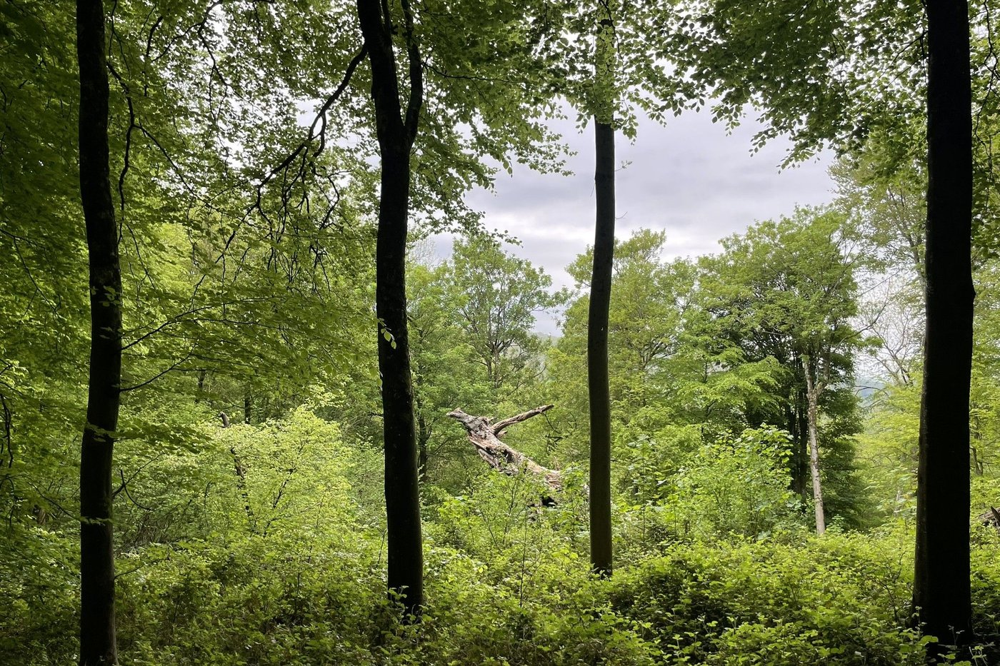
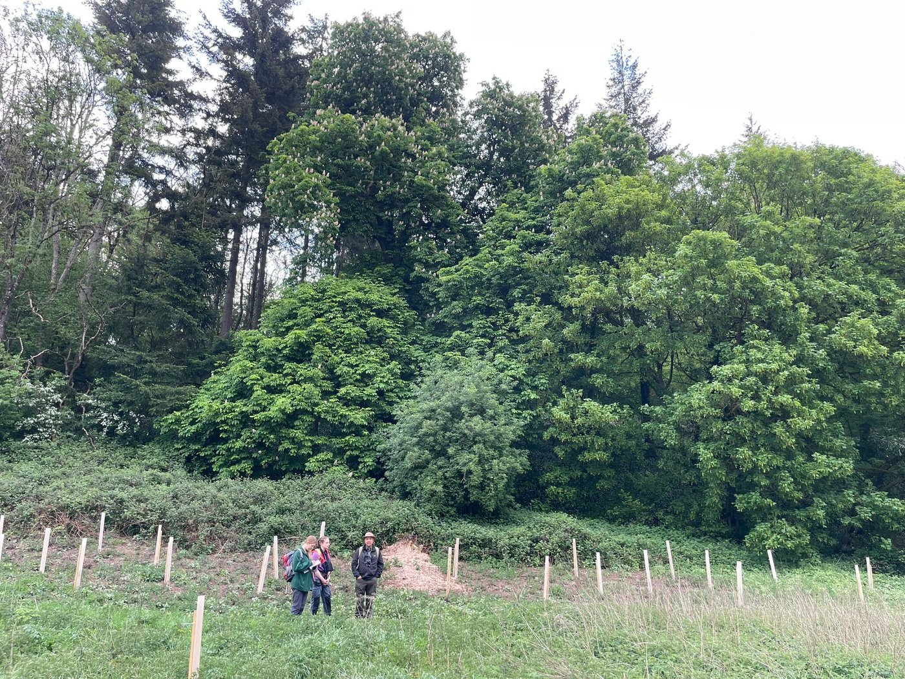
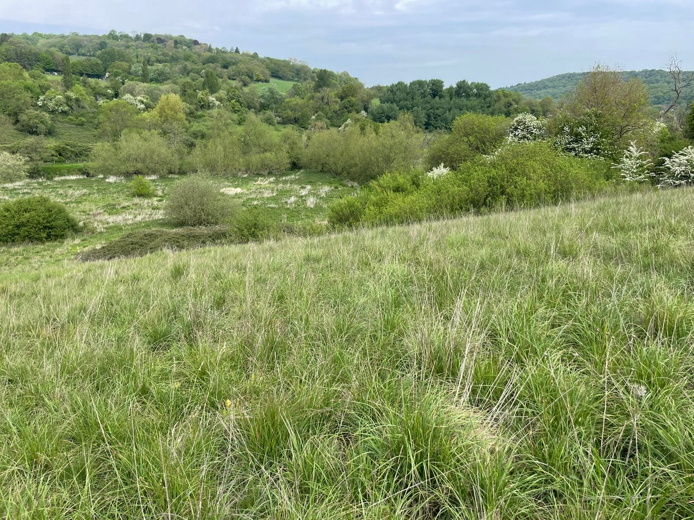
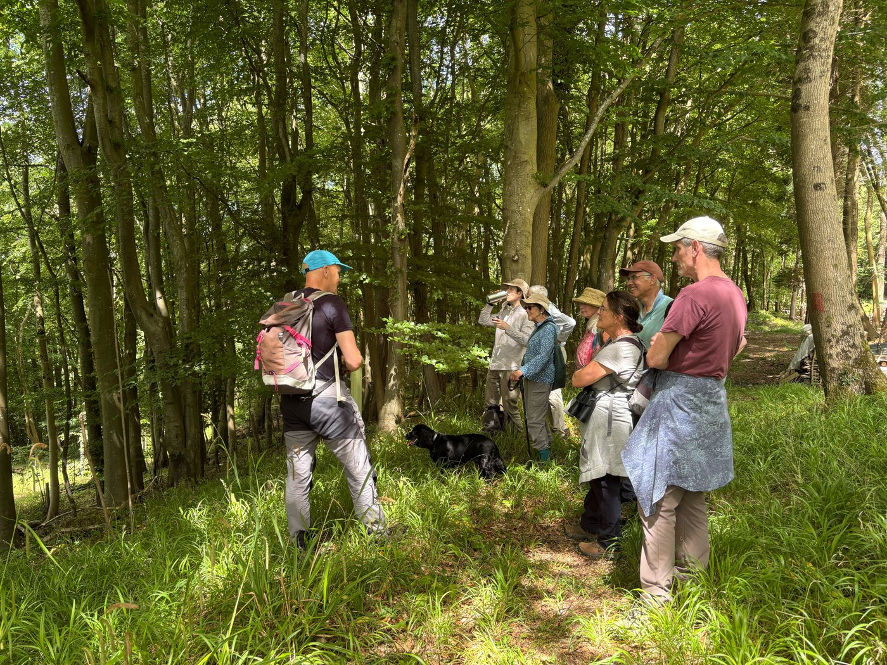
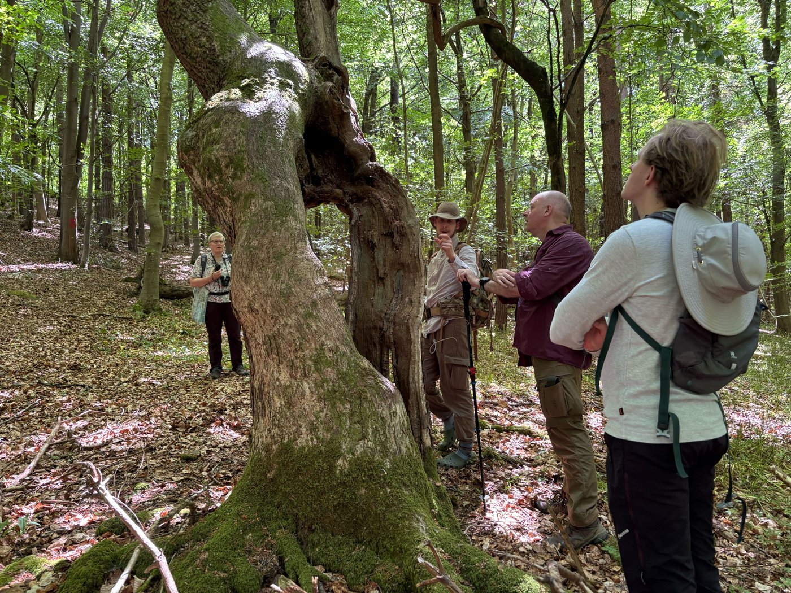
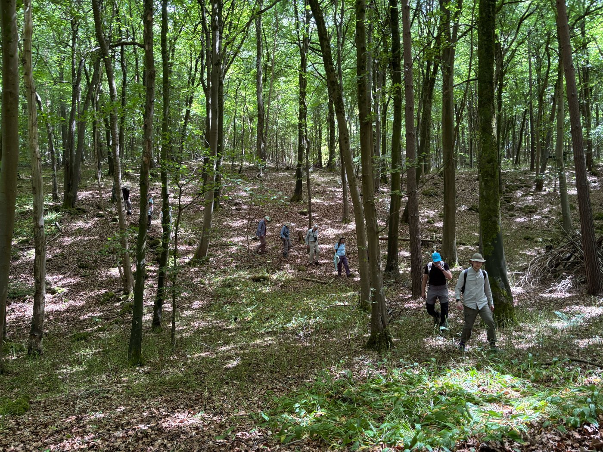
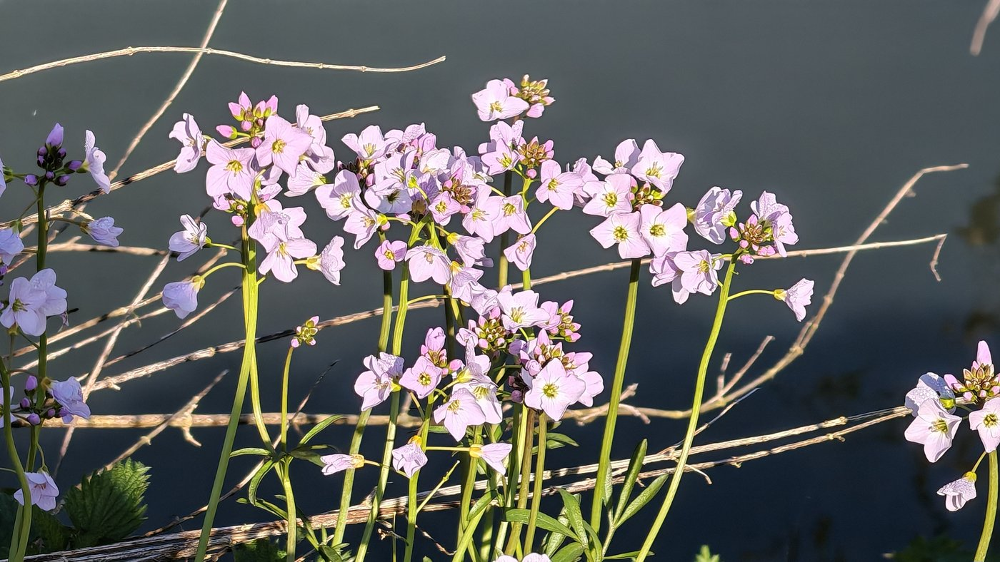
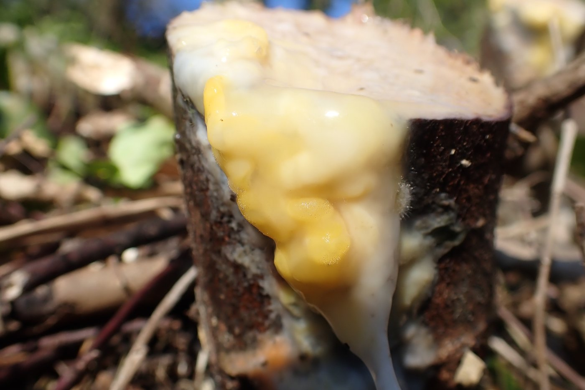
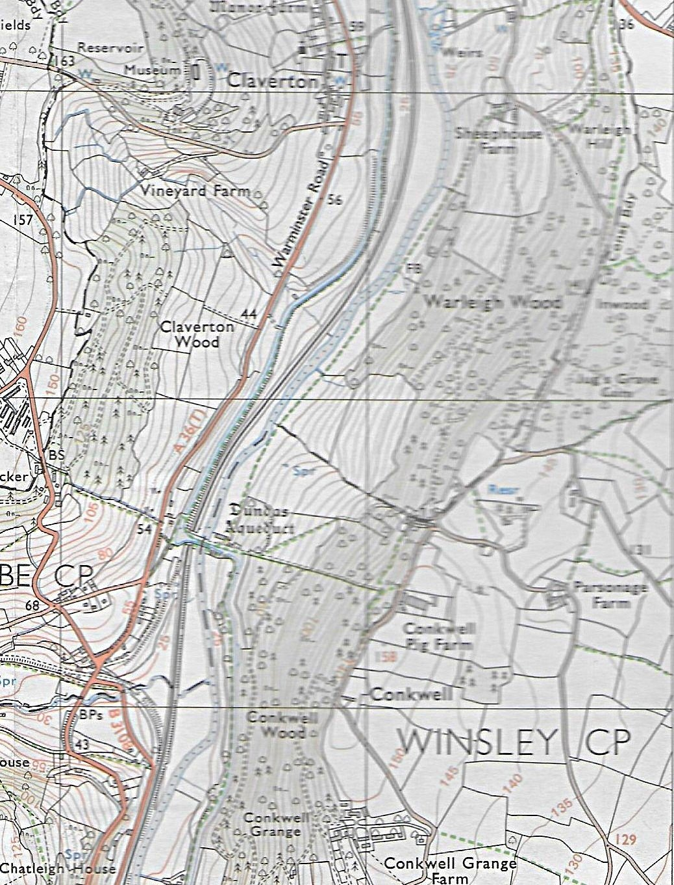

May has been an exciting month at our nature reserve, with new surveys, successful ecology tours and some Himalayan balsam bashing with our willing volunteers.

Surveys have begun at Warleigh Nature Reserve!

The amazing folk at RSK Wilding have been rummaging around our woodlands, wetlands, grasslands, turning over every leaf and rock to see what's around.

We cannot wait to see the full results of what they found, but so far it sounds like our goals are compatible with reality on the ground! It was a one day visit but the same team will be coming back in later in June for a bio blitz.

Photos by RSK Wilding

Others will be coming to carry out further surveys very soon.

Ecology Tours

Oscar, our ecologist, is leading ecology tours of Warleigh Nature Reserve. The first two tours took place in May.

These tours are free for anyone donating £60 or more to our crowdfunder as a thank you.

[Donate to Warleigh Nature Reserve crowdfunder here](https://www.crowdfunder.co.uk/p/warleigh-nature-reserve)

Ecology tours

Feedback from our May tours:

-   _We had a truly wonderful day on Saturday. Oscar was a very knowledgeable and charming guide, able to describe the ideas behind the project and the practical work being done in a way that drew the group into the excitement of what is being achieved._

-   _Many thanks for getting me booked on to the tour on Saturday - it was really interesting, I learned a lot and Oscar was a mine of information!_
_What a wonderful opportunity to let nature back in to those fields and woodlands and for it to be so accessible._

More tours in June and July

We have three further tours scheduled, on 6th and 13th June and 8th July from 10am to 1pm. The tour begins at the far end of The Angelfish Cafe car park at the bottom of Brassknocker Hill, Bath where Oscar, our ecologist, will meet you and take you on a walking tour of the new Warleigh Nature Reserve and Dundas Aqueduct, stopping at intervals to point out specific habitats, and species, discuss our projects and learn about the site’s history.

Choose a free crowdfunder donor ticket if you have donated £60 or more, or buy a general admission ticket for £60 plus Eventbrite’s admin fee.

[Book your tour tickets here](https://protect.earth/events/)

Himalayan balsam removal.

Volunteers have been busy pulling Himalayan balsam before it gets too large. There’s a lot to do, so do come along and lend a hand if you possibly can. It’s very satisfying when an area is cleared.

Himalayan Balsam

Photo by Samantha, one of our volunteers

# Photos of Warleigh Nature Reserve

Cuckooflower, also known as Lady’s Smock, is a Spring flower which can be found mainly in damp grasslands and on river banks. It flowers around the same time as the first cuckoo call, hence its name.

Deer vomit slime mould (Fusicolla merismoides) is a fungus which grows on the sap oozing from damaged trees.

It feels wet and slimy and can cause a severe stomach ache if eaten.

_If you visit Warleigh Nature Reserve and you have photos you would like to share, please send them to kathy@protect.earth with any comments and we will put them in a future newsletter._

Parking for visitors to Warleigh Nature Reserve

We recommended parking (paid) at Brassknocker Basin car park near the Angelfish Cafe, and enjoying the beautiful view as you walk across Dundas Aqueduct to get to the other side of the river.

The section of the ordnance survey map below shows Dundas Aqueduct near the bottom left. From there, go down the steps and follow the footpath (green dotted line) with the river to your left. Enter Warleigh Nature Reserve via the pedestrian entrance here:

Google maps link: https://maps.app.goo.gl/i48HByjvAaeVTHuV7

What3Words: career.pack.fame

Coordinates: 51.364853, -2.307189

Sheephouse Farm, near the top of the map, is at the far entrance of the nature reserve where the public footpath crosses their private farmyard. There is no parking available there.

# Volunteering & coming to events

# Regular Saturday Work Parties

We have regular work parties every Saturday throughout the Spring and Summer. Come along whenever it suits you, you don’t need to make a regular commitment. We will normally meet at the horsebox at 10am. If you arrive later and you cannot see us working, look out for a notice at the horsebox with our location. If you haven’t been before, contact Kathy, our volunteers coordinator, on kathy@protect.earth for detailed instructions on how to find us.

We meet here at the horsebox at 10am.

If we need to cancel a work party for any reason we will email everyone on the volunteer list to let you know.

Not on the volunteer list yet, but would like to be involved?

Simply email kathy@protect.earth letting us know what days you are likely to be available i.e. weekends only. A phone number really helps too as the site is large and it’s easier to keep in touch by mobile during the day. We won’t use your phone number for anything else and we never share your details with others.

Things you need to know when volunteering.

We’ll provide equipment, tea, coffee and biscuits but please bring the following:

-   Gardening gloves - the sturdier the better (We have a few pairs you can borrow)

-   Sturdy footwear - preferably boots or wellies

-   Weather appropriate clothing – layers and long sleeves are best, waterproof clothing, a hat. (Jeans/cotton clothing are best avoided if it is likely to rain as they take ages to dry out.)

-   A packed lunch if you plan to stay all day, and water in a refillable water bottle

-   Hand sanitiser

-   Sunblock if likely to be a sunny day

-   Insect repellent in Summer

Health and Safety

-   Do not come if you feel unwell, especially if you are likely to be contagious.

-   You are reminded to take breaks as and when you need to, and stop when you have had enough.

-   Maintain a comfortable temperature and bring waterproof clothing.

-   Drink water regularly in addition to tea and coffee to keep hydrated.

-   Take care when using tools, keep them below shoulder level where possible and place them where other people will not trip over them.

-   Ask another volunteer to help rather than lifting heavy items by yourself.

-   Protect your face and eyes from branches, etc.
