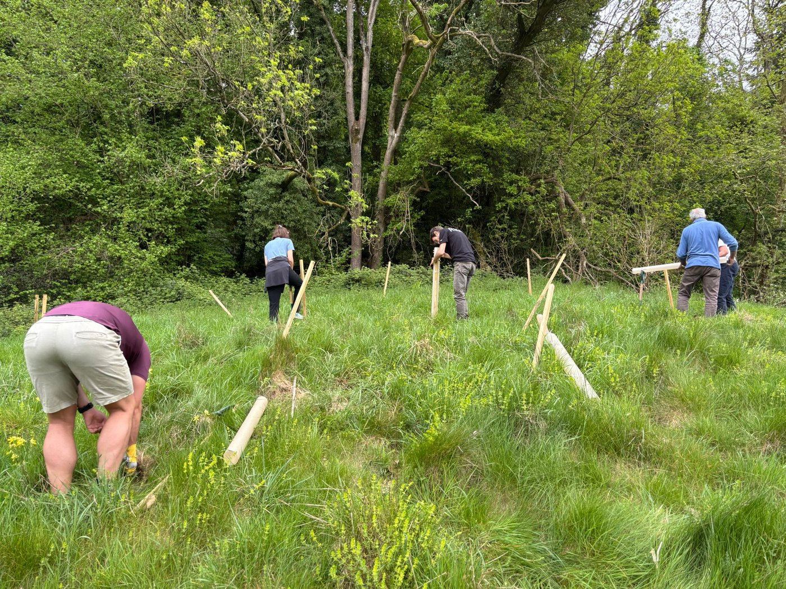
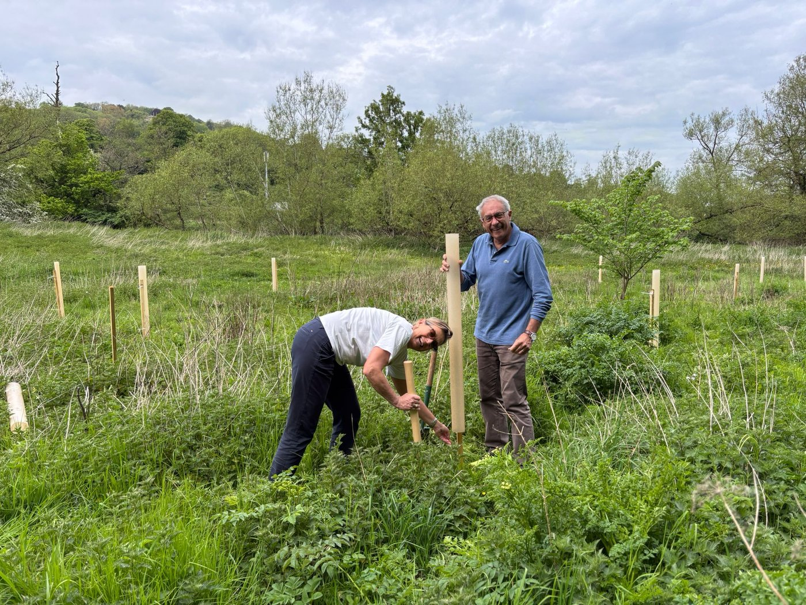
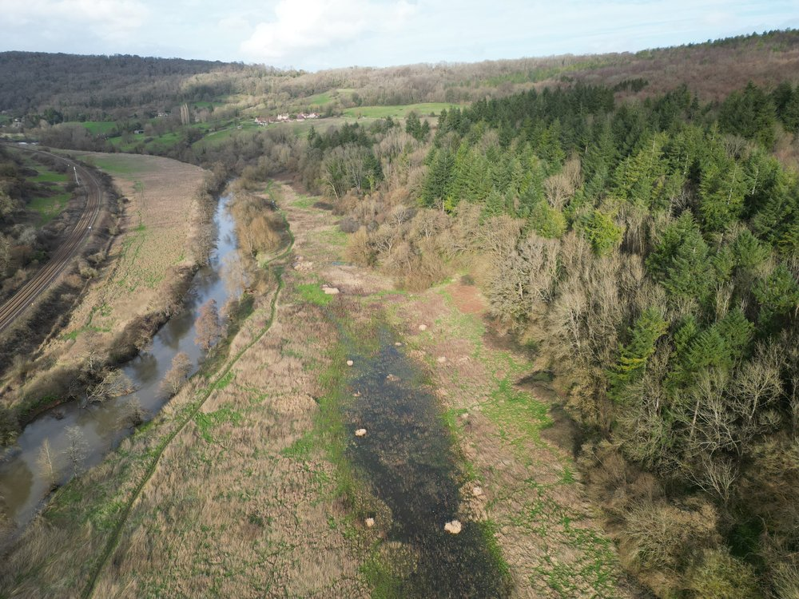
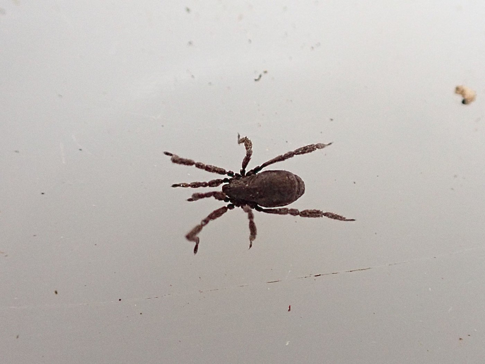
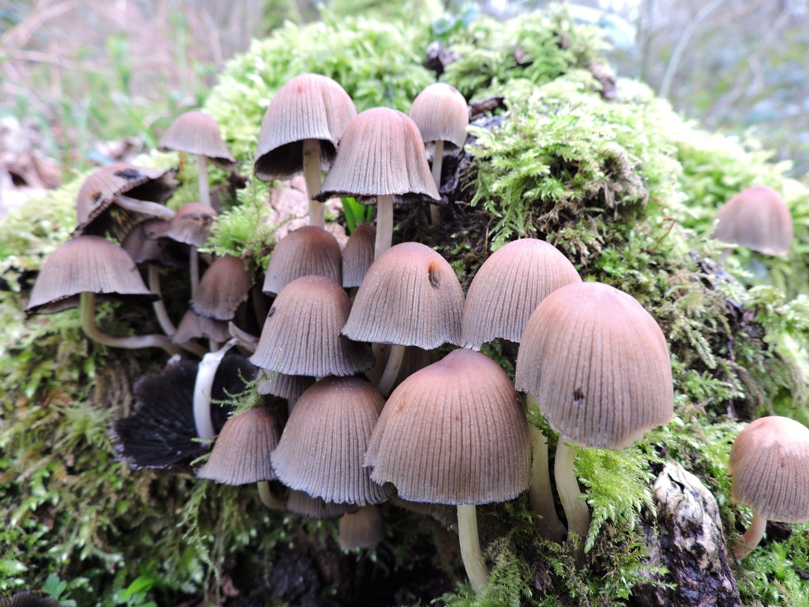
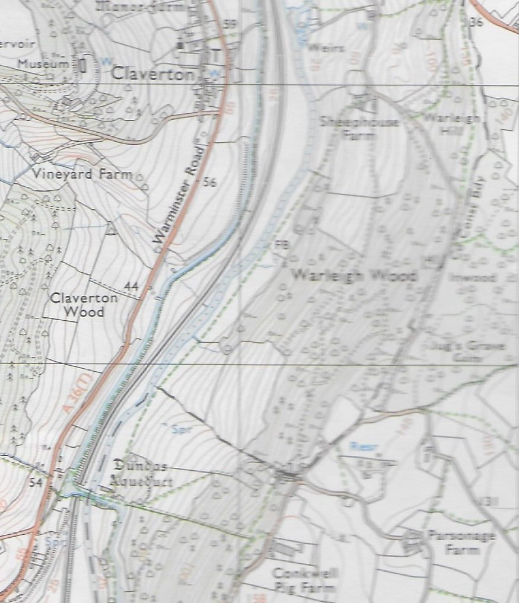

Warleigh Updates

# May 2026

# Warleigh Nature Reserve Newsletter

Hello everyone, welcome to our May newsletter. If this is your first newsletter, we are very glad you have joined us.

Our Saturday volunteering days are proving successful and we have made good progress with tasks. If you haven’t volunteered yet, and would like to take part, simply turn up on Saturday morning to find out what we have planned for the day. Beginners and children are very welcome. Find out more about our work parties at the bottom of this email.

Warleigh Nature Reserve now has it’s own own page on our new and improved Protect Earth website.

[Visit the new page on our website here](https://protect.earth/warleigh-nature-reserve/)

Deer fencing

The deer fencing is up! We need it to protect the new shoots growing from the coppiced hazel which the deer unfortunately consider a tasty treat.

We were able to use some of the coppiced hazel as fence posts, which looks more natural and has the added advantage of saving money.

Deer fencing

What is coppicing, and why are we coppicing at a nature reserve?

This new article on our website explains the history of coppicing and why it is beneficial to the environment.

If you would like to learn how to coppice - you can join a course at Warleigh, and at the same time help restore this ancient coppice to its full glory. You can sign up for updates about it here, the courses will start in September.

[Learn about coppicing or sign up for a coppicing course here](https://protect.earth/articles/intro-to-coppicing/)

Tree planting

Local nurseries were kind enough to donate some of their end of season stock, so during April volunteers have been helping us to plant 1,000 trees which might otherwise have ended up in a wood chipper. Some of them were used as hedging, some was dotted around in bramble patches so they'll be protected.

We also bought some alders to plant with our willows by the river and in the wetlands. As they grow, we hope that they will attract beavers who will coppice them for their own use.

Volunteers planting trees

Himalayan balsam removal.

Himalayan balsam has put in an appearance several weeks earlier that we would normally expect it. It is mainly along the river and in the wetlands but is also progressing through the scrubland towards higher ground.

Volunteers have been helping to remove it, both by hand and using a variety of tools including brush hooks which are very satisfying to use.

Himalayan Balsam

Over the next few weeks we will be showing volunteers how to sharpen and maintain their tools before doing battle with the balsam. This work is likely to take us well into July, although we will have occasional smaller tasks too.

So why all the fuss about Himalayan balsam? Well, it might look innocent enough with its pink flowers and tall stalks, but it spreads rapidly. Seeds float down the river and grow wherever they settle, causing problems for others. Worse, as an invasive species with no natural competitors, it outcompetes native plants and weakens riverbanks, contributing to erosion. Then, in the winter, it leaves the soil bare and ready to wash away.

Ecology Tours

If you donated to our crowdfunder and chose an ecology tour as your reward, you will be hearing from us very soon with an invitation.

Ecologist Oscar Price will lead you through Warleigh on a guided tour. Initial tours are planned for Saturdays when most people are likely to be available. If you are not available on Saturdays you can let us know when we contact you and we will make alternative arrangements for you.

Warleigh wetlands

Our Crowdfunder

We have raised £8,220 with our recent crowdfunder. Thank you to everyone who has donated so far.

It is not too late to donate, or to share with friends, if you are able.

[Donate to our crowdfunder here](https://www.crowdfunder.co.uk/p/warleigh-nature-reserve)

# Photos of Warleigh Nature Reserve

Spider (Anelasmocephalus cambridgei) This small, short-legged hoarvestman spider lives on the ground in calcareous soils and eats mainly snails. It secretes a glue which causes soil to stick to their backs as a kind of camouflage. They lay their eggs in empty snail shells and the young are purple in colour.

_Photo by Alvan White a regular volunteer - 20/02/26_

Trooping crumble cap (Coprinellus disseminatus) is also known as fairy inkcap or fairy bonnet. They grow up to 2cm in width, turning from beige to grey as they age, and are very fragile. They can be found on rotting wood, especially at the base of tree stumps, usually growing in large clusters.

_Photo by Alvan White - 20/02/26_

_If you visit Warleigh Nature Reserve and you have photos you would like to share, please send them to kathy@protect.earth with any comments and we will put them in a future newsletter._

Parking for visitors to Warleigh Nature Reserve

We recommended parking (paid) at Brassknocker Basin car park near the Angelfish Cafe, and enjoying the beautiful view as you walk across Dundas Aqueduct to get to the other side of the river.

The section of the ordnance survey map below shows Dundas Aqueduct near the bottom left. From there, go down the steps and follow the footpath (green dotted line) with the river to your left. Enter Warleigh Nature Reserve via the pedestrian entrance here:

Google maps link: https://maps.app.goo.gl/i48HByjvAaeVTHuV7

What3Words: career.pack.fame

Coordinates: 51.364853, -2.307189

Sheephouse Farm, near the top of the map, is at the far entrance of the nature reserve.

# Volunteering & coming to events

# Regular Saturday Work Parties

We have regular work parties every Saturday throughout the Spring and Summer. Come along whenever it suits you, you don’t need to make a regular commitment. We will normally meet at the horsebox at 10am. If you arrive later and you cannot see us working, look out for a notice at the horsebox with our location. If you haven’t been before, contact Kathy, our volunteers coordinator, on kathy@protect.earth for detailed instructions on how to find us.

We meet here at the horsebox at 10am.

If we need to cancel a work party for any reason we will email everyone on the volunteer list to let you know.

Not on the volunteer list yet, but would like to be involved?

Simply email kathy@protect.earth letting us know what days you are likely to be available i.e. weekends only. A phone number really helps too as the site is large and it’s easier to keep in touch by mobile during the day. We won’t use your phone number for anything else and we never share your details with others.

Things you need to know when volunteering.

We’ll provide equipment, tea, coffee and biscuits but please bring the following:

-   Gardening gloves - the sturdier the better (We have a few pairs you can borrow)

-   Sturdy footwear - preferably boots or wellies

-   Weather appropriate clothing – layers and long sleeves are best, waterproof clothing, a hat. (Jeans/cotton clothing are best avoided if it is likely to rain as they take ages to dry out.)

-   A packed lunch if you plan to stay all day, and water in a refillable water bottle

-   Hand sanitiser

-   Sunblock if likely to be a sunny day

-   Insect repellent in Summer

Health and Safety

-   Do not come if you feel unwell, especially if you are likely to be contagious.

-   You are reminded to take breaks as and when you need to, and stop when you have had enough.

-   Maintain a comfortable temperature and bring waterproof clothing.

-   Drink water regularly in addition to tea and coffee to keep hydrated.

-   Take care when using tools, keep them below shoulder level where possible and place them where other people will not trip over them.

-   Ask another volunteer to help rather than lifting heavy items by yourself.

-   Protect your face and eyes from branches, etc.
