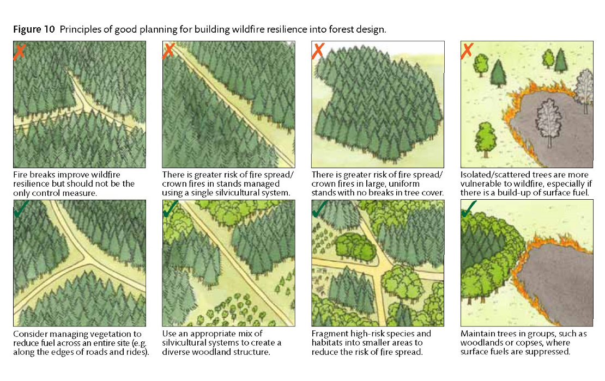
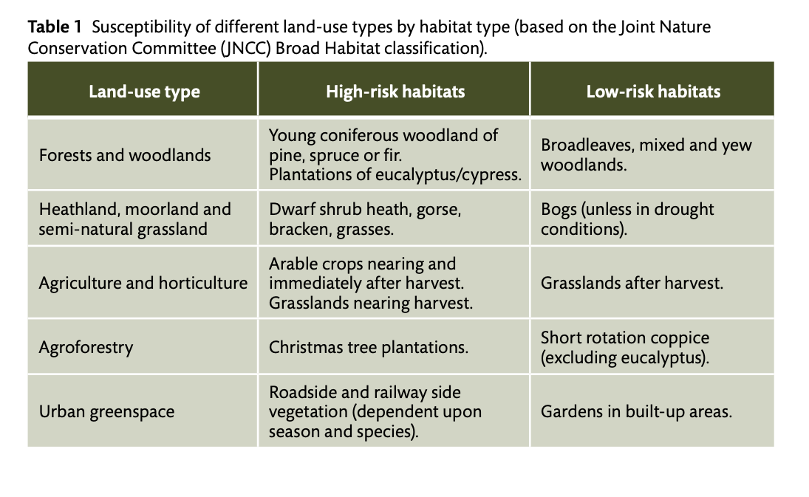
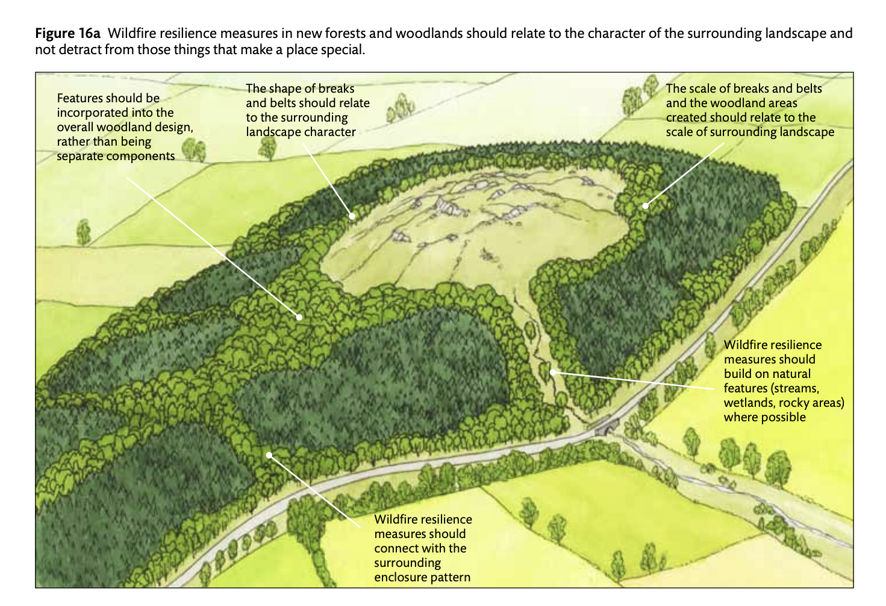
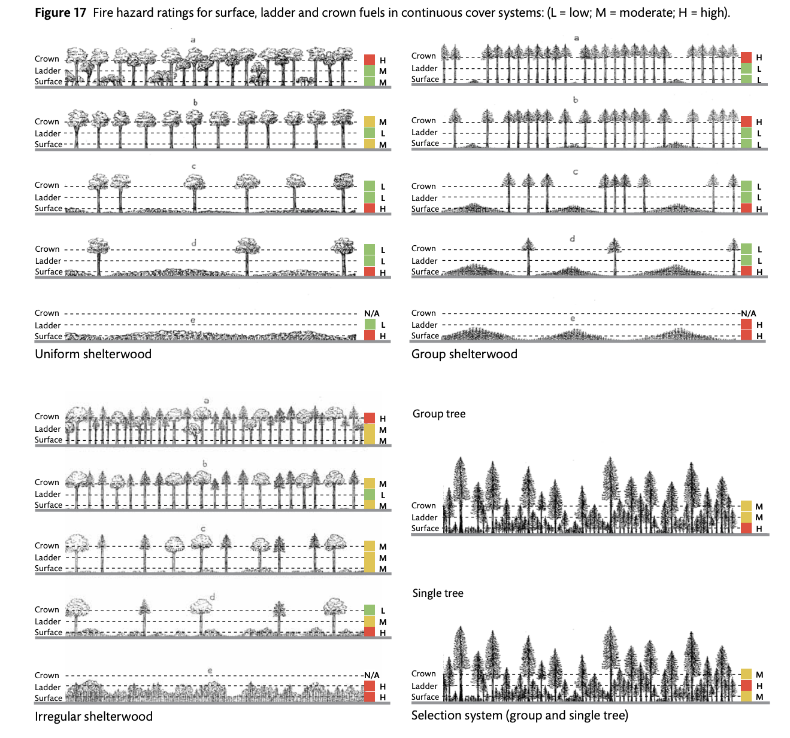

The UK is baking. In successive rolling heatwaves, the number of recorded deaths is rising. Our nature is struggling, plants, fungi and animals are having to try to adapt to the ever-unprecedented temperatures. And all of this is only exacerbating a growing risk - wildfire. We have seen fires spark in [North Wales](https://www.thetimes.com/uk/weather/article/heatwave-deaths-uk-met-office-report-bprggjsqs), [Cumbria](https://www.bbc.com/news/articles/cq6jn89vgrgo), [Peak District](https://www.mirror.co.uk/news/uk-news/peak-district-flames-scorching-heatwave-37349778) and [Somerset](https://www.bbc.com/news/articles/ckg8regml00o), among other places, seeing rates soar above even last year’s.

Wildfire conditions are visiting our shores more and more, with researchers saying that the chance of wildfire ignition has [“never been so high”](https://www.bbc.com/news/articles/c5yzyepzewwo). The oven-roasting heat and lack of rain are exposing the deep faultlines in our landscape. We had our first ["megafire"](https://www.forestryjournal.co.uk/news/26150025.researcher-says-scottish-wildfire-uks-first-megafire/) in Scotland in 2025, and this year we are witnessing almost constant wildfires burn across the country. Degraded peatlands, the wrong kind of grazing at the wrong time in the wrong place, and commercial forestry plantations are all adding fuel loads to the extreme conditions we’re experiencing.

Not only are human deaths rising in the heatwaves, but the lives of firefighters are risked at each fire. And with the increased likelihood and severity of wildfires, it’s just a matter of time until we see inhabited areas come into conflict with the infernos. The cost to the economy is staggering, wiping out valuable timber crops, destroying property, and damaging land so it is unable to absorb carbon or prevent flooding. Nature is hanging on by a thread.

It’s true that wildfires are mostly started by [human activity](https://www.rspb.org.uk/days-out/uk-wildfires-causes-and-prevention), but it is now easier than ever. In a landscape that should be as hard to set fire to as ‘wet asbestos’, a carelessly flicked cigarette, a barbecue in the wrong place or even a discarded glass bottle can be enough to destroy thousands of hectares.

There is a tendency to focus on fire-fighting. It’s brave, dynamic, and absolutely essential. However, it needs to be paired with fire prevention. Perhaps less attention-grabbing than helicopters and trucks, but fire prevention can save our environment, our wildlife, our homes and our economy.

## Forestry

Commercial forestry and timber is essential for the UK. Done right, it can produce sustainable building materials and products that have a much lower carbon footprint than other manufactured materials. However, we need to look at the way in which commercial forestry is done to ensure the chances of wildfires are reduced.

This is not only in the interest of the public good, and to protect nature, but also commercial forestry itself. In 2025, the Scottish megafire wiped out an enormous amount of timber in Cannich, South of Inverness, and even trees that have remained standing are now unsellable as timber - with a reduction in value of up to [60%](https://www.forestryjournal.co.uk/news/24363190.cannich-forestry-officials-detail-devastating-timber-costs/). The potential costs of loss of income due to wildfire need to be factored in when weighing up resilience measures - not making changes and sacrifices in terms of planting could lead to much higher costs in loss of trees to wildfire.

Our commercial forestry is particularly at risk around five years after replanting. The heather grows high, the trees are still small, and there tends to still be large piles of old brash from the previous felling. This needs particular attention is fire planning and prevention.

According to the [Forestry Commission guidance](https://www.forestresearch.gov.uk/climate-change/risks/wildfire/), a site is at higher risk of wildfire starting if there are potential sources of ignition on-site or nearby, including high visitor numbers, recreation routes, camp sites, lay-bys, or car parks. A vast swath of commercial forestry is open access, meaning that there is a higher chance of ignition, and there is a discussion to be had around balancing access with the safety of both people and wildlife.

_Figure 10 Principles of good planning for building wildfire resilience into forest design. **Source:** [Forest Research: Climate change hub > Risks > Wildfires](https://www.forestresearch.gov.uk/climate-change/risks/wildfire/)_

Habitats with a high fuel load also have a higher fire hazard, including sites with dense surface vegetation (open areas, rides, young woodland before canopy closure, scattered trees), flammable species (bracken, gorse, eucalyptus, cypress, pines), extensive areas of brash, dead or dying trees (disease outbreaks, windthrow damage, low species suitability). South facing sites, slopes and gullies and drought prone soils and dry organic peat soils all increase the risk of a wildfire starting. This describes an enormous amount of forestry plantations - the risk of wildfire continuing to decimate timber and nature is high.

_Table 1 Susceptibility of different land-use types by habitat type (based on the Joint Nature Conservation Committee (JNCC) Broad Habitat classification). **Source:** [Forest Research: Building wildfire resilience into forest management planning](https://cdn.forestresearch.gov.uk/2014/03/fcpg022.pdf)_

## Wildfire Prevention

Luckily, the Forestry Commission has provided [guidance](https://cdn.forestresearch.gov.uk/2014/03/fcpg022.pdf) on how to manage plantations - and it’s all good news for nature too. A lot more native mixed broadleaf is encouraged around the edges and throughout, firebreaks put in, and wetting areas will all help. And while this guidance is for new woodlands, as areas are harvested, the replanting can take these design principles into consideration.

_Figure 16a Wildfire resilience measures in new forests and woodlands should relate to the character of the surrounding landscape and not detract from those things that make a place special. **Source:** [Forest Research: Building wildfire resilience into forest management planning](https://cdn.forestresearch.gov.uk/2014/03/fcpg022.pdf)_

Beavers, again, can be our friends here. By [releasing beavers](https://esajournals.onlinelibrary.wiley.com/doi/full/10.1002/eap.2225?campaign=wolacceptedarticle) into woodlands and plantations with streams, rivers, ponds and lakes in or by them, they can [rewet the ground and create extremely effective](https://esajournals.onlinelibrary.wiley.com/doi/pdf/10.1002/eap.70102) wildfire barriers. There are devices called [‘beaver deceivers’](https://www.maine.gov/ifw/blogs/mdifw-blog/what-exactly-beaver-deceiver-and-what-does-it-do), which can be installed into dams to ensure there is a limit to the size of wetland area that can be created and protect valuable timber crops.

[Continuous Cover Forestry](https://www.ccfg.org.uk/) (or CCF) is also recommended for wildfire resilience, with the Forestry Commission stating that, “the adoption of areas of continuous cover forestry in close proximity to clearfell systems leads to the development of diverse landscapes of multi-structured woodland with diverse species mixes. This creates a mosaic of vegetation with improved resilience to wildfire”. CCF is also incredible for [wildlife](https://www.sciencedirect.com/science/article/pii/S0378112725005286), re-creating a more natural woodland environment with a greater diversity of microhabitats, increasing the range of feeding, mating and nesting sites for our [beleaguered nature](https://www.wildlife-woodlands.co.uk/continuous-cover-forestry/).

_Figure 17 Fire hazard ratings for surface, ladder and crown fuels in continuous cover systems: (L = low; M = moderate; H = high). **Source:** [Forest Research: Building wildfire resilience into forest management planning](https://cdn.forestresearch.gov.uk/2014/03/fcpg022.pdf)_

The forestry sector has been shifting for some time now, with [UKFS guidelines](https://cdn.forestresearch.gov.uk/2025/01/FCPG025B-WEB-compressed.pdf) directing that on new or restocked plantations that riparian buffer areas are created with native trees and shrubs. These buffer zones apply to not just rivers and lakes, but also connected ditches, drains, wetlands and ponds. Where drains are an issue in buffer areas, the guidance says to create wet woodland. Roads shouldn’t be built in the buffer zones, and any thinning or felling has to be done sensitively and carefully. All of these measures help to deacidify the water, prevent erosion, [increase biodiversity](https://www.nature.com/articles/s41467-026-70191-y) and help with flood management. They are incredibly effective wildfire breaks too - a win-win-win-win.

Everything that needs to happen is underway - but the pace is too slow. There are constraints - only after felling can plantations be redesigned, but there is still a lot more we could be doing now to transition into a wildfire-resilient (and flood-resilient and more biodiverse) landscape.

## Transition

The transition into wildfire-resilient landscapes needs careful management too. Recently, the RSPB Abernethy Reserve in the Cairngorms has been battling a [devastating wildfire](https://www.scotsman.com/hays-way/cairngorms-unpredictable-blaze-creating-treacherous-conditions-8808779). As they have moved to rewet and rewild this incredible estate, the build-up of vegetation under the oppressive heatwaves set a wildfire off. With climate change continuing to wreak havoc, and extreme weather events only increasing, rewilding is more important than ever. But - the risks must be managed over the transition, otherwise all the hard work is lost. It is also an opportunity to bring neighbours together - perhaps neighbours who have very different ideas of land management - and plan together to help prevent disasters like this.

## Wildfire Fighting

Even with all of these measures in place, we will continue to experience wildfires. For this, training, communication, and learning from others are key.

The shape of rural Britain has changed a lot over the past couple of generations. Whereas before, the local community would have been heavily involved in land work, with deep local knowledge, understanding of routes, gates, access, everything that fire crews need to tackle a blaze. Now, modern life has pulled many people out of that kind of work, and with the ability to work from home, many have relocated to more rural locations, but without the knowledge that comes from working the land. There are also local, volunteer fire crews that would have had to all hands on board when a wildfire arose, dropping everything. But now, 3, 4 or more days a month is not doable for many volunteers.

Networks need to be built and maintained beforehand, more retained and trained rural firefighters. More communication and coordinated planning between landowners, estate and land managers, no matter the type of land use. Specialised equipment needs to be made available, and plans thoroughly thought through that sit with all the interested parties and particularly the fire service.

Forestry plantations often sit on the edge of moorland, with good road access put in place for timber lorries and equipment - perfect for assisting the fire service out to where they need to go. But that doesn’t help if the fire service aren’t aware of the roads, or who has the key to open the gates when needed. Likewise, forestry equipment and machinery, as well as agricultural, could prove of use in a wildfire - but all of this needs to be a part of a coordinated plan developed ahead of time and reviewed over winter to ensure the optimal plan is in place. The FSC actually requires that forests have fire management plans, but done in isolation limits the effectiveness. Many from the 50s and 60s even have [fire ponds](https://www.forestresearch.gov.uk/climate-change/risks/wildfire/) dug in (also fantastic for wildlife) - the locations should be marked clearly in any planning.

## Learning From Others

We can learn from countries that have been fighting wildfires for generations. Spain and Portugal have a long history of incredibly dry, hot summers, and with rural depopulation, there are vast swaths of land with no eyes to see when something starts, no local knowledge to direct crews, access overgrown. This year has seen fires close to Paris, and deaths from [wildfires in Spain](https://apnews.com/article/spain-france-wildfires-europe-climate-change-54c775ade550b9e8d802ad27f30df27c?utm_source=cbnewsletter&utm_medium=email&utm_term=2026-07-17&utm_campaign=DeBriefed+UK+firewave+Fossil-fuelled+heat+deaths+London+s+Natural+History+Museum+spotlights+climate). However, Spain prepares for this - helicopter training to pick up water, natural and national parks have volunteers who are simply there to keep an eye in case a wildfire starts. Crews are trained and response is swift.

There are more sophisticated monitoring systems available, such as in Ghana, where they have towers that search for heat and smoke. When anything is detected, the team on the ground receives an alert on their phone. Computer modelling is being used, but it could be used much more widely, looking at where has been burned in the past, looking at areas in the most at-risk phase after replanting, looking at where to target resources.

Just as more prevention is needed, so we need more investment into monitoring and targeted fire-fighting. It will save lives, nature, the environment and money.

## The Future

Wildfires are going to be with us for some time to come. Our dry, hot summers are going to get dryer and hotter. We have to start planning for the future now, to ensure that we are able to cope with what is coming. That means we have to make decisions, make changes, have conversations and do training with more resources and energy than is being put in right now. Everything that we need to combat wildfires brings so many other benefits - increasing biodiversity and carbon capture, building bridges in communities, as well as creating economic resilience in an industry which we need.

Resilience is what we need as we move forward in this century, to ensure that there’s an end to the century that is still full of the life and wonder of the natural world. And us.
